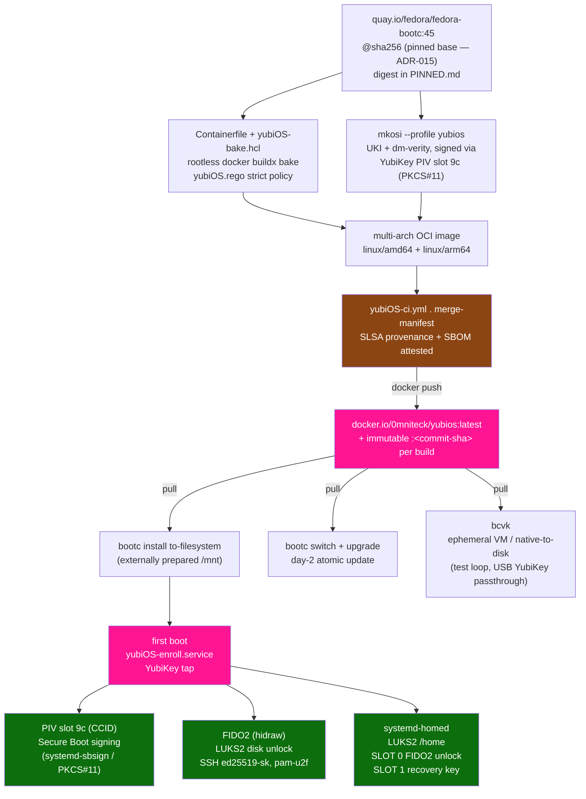

<div align="center">


# yubiOS

**FIDO2-first immutable OS — HSM/U2F as the root of trust**

[](LICENSE)
[](https://github.com/yubi-OS/yubiOS/blob/main/docs/TODO.md)
[](https://www.yubico.com)
[](https://fidoalliance.org)

*No OEM. No trust anchors you don't control.*
### 🦴 🚧 Work In Progress 🚧 Work In Progress 🚧 Work In Progress 🚧

</div>

---

## What it is

yubiOS is an immutable, bootc-delivered Linux OS that treats the owner's YubiKey as the user-facing identity, unlock, and authorization boundary. It combines:

| Layer | Inspiration | What it gives us |
|---|---|---|
| particleos ethos | [systemd/particleos](https://github.com/systemd/particleos) | Immutable `/usr`, UKIs, dm-verity, composefs, systemd-boot |
| bootc design | [bootc-dev/bootc](https://github.com/bootc-dev/bootc) | OCI image as OS delivery unit, day-2 upgrades via registry pull |
| systemd image model | [Fitting Everything Together](https://0pointer.net/blog/fitting-everything-together.html) | DPS partitions, systemd-repart first boot, A/B sysupdate, systemd-homed |
| YubiKey owner-control plane | FIDO2 / PIV / OATH | Owner-held authorization for signing, unlock, SSH, PAM, and app 2FA |

ARM64 is the primary target platform because it is where yubiOS can work toward owning the firmware stack below the UKI through TF-A, OP-TEE, fTPM, and U-Boot. x86-64 remains fully supported above the UKI, but its firmware and optional TPM are platform/OEM trust anchors.

### Ecosystem alignment

In January 2026 the core systemd team and the engineers behind, composefs, runc, Flatcar,
ParticleOS, and Ubuntu Core — founded [Amutable](https://amutable.com) with the mission:

> *“Deliver determinism and verifiable integrity to Linux workloads everywhere.”*

yubiOS is independently building toward the same architecture, with one additional constraint:
the owner-facing authority should live with the machine owner. A YubiKey provides the signing,
unlock, SSH, PAM, and application-2FA boundary, while TPM/fTPM measurement and firmware
state remain separate platform-integrity signals where they are useful. The "Fitting Everything
Together" essay at [0pointer.net](https://0pointer.net/blog/fitting-everything-together.html) is the
primary design reference for yubiOS — hermetic /usr, DPS partitions, systemd-repart first-boot,
A/B sysupdate, systemd-homed per-user encryption, and UKI + dm-verity trust chain.


## Trust chain

```text
YubiKey 5
- PIV slot 9c via CCID: Secure Boot / UKI signing with systemd-sbsign + PKCS#11
- FIDO2 hmac-secret via hidraw: LUKS2 root and systemd-homed unlock
- FIDO2 ed25519-sk via hidraw: SSH resident keys
- FIDO2 U2F via hidraw: sudo/login with pam-u2f
- OATH via hidraw: application 2FA
```

Secure Boot signing uses PIV/CCID, not hidraw. Full rationale: [ADR-002](https://github.com/yubi-OS/yubiOS/blob/main/docs/ADR.md#adr-002-secure-boot-signing-via-piv-ccid-not-fido2-hidraw).

## Get yubiOS

yubiOS currently publishes a pre-launch multi-arch [bootc](https://github.com/bootc-dev/bootc) OCI image on Docker Hub:

```sh
docker pull 0mniteck/yubios:latest
```

For repeatable artifact selection, pin the image by the digest produced by the
latest green `yubiOS-ci.yml` publish for the intended release. A pinned digest
does not by itself prove the image was reproducibly built; the CI two-build
evidence described below does. Do not treat a run-specific digest in an old PR
or research note as evergreen.

> **Warning:** yubiOS is groundwork / work in progress. The install flows below can destroy data on the target disk. Test on disposable hardware or a VM, back up recovery material first, and use the current [TODO.md](https://github.com/yubi-OS/yubiOS/blob/main/docs/TODO.md), [BLOCKERS.md](https://github.com/yubi-OS/yubiOS/blob/main/docs/BLOCKERS.md), and [PR.md](https://github.com/yubi-OS/yubiOS/blob/main/docs/PR.md) before treating any image as safe for broader use.

Prepare and mount the target filesystems first, for example with `systemd-repart` or another installer that creates the yubiOS DPS layout. Mount the target root at `/mnt` and its boot filesystem at `/mnt/boot`, then install the image with `bootc install to-filesystem`:

## Build from source with Bake, then install to-filesystem

The supported local build host is Ubuntu 26.04. Install the distro Docker
engine, enable it, and grant your user access to its socket:

```sh
sudo apt-get update
sudo apt-get install -y docker.io git
sudo systemctl enable --now docker
sudo usermod -aG docker "$USER"
```

Membership in the `docker` group is root-equivalent. Sign out and back in once
after changing group membership. From the repository root, run the local
CI-parity entrypoint. With no mode it follows the complete non-`ci_fork` image
set in `ci.yml`: all firmware boards, production, TEST-only dev, and the native
mkosi installer:

```sh
./scripts/build-local-images.sh
```

The complete build compiles the pinned EDK2/StandaloneMM, OP-TEE/fTPM, TF-A,
and U-Boot firmware sources; runs the QEMU fTPM checks; builds and verifies the
SoftHSM PKCS#11-signed mkosi UKI and disk payload; and runs the production/dev
Bake smoke tests. It is resource intensive. Use `images` for the original,
shorter production + dev pair or select one path:

```sh
./scripts/build-local-images.sh images
./scripts/build-local-images.sh production
./scripts/build-local-images.sh dev
./scripts/build-local-images.sh installer
./scripts/build-local-images.sh firmware
./scripts/build-local-images.sh firmware-qemu-arm64
./scripts/build-local-images.sh firmware-rockpro64-rk3399
ROCKCHIP_TPL=/path/to/real/rk3588-ddr-tpl.bin \
  ./scripts/build-local-images.sh firmware-rock5b-rk3588
LOCAL_TAG=review ./scripts/build-local-images.sh production
./scripts/build-local-images.sh repro-production
./scripts/build-local-images.sh repro-dev
```

Every mode launches the [PINNED.md](https://github.com/yubi-OS/yubiOS/blob/main/PINNED.md) DHI image as a privileged outer
container, installs the SHA-512-verified Docker 29.6.0 rootless extras and
Buildx 0.35.0 used by CI, starts a rootless Docker-in-Docker daemon, and selects
the policy-bound `hardened` builder. Source refs used by the artifact paths are
also pinned in `PINNED.md`. The entrypoint never logs in or pushes; it transfers
only the selected local tags into the host Docker daemon.

The `repro-production` and `repro-dev` modes are proof runs rather than image
loads. Each performs two no-cache builds with separate digest-pinned BuildKit
daemons, exports canonical OCI layouts, and requires their manifest, config,
and layer bytes to match. It also asserts that OCI config/history timestamps
equal the source commit epoch. Successful JSON reports are written to
`repro-evidence/`; the ARM64 CI lanes run the same gate and retain their reports.
The firmware workflow separately rebuilds StandaloneMM and all three board
paths on a second clean ARM64 lane, compares their unsigned components, and
retains board-scoped JSON evidence. The installer workflow likewise rebuilds
the ARM64 mkosi image from a clean job, removes the regenerable `ldconfig`
auxiliary cache, and compares a canonical unsigned root-filesystem record plus
the initrd and package manifest. The random SoftHSM certificate, root-resident
signed systemd-boot binary, signed UKI, ESP, Btrfs block serialization, and
full-disk wrapper are recorded as separate envelopes. See [the
reproducibility contract](https://github.com/yubi-OS/yubiOS/blob/main/refs/reproducible-builds-2026-07-22.md) for the
installer/TF-A signing, package-snapshot, and RK3588 TPL boundaries.

| Mode | Default host-loaded tags |
|---|---|
| `production` | `yubios:local` |
| `dev` | `yubios:local-dev` |
| `installer` | `yubios:local-installer` |
| `firmware` | `yubios:local-firmware-qemu-arm64`, `yubios:local-firmware-rockpro64-rk3399`, `yubios:local-firmware-rock5b-rk3588` |

`LOCAL_TAG=review` replaces the `local` portion of each name. Firmware builds
always produce ARM64 payload images, using cross-compilation on an amd64 host.
The RK3588 path needs a real external DDR/TPL blob for a bootable
`u-boot-rockchip.bin`. Without `ROCKCHIP_TPL`, it mirrors the CI gate by
packaging the built source-derived pieces and `RK-TPL-REQUIRED.txt`; do not
flash that incomplete ROCK 5B tag. The TPL is copied into the disposable build
container and removed with its temporary output directory.

With the target filesystems already mounted at `/mnt` and `/mnt/boot`, install
the locally built production image:

```sh
docker run --rm --privileged --pid=host --ipc=host \
  --security-opt label=type:unconfined_t \
  -v /dev:/dev \
  -v /var/lib/containers:/var/lib/containers \
  -v /:/run/host \
  yubios:local bootc install to-filesystem \
    --bootloader=systemd \
    --root-mount-spec="" \
    --composefs-backend \
    --skip-finalize \
    /run/host/mnt/
```

## Fetch/install from the OCI image, 1 step

```sh
IMAGE=docker.io/0mniteck/yubios:latest
docker pull "$IMAGE" && \
docker run --rm --privileged --pid=host --ipc=host \
  --security-opt label=type:unconfined_t \
  -v /var/lib/containers:/var/lib/containers \
  -v /dev:/dev \
  -v /:/run/host \
  "$IMAGE" \
  bootc install to-filesystem \
    --source-imgref="registry:${IMAGE}" \
    --bootloader=systemd \
    --root-mount-spec="" \
    --composefs-backend \
    --skip-finalize \
    /run/host/mnt/

bootc switch 0mniteck/yubios:latest
bootc upgrade
```

Every approved base image and GitHub Action SHA lives in [PINNED.md](https://github.com/yubi-OS/yubiOS/blob/main/PINNED.md). That file is the single source of truth for pins.

| Registry | `docker.io/0mniteck/yubios` |
|---|---|
| Production tags | `latest` plus immutable commit tags |
| Test tags | `dev`, `dev-<sha>` for swu2f TEST-only images |
| Local build tags | `yubios:local`, `yubios:local-dev`, `yubios:local-installer`, and board-scoped `yubios:local-firmware-*` |
| Artifact tags | `installer`, `firmware` and per-commit variants |
| Platforms | `linux/amd64`, `linux/arm64` |
| Supply chain | SLSA build provenance + SBOM attestations |

## Enrollment wizard

On first boot `yubiOS-enroll.service` runs on tty1 and walks through:

1. Secure Boot signing through PIV slot 9c.
2. Disk encryption through FIDO2 hmac-secret.
3. SSH resident key generation through `ed25519-sk`.
4. sudo/login registration through pam-u2f.

Each step is skippable and independently re-runnable. See [ONBOARDING.md](https://github.com/yubi-OS/yubiOS/blob/main/docs/ONBOARDING.md).

## Repo layout

```text
yubiOS/
├── .github/
│   ├── workflows/                  # CI, refresh, publish, firmware, VM/e2e, Lean, and integration lanes
│   ├── patches/                    # pinned CI-only compatibility patches
│   └── ISSUE_TEMPLATE/             # bug and feature intake templates
├── cosign/                         # cosign signing config + keypair for SLSA provenance / SBOM attestations
├── docs/                           # ADR, SPEC, MISSION, threat model, planning surfaces, and self-doc corpora
├── papers/                         # research papers (TeX + PDF), charts, data, Lean proofs, and render scripts
├── playbooks/                      # operational CI/CD runbooks (dispatch, signing, VM e2e, drift recovery)
├── refs/                           # dated research notes, planning cycles, implementation specs
├── scripts/                        # local CI-parity image build entrypoints + validation and drift tooling
├── skills/                         # agent skill corpus (SKILL.md source of truth, 121 skills)
├── tests/                          # unit, VM, PKCS#11, FIDO2, UKI, and policy verification tests
├── tools/                          # corpus tooling (auditor, point-map, spectral, skill-check, phonon, ...)
├── usr/lib/                        # OS overlay: bootc, systemd, udev, and yubiOS scripts (chipsec, sshd, uki)
├── Containerfile                   # production bootc image definition
├── Containerfile.dev               # TEST-only swu2f/dev image definition
├── Containerfile.uki               # UKI bake target image definition
├── Makefile                        # developer entrypoints
├── mkosi.conf                      # primary mkosi build definition
├── mkosi.conf.d/                   # desktop, minimal, Surface, Chipsec, and test profiles
├── mkosi.extra/ + mkosi.finalize   # injected overlays and finalize hook
├── yubiOS-bake.hcl                 # non-fork Docker build graph, tags, outputs, and policy wiring
├── yubiOS.rego                     # Docker Build Policy gate for pins and registries
├── renovate.json                   # pinned digest tracking automation
├── AGENTS.md                       # repository guidance for coding agents
├── README.md                       # project overview, install, and source map
├── PINNED.md                       # approved refs and digests
└── LICENSE                         # LGPL-2.1 project license
```

## Requirements

| Component | Minimum |
|---|---|
| YubiKey firmware | 5.2.3 for ed25519-sk |
| systemd | 261 for current measured-boot gates and v261 research targets |
| OpenSSH | 8.2 for FIDO2 key types |
| pam-u2f | 1.3.1 for CVE-2025-23013 fix |
| Platform | arm64/aarch64 primary; x86-64 secondary but fully supported |



## Current research notes

- Workflow evidence review: [refs/ci-evidence-2026-07-21.md](https://github.com/yubi-OS/yubiOS/blob/main/refs/ci-evidence-2026-07-21.md)
- systemd-family upstream progress and contributor bubble map: [refs/systemd-upstream-progress-2026-07-21.md](https://github.com/yubi-OS/yubiOS/blob/main/refs/systemd-upstream-progress-2026-07-21.md)
- Latest docs/research planning pass: [refs/planning-cycle-2026-07-11.md](https://github.com/yubi-OS/yubiOS/blob/main/refs/planning-cycle-2026-07-11.md)
- Public-relations campaign: [PR.md](https://github.com/yubi-OS/yubiOS/blob/main/docs/PR.md), with kickoff friend map at [refs/pr-friend-map-2026-07-17.md](https://github.com/yubi-OS/yubiOS/blob/main/refs/pr-friend-map-2026-07-17.md)
- ARM64 zstd EFI zboot / bcvk DirectBoot: [refs/zstd-efi-zboot-bcvk.md](https://github.com/yubi-OS/yubiOS/blob/main/refs/zstd-efi-zboot-bcvk.md)
- LUKS2 FIDO2 e2e coverage: [refs/luks-fido2-e2e-test.md](https://github.com/yubi-OS/yubiOS/blob/main/refs/luks-fido2-e2e-test.md)
- ARM64 fTPM Phase F0: [refs/arm64-ftpm-phase-f0.md](https://github.com/yubi-OS/yubiOS/blob/main/refs/arm64-ftpm-phase-f0.md)
- systemd v261 base-image history: [refs/v261-base-image.md](https://github.com/yubi-OS/yubiOS/blob/main/refs/v261-base-image.md)

All decisions are recorded in [ADR.md](https://github.com/yubi-OS/yubiOS/blob/main/docs/ADR.md), with source-backed research in [refs/](https://github.com/yubi-OS/yubiOS/blob/main/refs/).
