# yubiOS Architecture

Last reviewed: 2026-07-22
Status: planning baseline for `main`; ARM64 is primary, x86-64 is secondary and supported.

This document describes the current yubiOS architecture at the level needed for planning, review, and CI triage. Normative requirements live in [SPEC.md](SPEC.md), decisions live in [ADR.md](ADR.md), pinned inputs live in [PINNED.md](../PINNED.md), and threat coverage lives in [MITIGATE.md](MITIGATE.md).

## Thesis

yubiOS is a FIDO2-first immutable Linux system where the owner-held YubiKey is the human-presence and identity root of trust. The platform root is intentionally separate: on ARM64, the long-term production path is an owner-provisioned TF-A + OP-TEE + fTPM stack; on x86-64, the platform firmware and TPM remain OEM-supplied, so x86-64 is fully supported but not the flagship ownership story.

## Target Platforms

| Platform | Priority | Trust-chain stance | Current use |
|---|---:|---|---|
| ARM64 / RK3588 Path A | Primary | Owner-burned ROTPK, TF-A Trusted Board Boot, OP-TEE, fTPM, U-Boot UEFI, signed UKI | Flagship target and post-launch hardware bring-up |
| ARM64 / Path B boards | Primary development | FIT verification plus measured/attested boot where fuses are unavailable or unsafe | CI and board bring-up rehearsal |
| x86-64 | Secondary, supported | Owner-enrolled UEFI Secure Boot above OEM firmware; optional TPM/fTPM for measurement only | VM CI, developer installs, compatibility |

## Trust Boundaries

| Boundary | Mechanism | Owner-controlled material | Notes |
|---|---|---|---|
| Secure Boot / UKI signing | `systemd-sbsign` via YubiKey PIV slot 9c | PIV private key and enrolled certificate | Requires CCID/pcscd; not a FIDO2/hidraw operation |
| Disk unlock | LUKS2 + `systemd-cryptenroll --fido2-device=auto --fido2-with-client-pin=yes` | FIDO2 hmac-secret credential plus recovery key | No TPM slot is enrolled as the sole unlock gate |
| User homes | `systemd-homed` LUKS2 + FIDO2 | Per-user FIDO2 credential | Enables per-user cryptographic lock and portable homes |
| SSH | OpenSSH `ed25519-sk` resident keys | FIDO2 resident key | PIN verification is expected for administrative use |
| Login / sudo | pam-u2f >= 1.3.1 | FIDO2/U2F credential | `required`, not `sufficient`, so touch remains mandatory |
| Platform measurement | TPM/fTPM PCRs and `ConditionSecurity=measured-os` | ARM64 fTPM owned by yubiOS on Path A | Measurement is complementary to YubiKey possession, not a replacement |

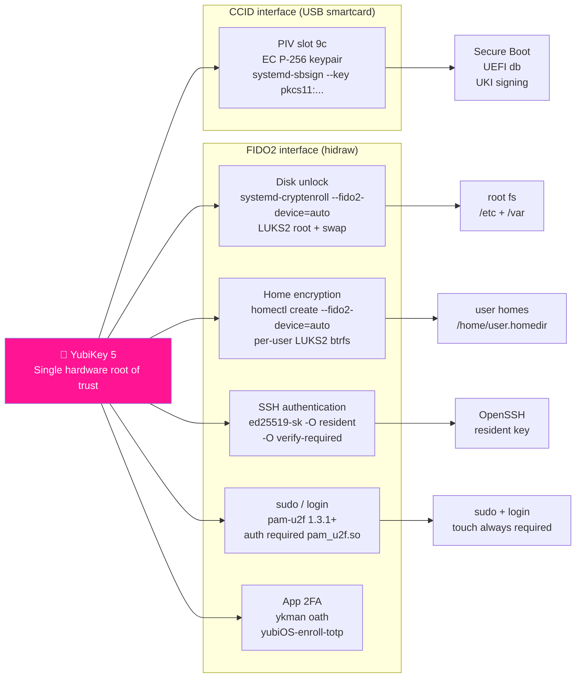

## Boot Flow

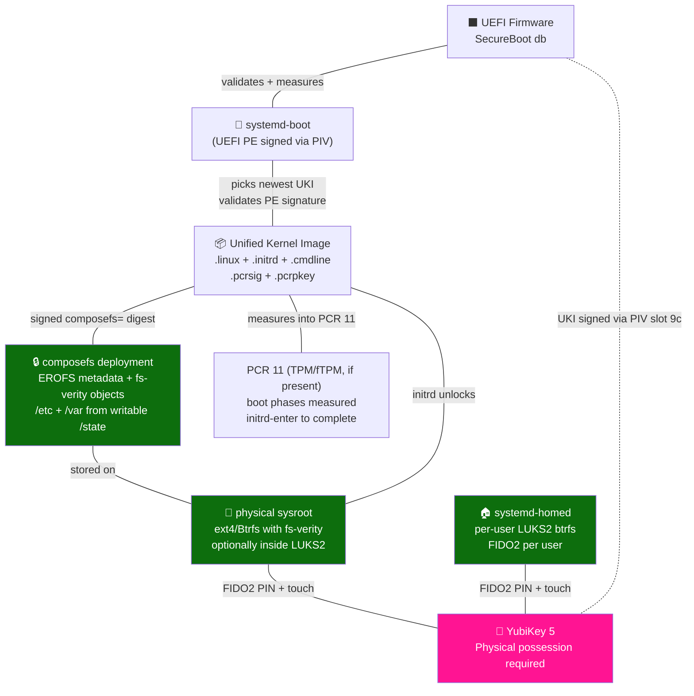

This diagram is the sealed bootc target. Native bootc composefs uses
fs-verity-protected files and an EROFS metadata image inside a writable
physical sysroot; it does not use a dm-verity EROFS root partition. The
separate mkosi/systemd-repart image path may use dm-verity for fixed partition
images. The current `to-filesystem` workflow validates strict fs-verity through
a traditional BLS entry and is therefore still an unsealed boot proof.

### ARM64 Primary Path

1. Boot ROM verifies an owner-burned ROTPK hash when the board supports Path A.
2. TF-A BL1/BL2 verify BL31, OP-TEE BL32, and U-Boot BL33.
3. OP-TEE hosts StandaloneMM and the fTPM trusted application; RPMB backs secure variables and TPM NV state on production boards.
4. U-Boot provides UEFI services, Secure Boot variable handling, and measured boot into the fTPM.
5. systemd-boot loads the same signed UKI used on x86-64.
6. In the sealed bootc target, the signed UKI binds the composefs digest and
   the bootc initramfs assembles the verified root from EROFS metadata and
   fs-verity objects. The separate mkosi path retains its dm-verity model.
7. Root, swap, and user homes unlock through YubiKey FIDO2 plus recovery material.

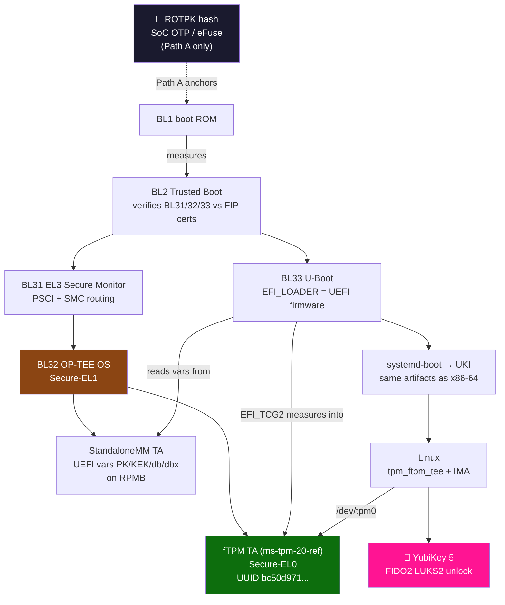

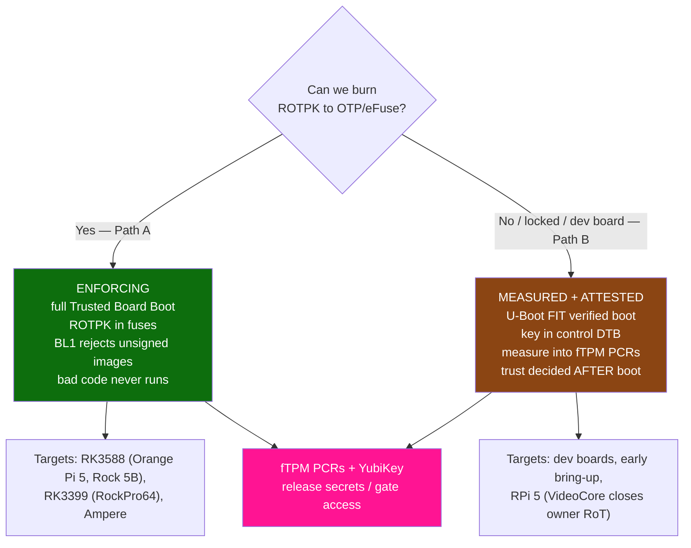

## Workflow-Built ARM64 Firmware Variants

`.github/workflows/ci_firmware-rk.yml` builds the same pinned secure-world components for three explicit variants on native amd64 and arm64 runners. StandaloneMM is built once per runner architecture plus a second clean ARM64 time with deterministic EDK2 stack-cookie inputs; each variant then selects its own TF-A platform, OP-TEE flavor, and U-Boot defconfig and also receives a clean `arm64-repro` build. A blocking job compares the intended unsigned components and retains board-scoped evidence before QEMU runs. Only the QEMU variant executes the emulated fTPM boot assertions; its randomly generated TF-A certificate envelope is recorded but excluded from equality, and compiling or publishing a board bundle is not physical-board proof.

| Variant | Workflow inputs and principal output | Evidence from run 29869527608 | Promotion boundary |
|---|---|---|---|
| `qemu-arm64` | TF-A `PLAT=qemu`, OP-TEE `vexpress-qemu_armv8a`, `qemu_arm64_defconfig`; `flash.bin` | Both runner architectures found the fTPM Early TA, functional TPM, and StandaloneMM SP with no known failure signatures. | CI baseline only; volatile emulated storage is not RPMB or owner-owned hardware. |
| `rock5b-rk3588` | TF-A `PLAT=rk3588`, OP-TEE `rockchip-rk3588`, `rock5b-rk3588_defconfig`; intended `u-boot-rockchip.bin` | Secure-world and U-Boot components compiled, but the log records no real RK3588 DDR/TPL blob and therefore no flashable `u-boot-rockchip.bin`. | Block publication/promotion as bootable firmware until a pinned, licensed, checksum-verified DDR/TPL input and real-board evidence exist. |
| `rockpro64-rk3399` | TF-A `PLAT=rk3399`, OP-TEE `rockchip-rk3399`, `rockpro64-rk3399_defconfig`; `u-boot-rockchip.bin` and SPI image | Native build artifacts include the combined Rockchip U-Boot images plus OP-TEE, StandaloneMM, and fTPM inputs. | Still needs physical boot, RPMB-backed variable/fTPM NV, ROTPK, recovery, and signed-UKI evidence. |

### QEMU ARM64 CI baseline

The QEMU path is the integration oracle for component wiring. It assembles `bl1.bin`, `fip.bin`, OP-TEE, StandaloneMM, the fTPM Early TA, and U-Boot into `flash.bin`; Stage 3 then boots that image and checks the secure- and normal-world logs. Its compatibility tags are `firmware-qemu-arm64[-<sha>]` plus `firmware[-<sha>]`.

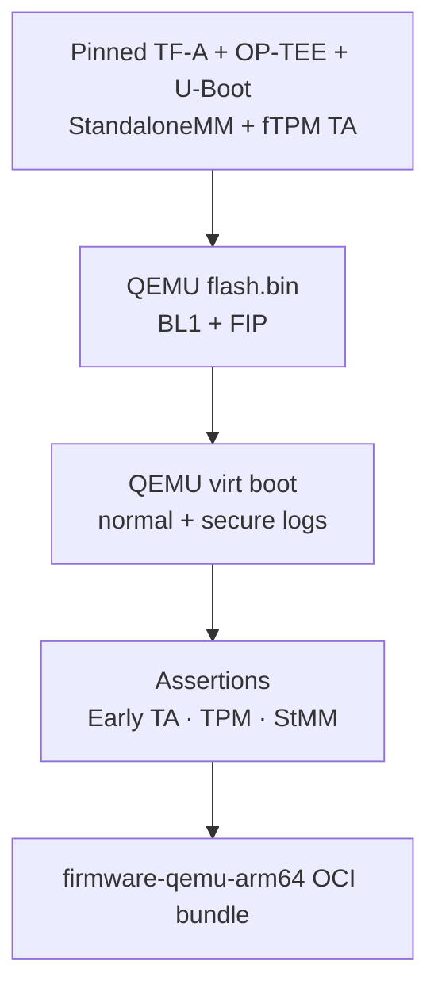

### Radxa ROCK 5B / RK3588 primary Path A lane

The workflow selects the RK3588 TF-A and OP-TEE platforms and the ROCK 5B U-Boot defconfig. U-Boot's RK3588 configuration requires an external DDR/TPL blob. In the reviewed run that input was absent, so `u-boot.bin` is useful diagnostic compile evidence but the expected combined `u-boot-rockchip.bin` was not produced. The current OCI bundle must not be described as flash-ready or as a Path A proof.

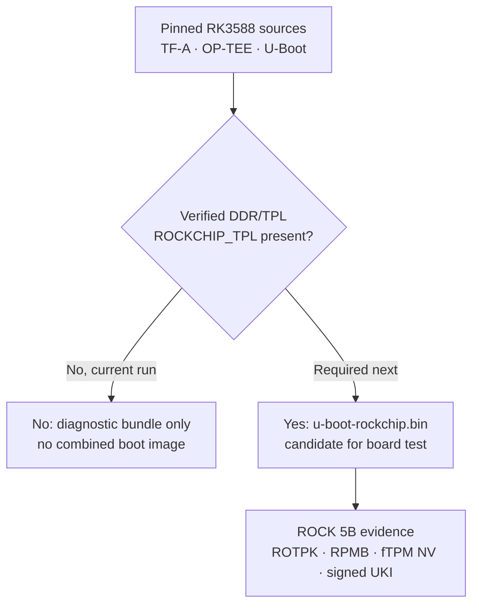

### ROCKPro64 / RK3399 supported secondary lane

The RK3399 lane currently produces `idbloader.img`, `u-boot.itb`, `u-boot-rockchip.bin`, and `u-boot-rockchip-spi.bin` alongside TF-A, OP-TEE, StandaloneMM, and fTPM material. Those files establish a board-specific build shape; the `firmware-rockpro64-rk3399[-<sha>]` bundle remains pre-production until a physical board proves the secure-storage and owner-root chain.

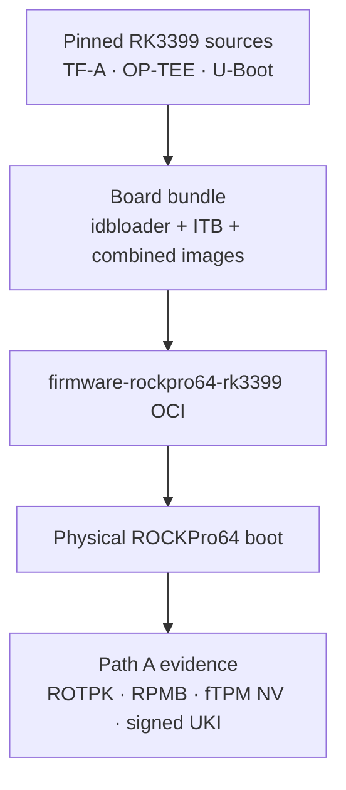

### x86-64 Supported Path

1. Owner-enrolled UEFI Secure Boot verifies systemd-boot and the signed UKI.
2. TPM measurement is used where available, but the TPM is not the owner-held identity root.
3. `/usr`, root, swap, and home follow the same immutable and FIDO2-gated runtime model as ARM64.

## Build And Distribution

The project keeps both build paths active:

| Path | Output | Purpose |
|---|---|---|
| bootc / OCI | `docker.io/0mniteck/yubios:latest`, `<sha>`, and test tags | Day-2 update stream and VM test source |
| mkosi | signed systemd-boot, UKI, and disk image | Installer validation plus retained ARM64 canonical unsigned-filesystem equality evidence; signature-bearing root/ESP wrappers are recorded separately |
| firmware OCI tags | `firmware-qemu-arm64`, `firmware-rock5b-rk3588`, `firmware-rockpro64-rk3399`, and per-commit variants | Variant-scoped ARM64 secure-world bundle publication |
| dev OCI tags | `dev`, `dev-<sha>` | TEST-only swu2f-enabled boot validation image |

### Practical bootc composefs build flow

The current published yubiOS image carries bootc 1.16.3 and a traditional
kernel/initramfs layout. The existing install workflow therefore proves a
strict composefs repository through an **unsealed BLS entry**. The production
sealed target starts when the pinned base provides the released bootc v1.16.4
split capability and the repository has a Secure Boot VM proof.

The practical sealed build has four isolation boundaries:

1. Build and policy-check the exact rootfs, then run
   `bootc container lint --fatal-warnings`.
2. Move the raw kernel and initramfs out with
   `bootc container split-kernel-and-rootfs --rootfs / --output /kernel`.
3. Derive a clean final-rootfs stage with neither `/kernel` nor raw
   `vmlinuz`/`initramfs.img`. Mount that tree at `/target` and the separate
   kernel-artifact tree at `/kernel` in a tools/signing stage.
4. Have bootc compute the composefs digest and pass it to `ukify`; sign the
   resulting UKI through the protected signing boundary and copy only the UKI
   into `/boot/EFI/Linux/` in the final image.

```sh
mapfile -t kernel_versions < <(
  find /kernel -mindepth 1 -maxdepth 1 -type d -printf '%f\n'
)
test "${#kernel_versions[@]}" -eq 1
kver="${kernel_versions[0]}"

bootc container ukify \
  --rootfs /target \
  --kernel-dir "/kernel/${kver}" \
  -- \
  --output "/out/${kver}.efi" \
  --signtool systemd-sbsign \
  --secureboot-private-key /run/secrets/secureboot_key \
  --secureboot-certificate /run/secrets/secureboot_cert
```

`--kernel-dir` belongs to bootc; everything after `--`, including `--output`,
belongs to `ukify`. `/target` must be the same clean rootfs that becomes the
final image. Every rootfs change produces a new composefs digest, so the UKI
must be regenerated and re-signed. Signing keys enter only as protected build
secrets or through external signing infrastructure.

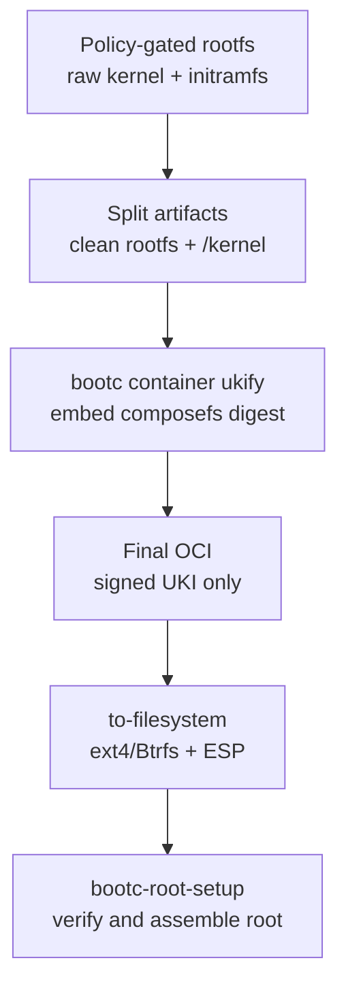

The installer prepares a writable ext4 filesystem with the `verity` feature
or a suitable Btrfs filesystem plus an ESP, then runs
`bootc install to-filesystem`. The installed physical sysroot contains
`/composefs/{images,objects,streams}` and `/state/deploy`: EROFS describes the
immutable metadata, fs-verity authenticates the metadata and content objects,
and writable `/etc` and `/var` state is assembled from `/state`. A signed
systemd-boot and signed UKI authenticate the digest anchor. Full promotion
also requires a Secure Boot boot test and a negative tamper test; offline
installation alone cannot prove the seal.

The command audit, current version gap, and promotion contract are recorded in
[the 2026-07-22 composefs research note](../refs/bootc-composefs-sealed-flow-2026-07-22.md).

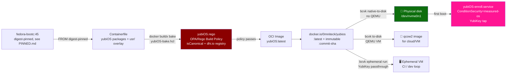

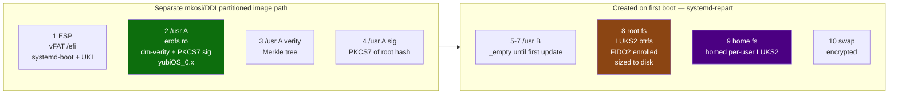

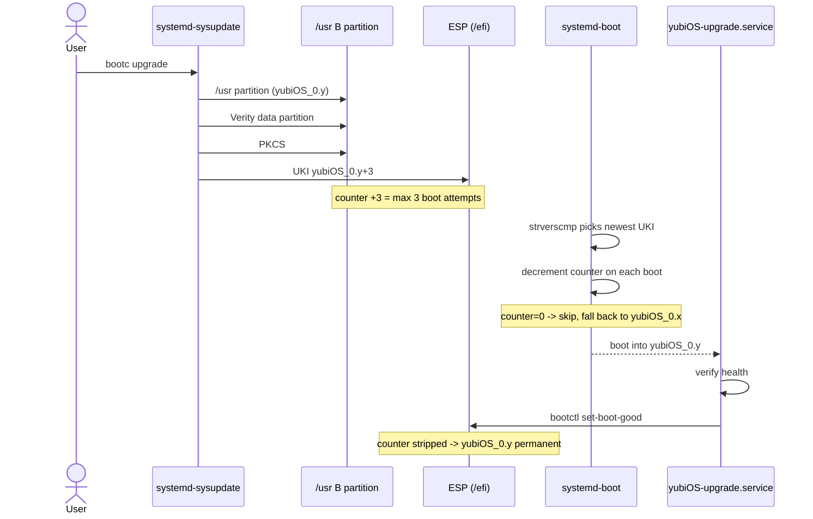

`PINNED.md` is the single source of truth for base-image digests and tool pins. Run-specific digests in old workflow logs or historical ADRs are evidence, not evergreen requirements.

## Version Requirements

| Component | Minimum / stance | Why |
|---|---|---|
| systemd | v261 target in current base | `ConditionSecurity=measured-os`, `systemd-tpm2-swtpm.service`, `systemd-sysinstall`, LUO/KHO research, and v261 planning work |
| systemd-sbsign | v257+ | Native PKCS#11 UKI signing path |
| pam-u2f | 1.3.1+ | Avoids CVE-2025-23013 bypass class |
| OpenSSL | 3.5+ for OpenSSL clients | Default hybrid `X25519MLKEM768` group |
| Go | 1.24+ for Go TLS clients | Default hybrid `X25519MLKEM768` group in `crypto/tls` |
| QEMU | Pinned by workflow | zstd EFI zboot boot compatibility is handled through the current pinned workaround |

### systemd hardening correction

The 2026-07-11 research cycle found one important wording bug: `RestrictFileSystems=` is not a new v261 directive. It is the older BPF-LSM filesystem-type limiter documented in `systemd.exec(5)`. systemd v261 added `RestrictFileSystemAccess=`, which should be evaluated separately. Documentation and future hardening audits should avoid gating `RestrictFileSystems=` on v261.

## First-Boot Services

| Service | Gate | Notes |
|---|---|---|
| `yubiOS-chipsec-firstboot.service` | `ConditionSecurity=measured-os`, `ConditionFirstBoot=yes` | One-shot firmware validation; raw hardware access is explicitly scoped |
| `yubiOS-enroll.service` | Measured boot expected | Enrolls owner YubiKey and recovery material after first boot |
| repart / install flow | DPS and systemd-repart | No traditional `/etc/fstab` installer model |

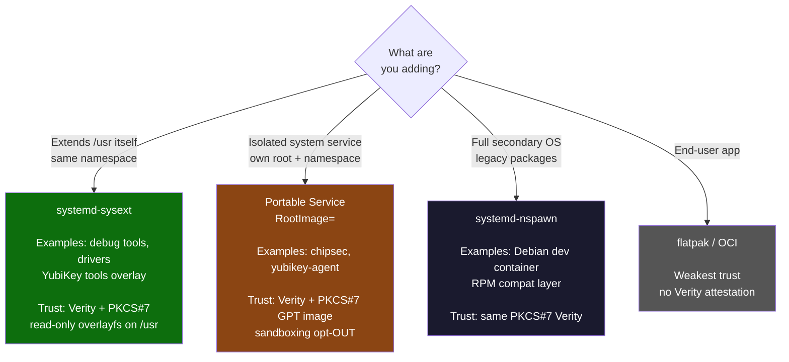

## Current Research Notes

The current evidence notes are [refs/bootc-composefs-sealed-flow-2026-07-22.md](../refs/bootc-composefs-sealed-flow-2026-07-22.md) for the composefs build and seal boundary, [refs/ci-evidence-2026-07-21.md](../refs/ci-evidence-2026-07-21.md) for the broader workflow state, and [refs/systemd-upstream-progress-2026-07-21.md](../refs/systemd-upstream-progress-2026-07-21.md) for the dated upstream snapshot. Historical planning context remains in [refs/planning-cycle-2026-07-11.md](../refs/planning-cycle-2026-07-11.md).

## Open Edges

- ARM64 Path A still needs real-board fuse/RPMB validation before being claimed as a production hardware route.
- The ROCK 5B bundle additionally needs a pinned, verified RK3588 DDR/TPL input before it is flashable; a successful component compile is not a boot-image claim.
- The zstd EFI zboot workaround should remain pinned and explicit until upstream QEMU behavior is available in the runner fleet.
- PQ TLS is satisfied by current OpenSSL and Go defaults, but CI should keep asserting it so a future base digest does not silently regress.
- Sealed bootc composefs promotion remains gated on a pinned base with the
  v1.16.4 split/ukify capabilities, protected UKI signing, Secure Boot boot
  evidence, and a negative fs-verity tamper test. The current BLS lane is
  strict but unsealed.
- The U-Boot FIDO2/U2F console gate remains idea-stage until the USB HID and recovery model are audited.


## Kernel+rootfs split (ADR-032)

yubiOS adopts the kernel+rootfs split as a first-class principle (ADR-032). The kernel (signed UKI) is published as a separate OCI artifact at `docker.io/0mniteck/yubios:uki-<sha>-<arch>`, alongside the bootc OS image (`latest`, `<sha>`) which carries the rootfs. The split is grounded in three pre-existing ADRs (006, 013, 022) and motivated by A/B-update granularity (only the rootfs or only the kernel moves per update), sharper reproducibility (each artifact independently pinable and attestable), and the bootc composefs fsverity chain's path to a sealed anchor (the BLS digest anchor must stay stable across rootfs-only changes).

The mkosi path produces the signed UKI as a side artifact of `mkosi build` via `--secure-boot-sign-tool systemd-sbsign` (ADR-008), anchored to the YubiKey PIV slot 9c via PKCS#11 (`provider:pkcs11`). The bootc install config `usr/lib/bootc/install/50-yubiOS.toml` now sets `[install] kargs` so bootc's auto-generated UKI uses the yubiOS standard cmdline (`root=dissect mount.usr=dissect rw audit=0`), matching the mkosi path per ADR-006's "both paths behave identically at runtime" principle.

The install-time BLSConfig wiring to use the pre-built UKI (the v1.16.3 `uki` key per PR [bootc-dev/bootc#2269](https://github.com/bootc-dev/bootc/pull/2269)) is staged as Phase 2 because bootc 1.16.3 has no project-authored BLSConfig drop-in intake. The `usr/lib/yubiOS/uki/install-uki.sh` script in this repo documents the install-time copy path (write the UKI to `/EFI/Linux/bootc/bootc_composefs-<digest>.efi` and a BLS `.conf` with the `uki` key) for the follow-up that wires it into either a bootc install hook or a first-boot systemd unit.

See [refs/kernel-rootfs-split-2026-07-29.md](../refs/kernel-rootfs-split-2026-07-29.md) for the upstream-source citations and the Phase 1/Phase 2 cut, and [ADR-032](ADR.md) for the policy decision.


## Continuous / adaptive coverage

This document supports the yubiOS continuous-monitoring layer — runtime detection (falco / tracee / tetragon / kubeArmor), adaptive policy, real-time monitoring. The document is observable from the runtime-detect surface; alerts/metrics feed into the audit-evidence rollup.
