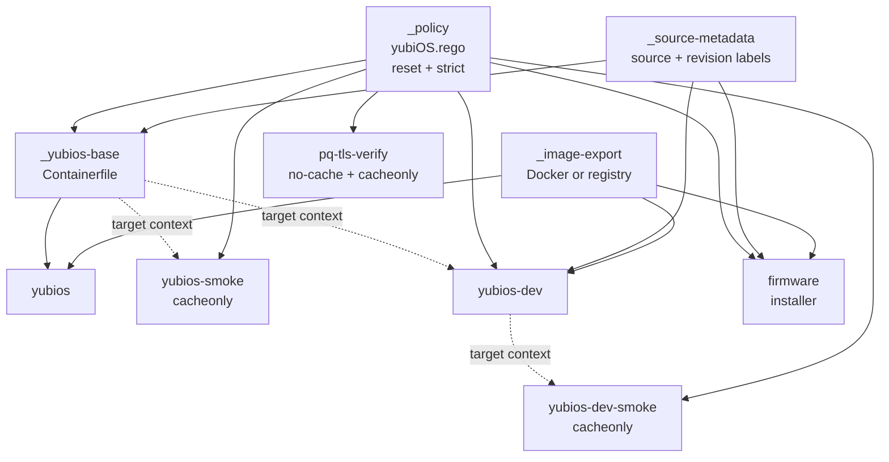
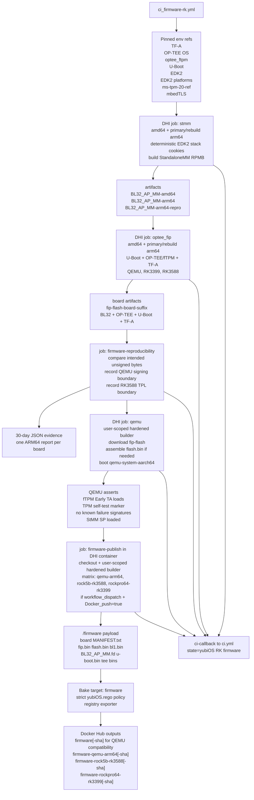
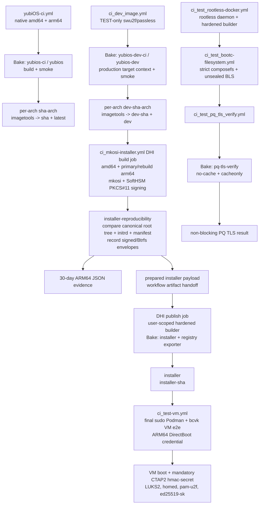
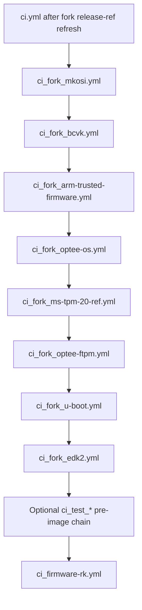
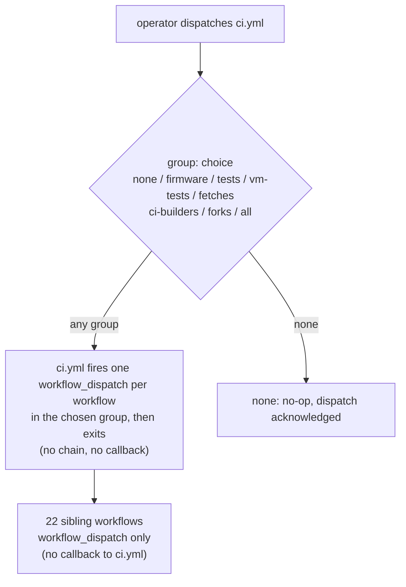
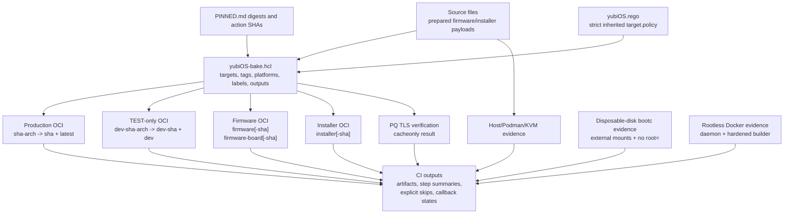
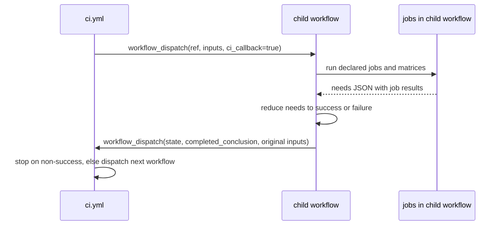

# CI_MAP.md

Regenerated from the `ci/group-routing-redesign` branch shape on 2026-07-29 UTC (PR #145).

Group-routing redesign (no-chain model): ci.yml now exposes a single `group:` choice input (none / firmware / tests / vm-tests / fetches / ci-builders / forks / all). Each value maps to a list of workflow files; ci.yml fires one independent `workflow_dispatch` per workflow in that group, then exits. There is **no state machine, no callback handoff, no chain**. The previous `ci_fork_run` and `ci_test_run` boolean flags and the four `*_Docker_push` per-sibling flags are removed. `Docker_push` propagates only to the builder workflows in a group (firmware, yubiOS-ci, ci_dev_image, ci_mkosi-installer); every other workflow ignores it. The legacy pass-through inputs (`Dev_Docker_push`, `Firmware_Docker_push`, `Installer_Docker_push`, `ci_fork_run`, `ci_test_run`, `vm_image`) and the 10-input `ci_*` callback contract are gone. The `firmware` group runs `ci_firmware-rk.yml` alone (no fetches preamble, no production/dev/installer follow-up). All 22 sibling workflows are `workflow_dispatch`-only -- the previous path-scoped `on: push:` triggers (used for self-edit validation and fork upstream-sync) are removed.

This map treats `.github/workflows/*.yml` as the source of truth for events, runners, jobs, artifacts, and callback handoffs. `yubiOS-bake.hcl` is the source of truth for every Docker build in the non-`ci_fork*` chain dispatched by `ci.yml`. `PINNED.md` remains the source of truth for approved action SHAs and image digests.

## Workflow Inventory

| Workflow file | Role | Main inputs | Main outputs |
|---|---|---|---|
| `.github/workflows/ci.yml` | Top-level dispatch router (no chain) | `group:` (none / firmware / tests / vm-tests / fetches / ci-builders / forks / all), `reason`, `target_ref`, `Docker_push` (propagated to firmware, yubiOS-ci, ci_dev_image, ci_mkosi-installer only) | Fires one `workflow_dispatch` per workflow in the chosen group's list, then exits |
| `.github/workflows/fetch-dhi-manifest.yml` | DHI base digest refresh | `dhi.io/debian-base:trixie-debian13-dev`, `PINNED.md` | Updated DHI digest refs committed by workflow when drift exists |
| `.github/workflows/fetch-fedora-bootc-manifest.yml` | Fedora bootc digest refresh | `quay.io/fedora/fedora-bootc:45`, `PINNED.md` | Updated Fedora bootc digest refs committed by workflow when drift exists |
| `.github/workflows/fetch-released-tag-ref.yml` | yubi-OS fork release-ref refresh | Nine fork/upstream mappings, stable-tag families, `PINNED.md` | Peeled release commits verified from each fork; all approved textual pins committed together when drift exists |
| `.github/workflows/ci_firmware-rk.yml` | Orchestrated ARM64/RK firmware integration, reproducibility, and publish lane | yubi-OS firmware forks, pinned refs, primary/rebuild ARM64 board matrices, `yubiOS-bake.hcl` | `BL32_AP_MM.fd`, `fip.bin`, `flash.bin`, board-scoped unsigned-component equality reports, QEMU verification, optional original and board-scoped firmware tags through Bake |
| `.github/workflows/yubiOS-ci.yml` | Production image build and publish | `Containerfile`, `yubiOS-bake.hcl`, `yubiOS.rego`, `usr/**`, unit tests | Bake build/smoke results; optional per-arch tags and multi-arch `0mniteck/yubios:<sha>` plus `latest` |
| `.github/workflows/ci_dev_image.yml` | TEST-only image with software FIDO2 | `Containerfile.dev`, production target context, `yubiOS-bake.hcl`, `yubiOS.rego` | Bake build/smoke results; optional `0mniteck/yubios:dev-<sha>` and `dev` |
| `.github/workflows/ci_mkosi-installer.yml` | mkosi disk image, ARM64 reproducibility proof, and installer artifact | `mkosi.conf`, `mkosi.conf.d/**`, `mkosi.finalize`, primary/rebuild ARM64 jobs, SoftHSM PKCS#11 mock, `yubiOS-bake.hcl` | signed UKI verification, canonical unsigned-root equality report with signed boot envelopes recorded separately, `yubiOS.raw.zst`, optional installer tags through Bake |
| `.github/workflows/ci_test_rootless-docker.yml` | Optional pre-image rootless Docker bootstrap validation | pinned Docker/Buildx downloads, pinned DHI container, amd64/arm64 matrix | rootless daemon and hardened Buildx builder verified across step boundaries, callback state |
| `.github/workflows/ci_test_bootc-filesystem.yml` | Optional pre-image external-image composefs regression smoke | resolved yubiOS image digest, disposable GPT disk, ext4 `verity` target, externally mounted `/mnt` and `/mnt/boot` | amd64/arm64 strict fs-verity composefs repository proof, EROFS metadata validation, unsealed BLS classification, omitted `root=`, callback state |
| `.github/workflows/ci_test_pq_tls_verify.yml` | Optional pre-image PQ hybrid TLS drift check | `yubiOS-bake.hcl`, `yubiOS.rego`, pinned DHI base, live TLS endpoint | uncached, non-blocking Bake verification result, callback state |
| `.github/workflows/ci_test-vm.yml` | Final VM e2e test when `ci_test_run=true` | pullable TEST-only yubiOS image, bcvk source, Podman storage, VM scripts | bcvk capability gate, DirectBoot SSH credential transport, mandatory CTAP2/LUKS2/homed/ed25519-sk assertions, callback state |
| `.github/workflows/ci_fork_*.yml` | Optional fork component checks | immutable yubi-OS release or approved release-descendant commits | component build/lint/test artifacts and callback state |

The older `ci_int_stmm.yml`, `ci_int_optee_fip.yml`, and `ci_int_qemu.yml` lane names are not separate files on current `main`. Their StMM, OP-TEE/FIP, and QEMU stages are embedded in the firmware integration workflows.

## Top-Level Dispatch Router (no chain)

`ci.yml` is a thin dispatch router. When called with `group=<name>`, it fires one `workflow_dispatch` per workflow in that group's list and exits. There is **no state machine, no callback, no chain**. Workflows in a group do not depend on each other; each runs independently from its own dispatch call.

Group-routing redesign (no-chain model): the single `group:` choice input decides which list of workflows gets dispatched. The previous `ci_fork_run` and `ci_test_run` boolean flags and the four `*_Docker_push` per-sibling flags are removed; the 10-input `ci_*` callback contract is removed too. `Docker_push` propagates only to the four builder workflows in a group (firmware, yubiOS-ci, ci_dev_image, ci_mkosi-installer); every other workflow receives `Docker_push=false` and ignores it.

| group | workflows dispatched (each independently) | publishes with `Docker_push=true` |
|---|---|---|
| `none` | — (no dispatch) | — |
| `firmware` | `ci_firmware-rk.yml` | firmware bundle |
| `tests` | `ci_test_rootless-docker.yml`, `ci_test_bootc-filesystem.yml`, `ci_test_pq_tls_verify.yml` | — |
| `vm-tests` | `ci_test-vm.yml`, `ci_test-vgpu-vm.yml` | — |
| `fetches` | `fetch-dhi-manifest.yml`, `fetch-fedora-bootc-manifest.yml`, `fetch-released-tag-ref.yml` | — |
| `ci-builders` | `yubiOS-ci.yml`, `ci_dev_image.yml`, `ci_mkosi-installer.yml` (firmware is its own group) | production + dev + installer |
| `forks` | `ci_fork_mkosi.yml`, `ci_fork_bcvk.yml`, `ci_fork_arm-trusted-firmware.yml`, `ci_fork_optee-os.yml`, `ci_fork_ms-tpm-20-ref.yml`, `ci_fork_optee-ftpm.yml`, `ci_fork_u-boot.yml`, `ci_fork_edk2.yml` | — |
| `all` | union of firmware, tests, vm-tests, fetches, ci-builders, forks | firmware, production, dev, installer |

```mermaid
flowchart TD
    start["ci.yml dispatch step"]
    pick{"group: choice"}
    none_path["none\nno dispatch"]
    firmware_path["firmware\n[ci_firmware-rk]"]
    tests_path["tests\n[rootless-docker, bootc-filesystem, pq-tls-verify]\n(3 independent dispatches)"]
    vm_tests_path["vm-tests\n[ci_test-vm, ci_test-vgpu-vm]\n(2 independent dispatches)"]\n    fetches_path["fetches\n[dhi, fedora-bootc, released-tag]\n(3 independent dispatches)"]\n    ci_builders_path["ci-builders\n[yubiOS-ci, ci_dev_image, ci_mkosi-installer]\n(3 independent dispatches)"]\n    forks_path["forks\n[8 ci_fork_*]\n(8 independent dispatches)"]\n    all_path["all\nunion of every group\n(20 independent dispatches)"]\n    done["exit"]\n\n    start --> pick\n    pick -- "none" --> none_path --> done\n    pick -- "firmware" --> firmware_path --> done\n    pick -- "tests" --> tests_path --> done\n    pick -- "vm-tests" --> vm_tests_path --> done
    pick -- "fetches" --> fetches_path --> done
    pick -- "ci-builders" --> ci_builders_path --> done
    pick -- "forks" --> forks_path --> done
    pick -- "all" --> all_path --> done
```

Each workflow runs as a standalone run from its own `workflow_dispatch` call. There is no callback handoff, no `state` propagation, no `completed_conclusion` propagation, and no `ci_*` input contract. To re-run a workflow, dispatch `ci.yml` again with the same group (or dispatch the workflow directly with its own inputs).

## Canonical Docker Bake Graph

The merged `yubiOS-bake.hcl` replaces workflow-local `docker build` and `docker buildx build` commands in every non-fork workflow dispatched by `ci.yml`. GitHub Actions still owns event handling, runner selection, Docker/Buildx installation, active-builder selection, artifact transfer, host/Podman/KVM work, and final multi-architecture index assembly. The design rationale and Docker primary-source trail are recorded in [the Bake consolidation note](../refs/docker-bake-consolidation-2026-07-17.md).

Four hidden targets provide the shared contract:

- `_policy` loads exactly one `yubiOS.rego` policy with `reset=true` and `strict=true`;
- `_source-metadata` supplies the source and revision OCI labels;
- `_image-export` selects Docker output with provenance and BuildKit manifest-list
  mode disabled when `PUSH=false` (the local image store accepts only a single
  image manifest), and registry output with both retained when `PUSH=true`; and
- `_yubios-base` defines the pinned production `Containerfile` build consumed by production and dev targets.



| Workflow | CI target/group | Explicit publication target | Builder ownership |
|---|---|---|---|
| `yubiOS-ci.yml` | `yubios-ci` (`yubios` + `yubios-smoke`) | `yubios` | Containerized job creates `hardened` with the digest-pinned BuildKit daemon |
| `ci_dev_image.yml` | `yubios-dev-ci` (`yubios-dev` + `yubios-dev-smoke`) | `yubios-dev` | Containerized job creates `hardened` with the digest-pinned BuildKit daemon |
| `ci_firmware-rk.yml` | None unless publication is requested | `firmware` | Build/publish jobs use the pinned DHI and digest-pinned BuildKit daemon; the DHI comparison job consumes retained build artifacts without another image build |
| `ci_mkosi-installer.yml` | DHI-contained mkosi validation, ARM64 comparison, and artifact handoff | `installer` | Build and publication jobs use the pinned DHI and digest-pinned BuildKit daemon; the DHI proof job compares retained component records without another image build |
| `ci_test_pq_tls_verify.yml` | `pq-tls-verify` | None; output is `cacheonly` | Containerized job creates `hardened` with the digest-pinned BuildKit daemon |

Production and dev publication remains a two-stage operation: native runners publish immutable per-architecture tags through Bake, then existing `imagetools` jobs create the `<sha>`/`latest` and `dev-<sha>`/`dev` multi-architecture indexes. Firmware and installer targets publish directly with the registry exporter from privileged DHI container jobs that check out the policy-bound Bake definition and explicitly select their user-scoped `hardened` builders.

Every material target receives the source commit epoch and deterministic Bake
exporter contract. The ARM64 production and dev jobs additionally build their
real subject twice with isolated no-cache builders, compare canonical OCI
layouts, assert config/history timestamps, and retain JSON evidence. Firmware
preseeds deterministic EDK2 stack cookies, rebuilds StandaloneMM and every board
in a second clean ARM64 job, compares the intended unsigned components, and
retains one report per board. Installer signatures, QEMU's random TF-A signing
envelope, and the external-TPL-dependent RK3588 final image remain explicitly
outside byte equality.

## ARM64/RK Firmware Integration

`ci_firmware-rk.yml` is the orchestrated firmware lane. Every stage runs in the pinned multi-arch DHI container. Build, QEMU, and publication stages install Docker/Buildx through the shared `wcurl` pattern and create a user-scoped `hardened` builder; the comparison stage needs only Python and the retained artifacts. The workflow preserves the firmware integration shape and adds clean `arm64-repro` StandaloneMM and per-board jobs. A blocking comparison records exact unsigned-component equality before QEMU executes. Publication then prepares one board payload per matrix entry and invokes the Bake `firmware` target with `PUSH=true` when requested. The QEMU board retains the compatibility `firmware` tags; every publishable board receives board-scoped tags.



The removed `ci_test-int.yml` workflow remains historical context only; `ci.yml` dispatches `ci_firmware-rk.yml` and waits for its `yubiOS RK firmware` callback state.

## TEST, Production, Dev, Installer, and Final VM Lanes



The VM lane intentionally remains outside Bake. bcvk hardcodes Podman for its privileged ephemeral container and reads from Podman's local image store, so the workflow pulls the selected image with `sudo podman`. Guest SSH runs from inside that outer container. For ARM64 DirectBoot, the public root key is delivered without firmware through systemd's kernel-command-line `tmpfiles.extra` credential path. The TEST image pins passless v0.11.2 to an immutable commit and enables soft-fido2's implemented `hmac-secret` extension during the build. Once it boots, passless/CTAP2 enumeration and the LUKS2, homed, pam-u2f, and OpenSSH security-key operations are hard assertions rather than skip-tolerant coverage.

The installer self-change push trigger runs amd64 plus two clean ARM64 mkosi builds without publishing. The blocking proof compares a canonical record of root filesystem bytes and intended metadata plus the initrd and package manifest, while recording the random signing envelope and Btrfs block serialization. Only a `workflow_dispatch` with `Docker_push=true` uploads the primary prepared `inst/installer` payload after that proof, hands it to the containerized publish job, and packages it through the policy-bound Bake `installer` target.

## Optional Fork Component CI

When dispatched as part of `group=forks` or `group=all`, `ci.yml` runs the fork component workflows before the optional pre-image TEST chain and firmware integration. They validate immutable release or approved release-descendant commits fetched from yubi-OS forks but do not stitch a full firmware image; stitching happens in `ci_firmware-rk.yml`.

Group-routing redesign (PR #145): fork runs are manual-only -- the 4 forks that previously auto-refreshed on upstream changes via path-scoped `on: push:` triggers (`ci_fork_arm-trusted-firmware.yml`, `ci_fork_bcvk.yml`, `ci_fork_ms-tpm-20-ref.yml`, `ci_fork_u-boot.yml`) now require a manual dispatch of the `forks` group to re-pin upstream fork refs.



## Trigger Policy (group-routing redesign)

All 22 sibling workflows are `workflow_dispatch`-only. The previous path-scoped `on: push:` triggers -- which previously served as self-edit validation (path-scoped to `.github/workflows/<self>.yml`) and as fork upstream-sync auto-runs (path-scoped to fork-source paths on 4 forks) -- are removed in PR #145. There is no longer a callback contract: workflows do not dispatch back to `ci.yml`. Each workflow runs as a standalone run from its own `workflow_dispatch` call.

To validate a workflow edit: dispatch `ci.yml` with the appropriate `group:` choice, which fans out to that group's workflows as independent dispatches (no chain). Fork upstream-sync no longer auto-runs on upstream changes -- dispatch the `forks` group to re-pin upstream refs.



Behavior changes documented in PR #145 body:

- 22 siblings: removed path-scoped `on: push:` (was self-edit validation + fork upstream-sync).
- 4 forks (`ci_fork_arm-trusted-firmware.yml`, `ci_fork_bcvk.yml`, `ci_fork_ms-tpm-20-ref.yml`, `ci_fork_u-boot.yml`) lose their upstream-sync auto-runs.
- 3 standalone workflows (`ci_test-ftpm-tpm0.yml`, `ci_test-fedora-bootc-arm64-pull.yml`, `ci_test-vgpu-vm.yml`) remain reachable only via individual `workflow_dispatch` -- they're tagged "tests" / "vm-tests" by filename taxonomy but are not in any group chain.

## Artifact and Registry Output Map



## Callback Contract

Every orchestrated child workflow accepts the same internal callback fields, including the carried `ci_fork_run` and `ci_test_run` choices. The child workflow computes an aggregate result from `needs`, then dispatches `ci.yml` so the state machine can proceed. `state` is the workflow display name from `github.workflow`, not necessarily the filename; for example, the installer reports `yubiOS mkosi-installer`, which is the exact state matched by current `ci.yml`.



## Workflow Job and Step Tree

The exact dispatch order is defined by the state-machine graph above. The detailed job trees below are grouped by lane for readability. Each job contains every declared `jobs.<job>.steps` entry in execution order. Matrix jobs are shown once; job and step `if` conditions still determine whether an entry runs for a particular event or matrix leg. GitHub-generated setup and cleanup operations are not declared workflow steps and are omitted.

- Workflow details
  - [`ci.yml`](../.github/workflows/ci.yml) — workflow: `CI`
    - Job `dispatch-next` — `Dispatch next workflow from current state`
      - Step 1: `Resolve and dispatch next workflow`
  - [`fetch-dhi-manifest.yml`](../.github/workflows/fetch-dhi-manifest.yml) — workflow: `fetch-dhi-manifest`
    - Job `fetch` — `fetch`
      - Step 1: `Checkout yubiOS for PINNED.md update`
      - Step 2: `Fetch dhi.io Debian base manifest and update pinned refs`
    - Job `ci-callback` — `Callback to ci.yml orchestrator`
      - Step 1: `Report current state to ci.yml`
  - [`fetch-fedora-bootc-manifest.yml`](../.github/workflows/fetch-fedora-bootc-manifest.yml) — workflow: `fetch-fedora-bootc-manifest`
    - Job `fetch` — `fetch`
      - Step 1: `Checkout yubiOS for PINNED.md update`
      - Step 2: `Fetch Fedora bootc manifest and update pinned refs`
    - Job `ci-callback` — `Callback to ci.yml orchestrator`
      - Step 1: `Report current state to ci.yml`
  - [`fetch-released-tag-ref.yml`](../.github/workflows/fetch-released-tag-ref.yml) — workflow: `fetch-released-tag-ref`
    - Job `fetch-release-refs` — `Resolve upstream releases and verify fork refs`
      - Step 1: `Checkout yubiOS for fork-ref updates`
      - Step 2: `Fetch release tags, verify fork objects, and update pins`
    - Job `ci-callback` — `Callback to ci.yml orchestrator`
      - Step 1: `Report current state to ci.yml`
  - [`ci_firmware-rk.yml`](../.github/workflows/ci_firmware-rk.yml) — workflow: `yubiOS RK firmware`
    - Job `stmm` — `Stage 1 - BL32_AP_MM.fd (StandaloneMM RPMB, AARCH64) ${{ matrix.artifact_suffix }}`
      - Step 1: `Install git for checkout and reproducibility`
      - Step 2: `Checkout`
      - Step 3: `Resolve reproducible build environment`
      - Step 4: `Install docker CLI + buildx (${{ matrix.arch }})`
      - Step 5: `Install EDK2 build deps`
      - Step 6: `Clone edk2 + edk2-platforms`
      - Step 7: `Resolve AARCH64 cross prefix`
      - Step 8: `Build BaseTools`
      - Step 9: `Build StandaloneMM RPMB platform`
      - Step 10: `Stage BL32_AP_MM.fd`
      - Step 11: `Upload BL32_AP_MM.fd`
    - Job `optee_fip` — `Stage 2 - ${{ matrix.board }} OP-TEE/TF-A/U-Boot ${{ matrix.artifact_suffix }}`
      - Step 1: `Install git for checkout and reproducibility`
      - Step 2: `Checkout`
      - Step 3: `Resolve reproducible build environment`
      - Step 4: `Install docker CLI + buildx (${{ matrix.arch }})`
      - Step 5: `Install full ARM64 firmware toolchain`
      - Step 6: `Download BL32_AP_MM.fd from stmm job`
      - Step 7: `Clone U-Boot and stage yubiOS fTPM fragment`
      - Step 8: `Build QEMU U-Boot BL33`
      - Step 9: `Stage StMM artifact`
      - Step 10: `Build OP-TEE TA dev kit`
      - Step 11: `Build fTPM TA`
      - Step 12: `Rebuild OP-TEE BL32 folding fTPM Early TA and StMM`
      - Step 13: `Build TF-A trusted firmware`
      - Step 14: `Verify FIP contents`
      - Step 15: `Build Rockchip U-Boot board image`
      - Step 16: `Write firmware artifact manifest`
      - Step 17: `Upload fip + flash artifacts`
    - Job `firmware-reproducibility` — `Stage 2 proof - ${{ matrix.board }} unsigned components (arm64)`
      - Step 1: `Install git for checkout and reproducibility`
      - Step 2: `Checkout`
      - Step 3: `Resolve reproducible build environment`
      - Step 4: `Clean firmware proof workspace`
      - Step 5: `Download primary StandaloneMM artifact`
      - Step 6: `Download rebuilt StandaloneMM artifact`
      - Step 7: `Download primary board artifact`
      - Step 8: `Download rebuilt board artifact`
      - Step 9: `Prove two clean firmware component builds match`
      - Step 10: `Retain firmware reproducibility evidence`
    - Job `qemu` — `Stage 3 - QEMU fTPM e2e (${{ matrix.arch }})`
      - Step 1: `Install git for checkout and reproducibility`
      - Step 2: `Checkout`
      - Step 3: `Resolve reproducible build environment`
      - Step 4: `Install docker CLI + buildx (${{ matrix.arch }})`
      - Step 5: `Install QEMU + TPM tooling`
      - Step 6: `Clean QEMU artifact directory`
      - Step 7: `Download fip/flash from optee_fip job`
      - Step 8: `Resolve or assemble flash.bin`
      - Step 9: `Boot stitched image under QEMU and assert fTPM markers`
      - Step 10: `Loud skip when no bootable image exists`
    - Job `firmware-publish` — `Stage 4 - Publish firmware bundle (${{ matrix.board }})`
      - Step 1: `Install git for checkout and reproducibility`
      - Step 2: `Checkout`
      - Step 3: `Resolve reproducible build environment`
      - Step 4: `Clean firmware publish workspace`
      - Step 5: `Download firmware artifacts (native arm64 build)`
      - Step 6: `RK3588 TPL publish gate`
      - Step 7: `Install docker CLI + buildx`
      - Step 8: `Assemble board-scoped /firmware payload`
      - Step 9: `Log in to Docker Hub`
      - Step 10: `Build and push firmware OCI artifact through Bake`
      - Step 11: `Verify pushed board tag`
    - Job `ci-callback` — `Callback to ci.yml orchestrator`
      - Step 1: `Report current state to ci.yml`
  - [`yubiOS-ci.yml`](../.github/workflows/yubiOS-ci.yml) — workflow: `yubiOS CI`
    - Job `shellcheck` — `shellcheck`
      - Step 1: `Checkout`
      - Step 2: `shellcheck`
    - Job `hadolint` — `hadolint`
      - Step 1: `Checkout`
      - Step 2: `hadolint (Containerfile lint)`
    - Job `unit-tests` — `unit-tests`
      - Step 1: `Checkout`
      - Step 2: `Install test dependencies`
      - Step 3: `Run unit tests (${{ matrix.arch }})`
    - Job `mkosi` — `mkosi`
      - Step 1: `Checkout`
      - Step 2: `Install mkosi (from yubi-OS fork)`
      - Step 3: `Validate mkosi config (${{ matrix.arch }})`
    - Job `build` — `build`
      - Step 1: `Checkout`
      - Step 2: `Resolve reproducible build environment`
      - Step 3: `Install docker CLI + buildx (${{ matrix.arch }})`
      - Step 4: `Log in to Docker Hub`
      - Step 5: `Build OCI image (${{ matrix.arch }})`
      - Step 6: `Prove two clean production OCI builds match`
      - Step 7: `Retain production reproducibility evidence`
      - Step 8: `Push per-arch image (${{ matrix.arch }})`
    - Job `merge-manifest` — `merge-manifest`
      - Step 1: `Install docker CLI + buildx`
      - Step 2: `Log in to Docker Hub`
      - Step 3: `Create + push multi-arch manifest`
      - Step 4: `Verify manifest list`
    - Job `ci-callback` — `Callback to ci.yml orchestrator`
      - Step 1: `Report current state to ci.yml`
  - [`ci_dev_image.yml`](../.github/workflows/ci_dev_image.yml) — workflow: `yubiOS dev/test image (swu2f, ADR-026)`
    - Job `build` — `build`
      - Step 1: `Checkout`
      - Step 2: `Resolve reproducible build environment`
      - Step 3: `Install docker CLI + buildx (${{ matrix.arch }})`
      - Step 4: `Log in to Docker Hub`
      - Step 5: `Build and verify dev/test image (${{ matrix.arch }})`
      - Step 6: `Prove two clean dev OCI builds match`
      - Step 7: `Retain dev reproducibility evidence`
      - Step 8: `Push per-arch dev image (${{ matrix.arch }})`
    - Job `merge-manifest` — `merge-manifest`
      - Step 1: `Install docker CLI + buildx`
      - Step 2: `Log in to Docker Hub`
      - Step 3: `Guard dev/test manifest tags`
      - Step 4: `Create + push multi-arch dev manifest`
      - Step 5: `Verify manifest list`
    - Job `ci-callback` — `Callback to ci.yml orchestrator`
      - Step 1: `Report current state to ci.yml`
  - [`ci_test-vm.yml`](../.github/workflows/ci_test-vm.yml) — workflow: `yubiOS VM e2e (tests/vm)`
    - Job `lint-vm-scripts` — `lint-vm-scripts`
      - Step 1: `Checkout`
      - Step 2: `shellcheck + bash -n on tests/vm/*.sh`
    - Job `vm-e2e` — `vm-e2e`
      - Step 1: `Checkout`
      - Step 2: `Free disk space (self-hosted rock1 persists disk across runs -- unlike hosted runners)`
      - Step 3: `Install host deps (swtpm + qemu + fido2 + cryptsetup)`
      - Step 4: `Install zstd-capable QEMU for ARM64 DirectBoot`
      - Step 5: `Disk space before bcvk build (diagnostic)`
      - Step 6: `Free disk space (pre-build -- kill stray containers from an aborted prior run)`
      - Step 7: `Build bcvk @ pinned source (feasibility gate)`
      - Step 8: `Disk space after bcvk build attempt (diagnostic)`
      - Step 9: `Gate on KVM (bcvk hard-requires /dev/kvm; now real hardware on arm64 via self-hosted rock1)`
      - Step 10: `Gate amd64 boot leg on platform-priority policy (ADR-023: ARM64 is primary)`
      - Step 11: `Assert bcvk exposes --swtpm/--swu2f (real regression gate)`
      - Step 12: `Free disk space (pre-pull -- reclaim space the cargo build just used)`
      - Step 13: `Pull yubiOS image into podman storage (bcvk boots from local storage)`
      - Step 14: `Relax AppArmor profiles for bcvk VM boot`
      - Step 15: `Run tests/vm/test-luks-fido2-ci.sh (boot leg gated on image availability)`
      - Step 16: `Run tests/vm/test-fido2-enrollment.sh (enrollment surface,`
      - Step 17: `Free disk space (post-run -- leave rock1 clean for the next run)`
      - Step 18: `Note hardware-only variant (lint-only in CI)`
    - Job `ci-callback` — `Callback to ci.yml orchestrator`
      - Step 1: `Report current state to ci.yml`
  - [`ci_mkosi-installer.yml`](../.github/workflows/ci_mkosi-installer.yml) — workflow: `yubiOS mkosi-installer`
    - Job `build` — `mkosi disk image — SoftHSM PKCS#11 signed UKI (${{ matrix.artifact_suffix }})`
      - Step 1: `Install git for checkout and reproducibility`
      - Step 2: `Checkout`
      - Step 3: `Resolve reproducible build environment`
      - Step 4: `Install docker CLI + buildx (${{ matrix.arch }})`
      - Step 5: `Install mkosi build deps + mkosi (pinned yubi-OS fork)`
      - Step 6: `SoftHSM token in /run — mock of YubiKey PIV slot 9c`
      - Step 7: `Build disk image (minimal profile, PKCS#11-signed UKI)`
      - Step 8: `Verify UKI is signed by the PKCS#11 (SoftHSM) key`
      - Step 9: `Assemble /installer payload + MANIFEST`
      - Step 10: `Record unsigned installer subjects and signing boundary`
      - Step 11: `Upload installer reproducibility subject`
      - Step 12: `Upload prepared installer payload`
    - Job `installer-reproducibility` — `Prove unsigned mkosi installer subjects (arm64)`
      - Step 1: `Install git for checkout and reproducibility`
      - Step 2: `Checkout`
      - Step 3: `Resolve reproducible build environment`
      - Step 4: `Install verification runtime`
      - Step 5: `Download primary installer subject`
      - Step 6: `Download rebuilt installer subject`
      - Step 7: `Prove two clean unsigned installer builds match`
      - Step 8: `Retain installer reproducibility evidence`
    - Job `installer-publish` — `Publish installer OCI artifact (${{ matrix.arch }})`
      - Step 1: `Install git for checkout and reproducibility`
      - Step 2: `Checkout`
      - Step 3: `Resolve reproducible build environment`
      - Step 4: `Download prepared installer payload`
      - Step 5: `Install docker CLI + buildx (${{ matrix.arch }})`
      - Step 6: `Build and push installer OCI artifact through Bake`
    - Job `merge-manifest` — `Merge installer multi-arch manifest`
    - Job `ci-callback` — `Callback to ci.yml orchestrator`
      - Step 1: `Report current state to ci.yml`
  - [`ci_test_pq_tls_verify.yml`](../.github/workflows/ci_test_pq_tls_verify.yml) — workflow: `TEST - PQ hybrid TLS verification (ADR-025)`
    - Job `pq-tls-verify` — `pq-tls-verify`
      - Step 1: `Checkout`
      - Step 2: `Resolve reproducible build environment`
      - Step 3: `Install docker CLI + buildx`
      - Step 4: `Verify PQ hybrid TLS through the policy-bound Bake target`
    - Job `ci-callback` — `Callback to ci.yml orchestrator`
      - Step 1: `Report current state to ci.yml`

## Pre-Image TEST Workflow Detail and Self-Change Evidence

When dispatched as part of `group=tests` (or `group=all`), these workflows run after the optional `ci_fork_*` chain and before any image build. Group-routing redesign (PR #145): the narrow `on: push:` self-change triggers are removed -- pre-image TEST workflows are `workflow_dispatch`-only. Maintainers dispatch each workflow manually (either via `ci.yml/dispatches` with `group=tests`, or via the workflow's own `workflow_dispatch` button).

Initial self-change evidence is green: [bootc install run 29884493346](https://github.com/yubi-OS/yubiOS/actions/runs/29884493346) passed the amd64 and arm64 disposable-disk legs, and [rootless Docker run 29884493340](https://github.com/yubi-OS/yubiOS/actions/runs/29884493340) passed both architecture legs. The bootc run generated raw kernel/initramfs BLS entries with a strict `composefs=<128-hex digest>` and no `root=`. It is therefore evidence for enforced fs-verity through an unsealed BLS deployment, not for a signed-UKI seal.

The bootc filesystem workflow runs before the production build and resolves a
published image tag to an immutable digest. It is deliberately classified as
an external-image regression smoke, not a test of the checked-out commit.

- [`ci_test_bootc-filesystem.yml`](../.github/workflows/ci_test_bootc-filesystem.yml) — workflow: `TEST - bootc to-filesystem install e2e`
  - Job `install-to-filesystem` — `install-to-filesystem (${{ matrix.arch }})`, native amd64/arm64 matrix on fresh hosted VMs
    - Step 1: `Checkout`
    - Step 2: `Assert README install contract`
    - Step 3: `Prepare fresh externally partitioned target at /mnt` with ext4 `verity`
    - Step 4: `Resolve image digest and install with the README command`, reporting bootc sealed-build capabilities and checking the shipped initramfs
    - Step 5: `Verify strict composefs repository and unsealed BLS deployment`, including EROFS parsing, fs-verity measurement, rejected tamper, digest-bound BLS paths, and omitted `root=`
    - Step 6: `Detach disposable target`
  - Job `ci-callback` — `Callback to ci.yml orchestrator`
    - Step 1: `Report current state to ci.yml`
- [`ci_test_rootless-docker.yml`](../.github/workflows/ci_test_rootless-docker.yml) — workflow: `TEST - Rootless Docker bootstrap validation`
  - Job `rootless-docker` — native amd64/arm64 matrix inside the pinned privileged DHI container
    - Step 1: `Exercise rootless Docker bootstrap (${{ matrix.arch }})`
    - Step 2: `Verify rootless Docker across the step boundary (${{ matrix.arch }})`
  - Job `ci-callback` — `Callback to ci.yml orchestrator`
    - Step 1: `Report current state to ci.yml`


## Continuous / adaptive coverage

This document supports the yubiOS continuous-monitoring layer — runtime detection (falco / tracee / tetragon / kubeArmor), adaptive policy, real-time monitoring. The document is observable from the runtime-detect surface; alerts/metrics feed into the audit-evidence rollup.


## Segmentation coverage

This document applies the yubiOS segmentation primitive — Linux namespaces, cgroups, sandbox, isolation boundary, trust boundary, jail idioms (nsjail, bwrap, firejail), landlock, seccomp. The boundary is named; the trust-domain transition is documented.
