# yubi-OS/yubiOS — CI Architecture Map

> Regenerated 2026-10-06 from main `e46a3cb817c988185f97ff210c9b5577d8f83500`
> (tree `d45dd6f5915c20f1644ee7f8a18192c8a1041e02`). Modeled on
> [ENDPOINTS.md](ENDPOINTS.md): every YAML automation surface in the repo is
> inventoried, grouped into capability domains, and cross-checked against the live
> tracker. The `.yml` files are the source of truth; this document is the
> architectural reference. [ci-launchpad](https://ci-launchpad-55qejzzz.sauna.new/)
> (Sauna app, updated 2026-10-06) now tracks every `.yml` file in the repo live via
> a git-tree census. [PINNED.md](../PINNED.md) remains the source of truth for
> approved action SHAs and image digests; `yubiOS-bake.hcl` remains the source of
> truth for every Docker build in the non-`ci_fork*` chain.

## Census

| Measure | Count |
|---|---|
| `.yml` files in the repo | 40 |
| GitHub Actions workflows (`.github/workflows/*.yml`) | 39 |
| Non-workflow YAML (`.github/FUNDING.yml`) | 1 |
| Workflows with `workflow_dispatch` | 39 |
| Scheduled workflows (`schedule:` cron) | 7 |
| Push-triggered workflows (branch/path-scoped) | 3 |
| Pull-request-triggered workflows (path-scoped) | 6 |
| `workflow_call`-callable workflows | 1 (`ci_test_sealed-uki-vm.yml`) |
| Total declared jobs across all workflows | 87 |
| Workflows in the ci.yml group taxonomy | 38 |
| Workflows outside ci.yml's own group lists | 1 (`ci.yml` itself) |
| Workflows outside every grouping (incl. ci-launchpad taxonomy) | 0 |
| ci.yml `all` group size (independent dispatches) | 38 |
| Largest workflow file | `ci_firmware-rk.yml` (69,375 B) |

Supersedes the 2026-09-18 drift-check addendum: that record flagged the map's
counts vs the 39-workflow census and deferred the content pass to "the next pass" —
this document is that pass. It also supersedes the 2026-10-05 map (main
`a8959116`): ci.yml's group taxonomy has since gained the `audits` and `research`
choices, and the PR-trigger count above is corrected from the prior map's 7 to the
actual 6 (only six workflows declare `pull_request` triggers). The prior
`group-routing-redesign` (PR #145) history (no-chain model, no callback contract)
is preserved below in condensed form.

## Capability Map

Eight dispatchable group domains — the eight non-`none` values of ci.yml's
`group` choice — plus the orchestrator and the non-workflow YAML cover the 39
workflows. Domain membership is by dispatch contract and blast radius, not
filename convention alone. As of 2026-10-06 every workflow on main is reachable
through a real ci.yml group choice (commit `e46a3cb8` added `audits` + `research`
and closed the last reachability orphans).

| Domain | ci.yml group | Workflows | Publishes |
|---|---|---|---|
| Orchestrator | — | `ci.yml` | nothing (fans out dispatches) |
| Image builders | `ci-builders` | `yubiOS-ci.yml`, `ci_dev_image.yml`, `ci_mkosi-installer.yml`, `ci_build-test-fixtures.yml` | production, dev, installer OCI + fixture image tags |
| Firmware lane | `firmware` | `ci_firmware-rk.yml` | firmware OCI (board-scoped) |
| Pre-image test chain | `tests` | `ci_test_rootless-docker.yml`, `ci_test_bootc-filesystem.yml`, `ci_test_pq_tls_verify.yml`, `ci_test-bootc-lifecycle.yml`, `ci_test-sysext-portable.yml`, `ci_test-fedora-bootc-arm64-pull.yml`, `ci_test-ftpm-tpm0.yml`, `diag_sign-matrix.yml` | nothing (evidence only) |
| VM e2e | `vm-tests` | `ci_test-vm.yml`, `ci_test-vgpu-vm.yml`, `ci_test_sealed-uki-vm.yml` | nothing (evidence only) |
| Fetches (pin refresh) | `fetches` | `fetch-dhi-manifest.yml`, `fetch-fedora-bootc-manifest.yml`, `fetch-released-tag-ref.yml` | commits to `PINNED.md` on drift |
| Fork component CI | `forks` | 8 × `ci_fork_*.yml` | nothing (build/lint/test artifacts) |
| Governance + drift guards | `audits` | `ci_token-audit.yml`, `ci_input-shape.yml`, `ci_dispatch-reachability.yml`, `ci_fork-drift-detect.yml`, `ci_package-floor.yml` | issues/exit codes on drift |
| Research CI | `research` | `lean-check.yml`, `lean-run.yml`, `phonon-followups.yml`, `zernike-lens.yml`, `zernike-caustics.yml`, `zernike-spectrum.yml` | nothing (papers/tools evidence) |
| Non-workflow | — | `.github/FUNDING.yml` | GitHub Sponsors config |

### Orchestrator (`ci.yml`)

Single `group:` choice input (`none / firmware / tests / vm-tests / fetches /
ci-builders / forks / audits / research / all`), plus `reason`, `target_ref`,
`Docker_push`. When dispatched it fires one independent `workflow_dispatch` per
workflow in the chosen group's list, then exits. There is no state machine, no
callback handoff, no chain: every workflow in a group runs standalone from its own
dispatch call, and `Docker_push` propagates only to the four builder workflows
(firmware, yubiOS-ci, ci_dev_image, ci_mkosi-installer); every other workflow
ignores it. The `all` group is the union of the eight dispatchable groups: 38
independent dispatches, verified against the `WORKFLOWS` array in the dispatch
step (counted 2026-10-06).

2026-10-06: the `audits` (5 governance guards) and `research` (6 research
workflows) group choices were added to ci.yml (commit `e46a3cb8`), promoting what
the ci-launchpad app had tracked as hand-maintained taxonomy rows into real
orchestrator dispatch targets. The same commit added `lean-run.yml` and
`phonon-followups.yml` to `research` and `all`, clearing the dispatch-reachability
orphans those two workflows had in the `all` union.

Key invariants:
- No chain: a group dispatch does not sequence its members; each runs independently.
- `Docker_push` is honored only by `ci_firmware-rk.yml`, `yubiOS-ci.yml`,
  `ci_dev_image.yml`, `ci_mkosi-installer.yml` (the `ci_build-test-fixtures`
  push is controlled by its own `push` input, not `Docker_push`).
- Re-running means re-dispatching (same group, or the workflow directly).
- The `all` group's `WORKFLOWS` array and the per-group arrays agree with the
  group taxonomy in the file header comment; `ci_dispatch-reachability.yml`
  asserts this on Mondays and on workflow-file PRs.

Composes with:
- ci-launchpad (the Sauna app fires the same `workflow_dispatch` calls with the
  full input schema visible, and tracks every `.yml` file in the repo).
- Every group member (independent dispatch targets).

### Image builders (production / dev / installer / fixtures)

Four OCI builders, three of them Bake-driven from `yubiOS-bake.hcl`:

- `yubiOS-ci.yml` — production image (8 jobs: shellcheck, hadolint, unit-tests,
  mkosi config validation, build, merge-manifest, verify-attest, legacy
  ci-callback). Publishes per-arch tags then a `<sha>`/`latest` multi-arch index.
- `ci_dev_image.yml` — TEST-only image with software FIDO2 (swu2f, ADR-026).
  Publishes `dev-<sha>`/`dev`.
- `ci_mkosi-installer.yml` — mkosi disk image + signed-UKI verification +
  ARM64 reproducibility proof + installer artifact. Publishes `installer[-sha]`.
- `ci_build-test-fixtures.yml` — builds and optionally pushes the test-fixture
  image tags consumed by other workflows. Push is opt-in via input (`tag`,
  default `v1`, immutable by convention; `push` input defaults true on dispatch).
  The fixtures builder is the fourth `ci-builders` group member but is not a
  Bake target.

Key invariants:
- Every Bake build passes the `yubiOS.rego` OPA policy (`reset=true, strict=true`).
- Reproducibility: production, dev, and installer each build their subject twice
  in clean ARM64 jobs and compare canonical bytes; signed envelopes (installer
  signatures, QEMU's random TF-A signing envelope, external-TPL-dependent
  RK3588 final image) are recorded but excluded from byte equality.
- Publication is two-stage for prod/dev (per-arch tags, then `imagetools`
  multi-arch index) and direct registry-export for firmware/installer.

Composes with:
- Bake `_policy` / `_source-metadata` / `_image-export` / `_yubios-base` hidden targets.
- `fetch-*` workflows (consume the digests `PINNED.md` pins).

### Firmware lane (`ci_firmware-rk.yml`)

The orchestrated ARM64/RK firmware integration: StandaloneMM RPMB build
(amd64 + primary/rebuild arm64), OP-TEE/fTPM/TF-A/U-Boot board builds (QEMU,
RK3399, RK3588), a blocking unsigned-component equality proof before QEMU,
QEMU fTPM e2e asserts, then optional board-scoped publication through the Bake
`firmware` target. 69 KB, 6 jobs, the largest workflow in the repo.

Key invariants:
- Blocking comparison of intended unsigned components (per-board 30-day JSON
  evidence) runs before QEMU executes.
- The RK3588 TPL publish gate refuses publication when the external TPL
  dependency is unresolved (OMN-56).
- Board-scoped tags (`firmware-qemu-arm64`, `firmware-rock5b-rk3588`,
  `firmware-rockpro64-rk3399`); the QEMU board keeps the compatibility
  `firmware` tags.

Composes with:
- The 8 fork workflows (component artifacts feed stitching, conceptually; the
  fork workflows validate pinned forks but do not stitch).
- `ci_test-ftpm-tpm0.yml` and the VM lane (consume `firmware-qemu-arm64`).

### Pre-image test chain (`tests` group)

Eight workflows that validate the system before or beside image publication
(eight because the diagnostics matrix `diag_sign-matrix.yml` rides in the same
group):

- `ci_test_rootless-docker.yml` — rootless daemon + hardened Buildx builder
  across step boundaries (amd64/arm64 in the pinned DHI container).
- `ci_test_bootc-filesystem.yml` — bootc install-to-filesystem on a disposable
  GPT disk: strict fs-verity composefs proof, EROFS metadata validation,
  unsealed BLS classification, omitted `root=`.
- `ci_test_pq_tls_verify.yml` — PQ hybrid TLS drift check (ADR-025),
  non-blocking, cacheonly Bake target.
- `ci_test-bootc-lifecycle.yml` — bootc upgrade/rollback + homed migration
  (OMN-156); VM legs optional on the self-hosted arm64 rock1 runner.
- `ci_test-sysext-portable.yml` — sysext attach/detach + portable-service
  activation (OMN-156); same optional VM-legs shape.
- `ci_test-fedora-bootc-arm64-pull.yml` — arm64 pull integrity of the pinned
  fedora-bootc index digest (OMN-139).
- `ci_test-ftpm-tpm0.yml` — fTPM `/dev/tpm0` guest verify against the published
  QEMU ARM64 firmware (OMN-96); Stage B (in-guest Linux payload) opt-in.
- `diag_sign-matrix.yml` — UKI signing matrix across 10 variants (dispatch
  only, `workflow_dispatch: {}`); grouped with the tests as a diagnostics run.

Key invariants:
- All are `workflow_dispatch`-only by default; the two lifecycle/sysext
  workflows also run Monday-cron and on path-scoped PRs touching their files.
- VM legs gate on `run_vm_legs` + the `["self-hosted","Linux","ARM64","KVM"]`
  runner selector (rock1); hosted amd64 legs loud-skip with ADR-023 rationale.
- Evidence-only: none publish artifacts to a registry.

### VM e2e lane (`vm-tests` group)

Three workflows run the final VM e2e. `ci_test-vm.yml` and `ci_test-vgpu-vm.yml`
(61 KB — the second largest file) run the bcvk-based VM e2e: bcvk built at pinned
source, hard `/dev/kvm` gate, yubiOS image pulled into Podman storage, mandatory
CTAP2/LUKS2/homed/ed25519-sk assertions. The vGPU variant adds the vGPU/virtio CI
legs; both carry the DESTRUCTIVE `hw_device` input (spare block device on rock1,
wipes it) and the real-U2F guard (`ALLOW_REAL_U2F=1` required on rock1 because a
physical YubiKey is attached; PR #144 refuses to silently run passless tests
there). `ci_test_sealed-uki-vm.yml` — sealed-UKI Secure Boot VM e2e (PR #155
green at V83) — joined the group on the 2026-10-05 map pass; it is the only
`workflow_call`-callable workflow in the repo (5 jobs incl. negative tamper
tests) and is also directly dispatchable.

Key invariants:
- The `hw_device` input is destructive and opt-in only; it never runs on push.
- The VM lane intentionally stays outside Bake (bcvk reads Podman's local store).
- ARM64 DirectBoot delivers the public root key via the systemd kernel
  command-line `tmpfiles.extra` credential path.

### Fetches (pin refresh) (`fetches` group)

Three workflows that keep `PINNED.md` honest: `fetch-dhi-manifest.yml` (DHI
Debian base digests), `fetch-fedora-bootc-manifest.yml` (fedora-bootc index
digest), `fetch-released-tag-ref.yml` (nine fork/upstream release mappings,
peeled commits verified from each fork). All commit updated pins themselves when
drift exists; none are scheduled (manual dispatch, historically via the
`fetches` group).

### Fork component CI (`forks` group)

Eight `ci_fork_*.yml` workflows build/lint/test the yubi-OS forks at immutable
release or approved release-descendant commits pinned by
`fetch-released-tag-ref.yml`: mkosi (validate-profile/shellcheck/ruff), bcvk
(unit-tests/clippy), TF-A, OP-TEE OS, ms-tpm-20-ref, optee_ftpm, U-Boot, edk2
(StandaloneMM). None stitch a full firmware image; stitching is
`ci_firmware-rk.yml`'s job. Fork runs are manual-only since PR #145 (the four
former path-scoped upstream-sync auto-runs were removed; dispatch the `forks`
group to re-pin and validate).

### Governance + drift guards (`audits` group)

Five scheduled/path-scoped guard workflows that watch the CI surface itself.
Since 2026-10-06 they are ci.yml's real `audits` group choice (commit `e46a3cb8`),
not just an app-taxonomy bucket:

| Workflow | Cron (UTC) | PR trigger | What it guards |
|---|---|---|---|
| `ci_input-shape.yml` | `0 9 * * 1` (Mon 09:00) | paths (workflows) | workflow_dispatch input shapes (OMN-158) |
| `ci_token-audit.yml` | `0 9 * * 1` (Mon 09:00) | paths (workflows) | workflow token scopes (OMN-161) |
| `ci_dispatch-reachability.yml` | `0 9 * * 1` (Mon 09:00) | paths (workflows) | workflow_dispatch→group reachability (OMN-159) |
| `ci_package-floor.yml` | `0 6 * * *` (daily) | paths (mkosi) | package version floors against the dev image (OMN-62) |
| `ci_fork-drift-detect.yml` | `0 6 * * *` (daily) | — | fork/upstream drift beyond a commit threshold (OMN-160) |

All accept a `fail_on` choice (default ERROR) or analogous threshold input and
are designed to file issues / exit non-zero on drift. `ci_input-shape`,
`ci_token-audit`, and `ci_dispatch-reachability` are also the PR-time
self-edit validators for workflow file changes (path-scoped `pull_request`
triggers — the one class of automatic trigger PR #145 deliberately kept).

### Research CI (`research` group)

Six workflows serving the papers/ + tools/ research corpus:

- `lean-check.yml` — Lean CI: machine-checks CurvedCorpus.lean + §10-§13 on
  push to `main`/`lean-check-*` (path-scoped) or dispatch; also runs
  verify-measurements (published constants) and verify-tools (tool selftests,
  incl. the edge-standard suite added 2026-10-05).
- `lean-run.yml` — real-corpus CI companion: asserts the published corpus level
  and statement distribution on the real refs/ corpus. Added to the `research`
  and `all` groups 2026-10-06 (commit `e46a3cb8`) to clear a reachability orphan.
- `phonon-followups.yml` — runs `papers/scripts/phonon_followups.py` on push to
  `phonon-followups-*` (path-scoped) or dispatch. Same 2026-10-06 orphan fix.
- `zernike-lens.yml`, `zernike-caustics.yml`, `zernike-spectrum.yml` — the
  Zernike program's three single-job runners (lens recon/classify, caustic
  fold classification, spectral channel).

All run on hosted `ubuntu-latest`; none publish anything. The group is a real
orchestrator dispatch target as of 2026-10-06 (before that it existed only in
the app's hand-maintained taxonomy, dispatch-limited to the members directly).

### Non-workflow YAML

`.github/FUNDING.yml` (26 B) — GitHub Sponsors configuration, not an automation.
Listed in the census because the tracker now covers every `.yml` in the repo and
must be able to say so honestly.

## Architecture Diagrams

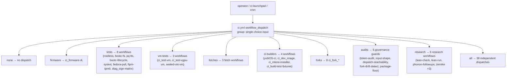
```mermaid
flowchart TD
    op["operator / ci-launchpad / cron"] --> ci["ci.yml workflow_dispatch\ngroup: single choice input"]
    ci --> g0["none → no dispatch"]
    ci --> g1["firmware → ci_firmware-rk"]
    ci --> g2["tests → 8 workflows\n(rootless, bootc-fs, pq-tls, bootc-lifecycle,\nsysext, fedora-pull, ftpm-tpm0, diag_sign-matrix)"]
    ci --> g3["vm-tests → 3 workflows\n(ci_test-vm, ci_test-vgpu-vm, sealed-uki-vm)"]
    ci --> g4["fetches → 3 fetch workflows"]
    ci --> g5["ci-builders → 4 workflows\n(yubiOS-ci, ci_dev_image, ci_mkosi-installer,\nci_build-test-fixtures)"]
    ci --> g6["forks → 8 ci_fork_*"]
    ci --> g7["audits → 5 governance guards\n(token-audit, input-shape, dispatch-reachability,\nfork-drift-detect, package-floor)"]
    ci --> g8["research → 6 research workflows\n(lean-check, lean-run, phonon-followups, zernike ×3)"]
    ci --> g9["all → 38 independent dispatches"]
```

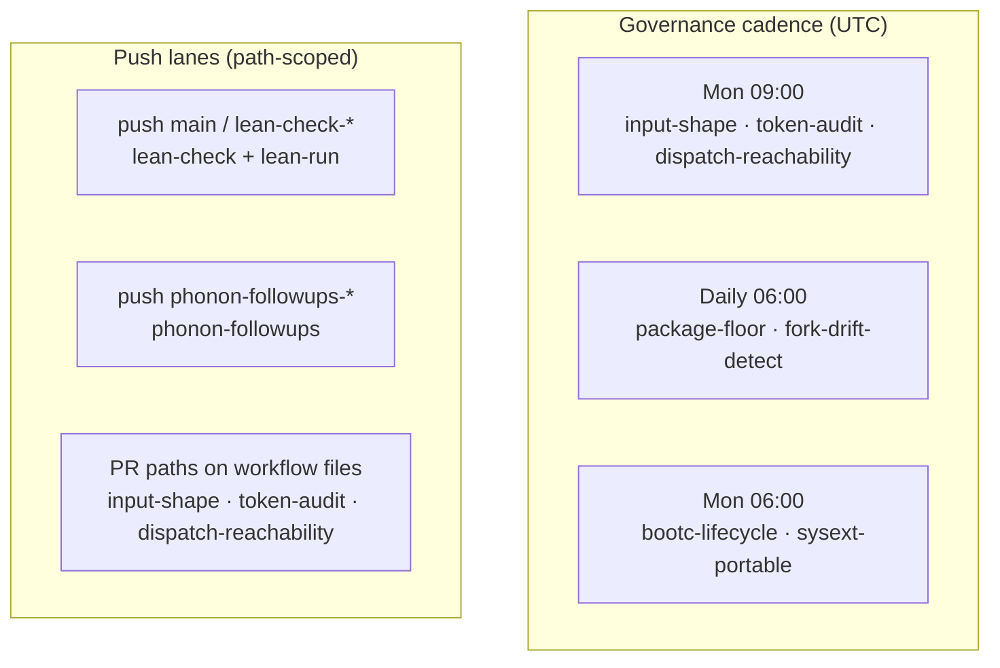
```mermaid
flowchart TD
    subgraph guards["Governance cadence (UTC)"]
        mon9["Mon 09:00\ninput-shape · token-audit · dispatch-reachability"]
        daily6["Daily 06:00\npackage-floor · fork-drift-detect"]
        mon6["Mon 06:00\nbootc-lifecycle · sysext-portable"]
    end
    subgraph pushlanes["Push lanes (path-scoped)"]
        leanpush["push main / lean-check-*\nlean-check + lean-run"]
        phononpush["push phonon-followups-*\nphonon-followups"]
        prpaths["PR paths on workflow files\ninput-shape · token-audit · dispatch-reachability"]
    end
```

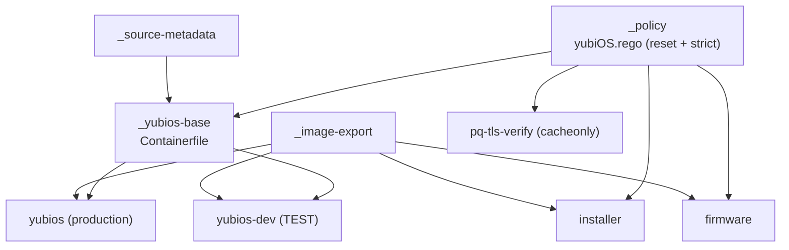
```mermaid
flowchart TD
    policy["_policy\nyubiOS.rego (reset + strict)"]
    metadata["_source-metadata"]
    exporter["_image-export"]
    base["_yubios-base\nContainerfile"]
    prod["yubios (production)"]
    dev["yubios-dev (TEST)"]
    inst["installer"]
    fw["firmware"]
    pq["pq-tls-verify (cacheonly)"]
    policy --> base
    metadata --> base
    base --> prod
    exporter --> prod
    base --> dev
    exporter --> dev
    policy --> inst
    exporter --> inst
    policy --> fw
    exporter --> fw
    policy --> pq
```

### Diagrams carried from the pre-regeneration map

The diagrams below are carried from the pre-regeneration CI_MAP (2026-07-29
shape, drifted-note 2026-09-18). Group lists in the dispatch router and the
trigger-policy diagram are updated to the 2026-10-06 taxonomy; the
callback-contract diagram is historical: PR #145 removed the callback chain, so
that diagram describes a contract that no longer fires.

**Top-level dispatch router (group choice fan-out)**

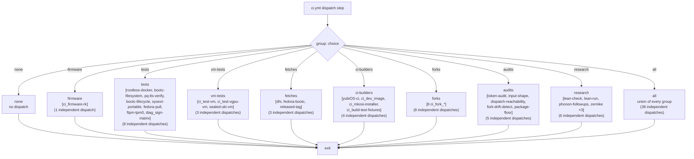
```mermaid
flowchart TD
    start["ci.yml dispatch step"]
    pick{"group: choice"}
    none_path["none\nno dispatch"]
    firmware_path["firmware\n[ci_firmware-rk]\n(1 independent dispatch)"]
    tests_path["tests\n[rootless-docker, bootc-filesystem, pq-tls-verify,\nbootc-lifecycle, sysext-portable, fedora-pull,\nftpm-tpm0, diag_sign-matrix]\n(8 independent dispatches)"]
    vm_tests_path["vm-tests\n[ci_test-vm, ci_test-vgpu-vm, sealed-uki-vm]\n(3 independent dispatches)"]
    fetches_path["fetches\n[dhi, fedora-bootc, released-tag]\n(3 independent dispatches)"]
    ci_builders_path["ci-builders\n[yubiOS-ci, ci_dev_image, ci_mkosi-installer,\nci_build-test-fixtures]\n(4 independent dispatches)"]
    forks_path["forks\n[8 ci_fork_*]\n(8 independent dispatches)"]
    audits_path["audits\n[token-audit, input-shape, dispatch-reachability,\nfork-drift-detect, package-floor]\n(5 independent dispatches)"]
    research_path["research\n[lean-check, lean-run, phonon-followups, zernike ×3]\n(6 independent dispatches)"]
    all_path["all\nunion of every group\n(38 independent dispatches)"]
    done["exit"]

    start --> pick
    pick -- "none" --> none_path --> done
    pick -- "firmware" --> firmware_path --> done
    pick -- "tests" --> tests_path --> done
    pick -- "vm-tests" --> vm_tests_path --> done
    pick -- "fetches" --> fetches_path --> done
    pick -- "ci-builders" --> ci_builders_path --> done
    pick -- "forks" --> forks_path --> done
    pick -- "audits" --> audits_path --> done
    pick -- "research" --> research_path --> done
    pick -- "all" --> all_path --> done
```

**Canonical Docker Bake graph**

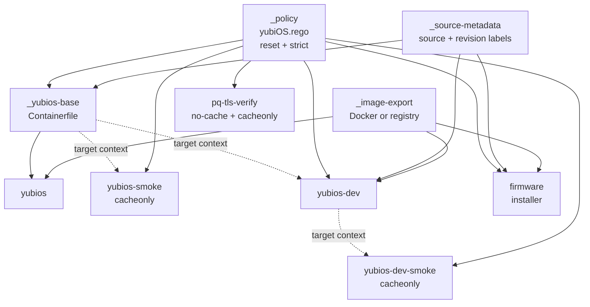
```mermaid
flowchart TD
    policy["_policy\nyubiOS.rego\nreset + strict"]
    metadata["_source-metadata\nsource + revision labels"]
    exporter["_image-export\nDocker or registry"]
    base["_yubios-base\nContainerfile"]
    prod["yubios"]
    prod_smoke["yubios-smoke\ncacheonly"]
    dev["yubios-dev"]
    dev_smoke["yubios-dev-smoke\ncacheonly"]
    artifacts["firmware\ninstaller"]
    pq["pq-tls-verify\nno-cache + cacheonly"]

    policy --> base
    metadata --> base
    base --> prod
    exporter --> prod
    base -. "target context" .-> prod_smoke
    policy --> prod_smoke
    base -. "target context" .-> dev
    policy --> dev
    metadata --> dev
    exporter --> dev
    dev -. "target context" .-> dev_smoke
    policy --> dev_smoke
    policy --> artifacts
    metadata --> artifacts
    exporter --> artifacts
    policy --> pq
```

**ARM64/RK firmware integration**

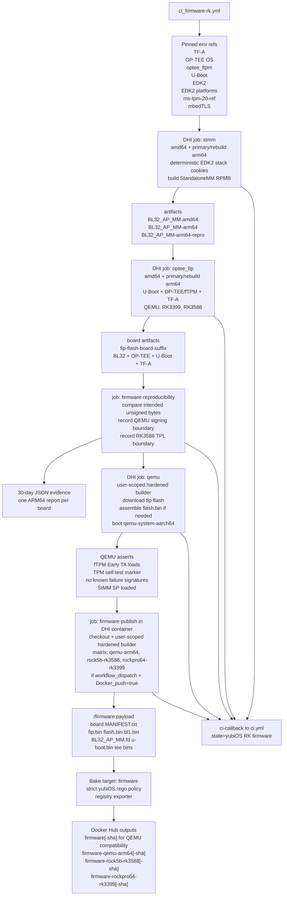
```mermaid
flowchart TD
    wf["ci_firmware-rk.yml"]
    refs["Pinned env refs\nTF-A\nOP-TEE OS\noptee_ftpm\nU-Boot\nEDK2\nEDK2 platforms\nms-tpm-20-ref\nmbedTLS"]
    stmm["DHI job: stmm\namd64 + primary/rebuild arm64\ndeterministic EDK2 stack cookies\nbuild StandaloneMM RPMB"]
    stmm_out["artifacts\nBL32_AP_MM-amd64\nBL32_AP_MM-arm64\nBL32_AP_MM-arm64-repro"]
    optee["DHI job: optee_fip\namd64 + primary/rebuild arm64\nU-Boot + OP-TEE/fTPM + TF-A\nQEMU, RK3399, RK3588"]
    optee_out["board artifacts\nfip-flash-board-suffix\nBL32 + OP-TEE + U-Boot + TF-A"]
    proof["job: firmware-reproducibility\ncompare intended unsigned bytes\nrecord QEMU signing boundary\nrecord RK3588 TPL boundary"]
    evidence["30-day JSON evidence\none ARM64 report per board"]
    qemu["DHI job: qemu\nuser-scoped hardened builder\ndownload fip-flash\nassemble flash.bin if needed\nboot qemu-system-aarch64"]
    asserts["QEMU asserts\nfTPM Early TA loads\nTPM self-test marker\nno known failure signatures\nStMM SP loaded"]
    publish["job: firmware-publish in DHI container\ncheckout + user-scoped hardened builder\nmatrix: qemu-arm64, rock5b-rk3588, rockpro64-rk3399\nif workflow_dispatch + Docker_push=true"]
    fw_payload["/firmware payload\nboard MANIFEST.txt\nfip.bin flash.bin bl1.bin\nBL32_AP_MM.fd u-boot.bin tee bins"]
    bake["Bake target: firmware\nstrict yubiOS.rego policy\nregistry exporter"]
    fw_registry["Docker Hub outputs\nfirmware[-sha] for QEMU compatibility\nfirmware-qemu-arm64[-sha]\nfirmware-rock5b-rk3588[-sha]\nfirmware-rockpro64-rk3399[-sha]"]
    cb["ci-callback to ci.yml\nstate=yubiOS RK firmware"]

    wf --> refs
    refs --> stmm --> stmm_out --> optee --> optee_out --> proof --> evidence
    proof --> qemu --> asserts --> publish --> fw_payload --> bake --> fw_registry
    stmm --> cb
    optee --> cb
    proof --> cb
    qemu --> cb
    publish --> cb
```

**TEST / production / dev / installer / final VM lanes**

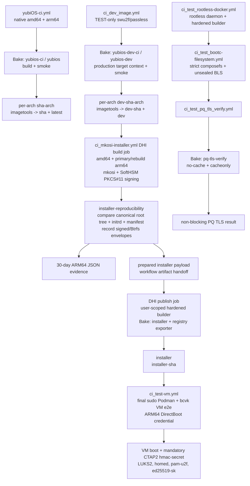
```mermaid
flowchart TD
    prod_wf["yubiOS-ci.yml\nnative amd64 + arm64"]
    prod_bake["Bake: yubios-ci / yubios\nbuild + smoke"]
    prod_out["per-arch sha-arch\nimagetools -> sha + latest"]
    dev_wf["ci_dev_image.yml\nTEST-only swu2f/passless"]
    dev_bake["Bake: yubios-dev-ci / yubios-dev\nproduction target context + smoke"]
    dev_out["per-arch dev-sha-arch\nimagetools -> dev-sha + dev"]
    vm["ci_test-vm.yml\nfinal sudo Podman + bcvk VM e2e\nARM64 DirectBoot credential"]
    vm_out["VM boot + mandatory CTAP2 hmac-secret\nLUKS2, homed, pam-u2f, ed25519-sk"]
    installer["ci_mkosi-installer.yml DHI build job\namd64 + primary/rebuild arm64\nmkosi + SoftHSM PKCS#11 signing"]
    installer_proof["installer-reproducibility\ncompare canonical root tree + initrd + manifest\nrecord signed/Btrfs envelopes"]
    installer_evidence["30-day ARM64 JSON evidence"]
    installer_payload["prepared installer payload\nworkflow artifact handoff"]
    installer_bake["DHI publish job\nuser-scoped hardened builder\nBake: installer + registry exporter"]
    installer_out["installer\ninstaller-sha"]
    rootless["ci_test_rootless-docker.yml\nrootless daemon + hardened builder"]
    bootc["ci_test_bootc-filesystem.yml\nstrict composefs + unsealed BLS"]
    pq["ci_test_pq_tls_verify.yml"]
    pq_bake["Bake: pq-tls-verify\nno-cache + cacheonly"]
    pq_out["non-blocking PQ TLS result"]

    prod_wf --> prod_bake --> prod_out
    dev_wf --> dev_bake --> dev_out --> installer --> installer_proof --> installer_evidence
    installer_proof --> installer_payload --> installer_bake --> installer_out --> vm --> vm_out
    rootless --> bootc --> pq --> pq_bake --> pq_out
```

**Optional fork component CI chain**

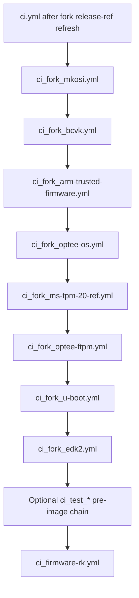
```mermaid
flowchart TD
    start["ci.yml after fork release-ref refresh"]
    mkosi["ci_fork_mkosi.yml"]
    bcvk["ci_fork_bcvk.yml"]
    tfa["ci_fork_arm-trusted-firmware.yml"]
    optee["ci_fork_optee-os.yml"]
    ms["ci_fork_ms-tpm-20-ref.yml"]
    ftpm["ci_fork_optee-ftpm.yml"]
    uboot["ci_fork_u-boot.yml"]
    edk2["ci_fork_edk2.yml"]
    tests["Optional ci_test_* pre-image chain"]
    firmware["ci_firmware-rk.yml"]

    start --> mkosi --> bcvk --> tfa --> optee --> ms --> ftpm --> uboot --> edk2 --> tests --> firmware
```

**Trigger policy (post-PR-#145)**

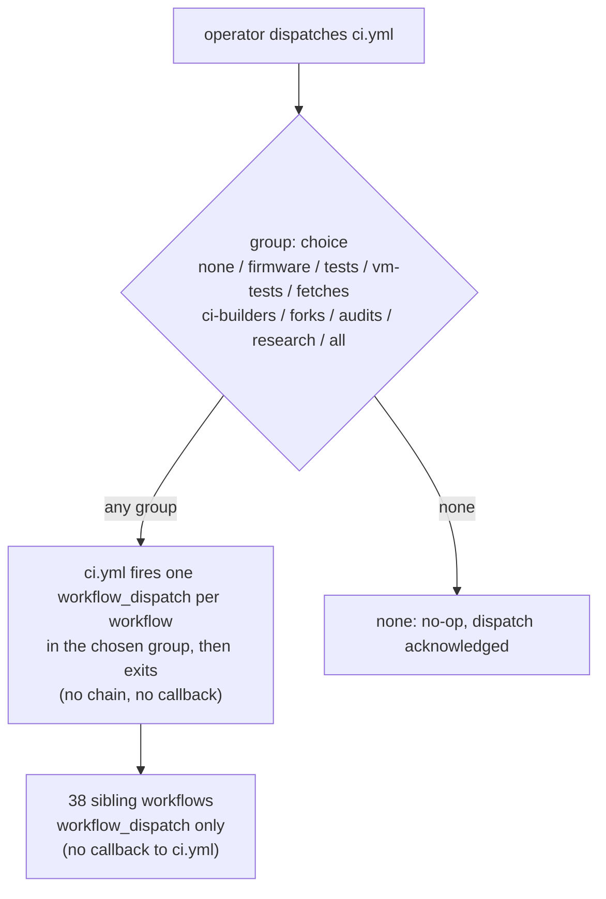
```mermaid
flowchart TD
    manual["operator dispatches ci.yml"]
    pick{"group: choice\nnone / firmware / tests / vm-tests / fetches\nci-builders / forks / audits / research / all"}
    dispatch["ci.yml fires one workflow_dispatch per workflow\nin the chosen group, then exits\n(no chain, no callback)"]
    sibling["38 sibling workflows\nworkflow_dispatch only\n(no callback to ci.yml)"]
    none_path["none: no-op, dispatch acknowledged"]

    manual --> pick
    pick -- "none" --> none_path
    pick -- "any group" --> dispatch --> sibling
```

**Artifact and registry output map**

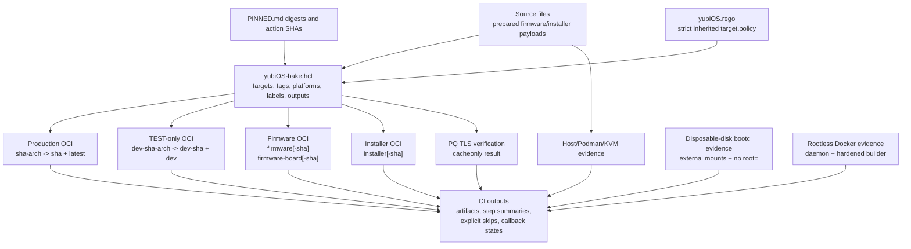
```mermaid
flowchart TD
    source["Source files\nprepared firmware/installer payloads"]
    pins["PINNED.md digests and action SHAs"]
    policy["yubiOS.rego\nstrict inherited target.policy"]
    bake["yubiOS-bake.hcl\ntargets, tags, platforms, labels, outputs"]
    prod["Production OCI\nsha-arch -> sha + latest"]
    dev["TEST-only OCI\ndev-sha-arch -> dev-sha + dev"]
    firmware["Firmware OCI\nfirmware[-sha]\nfirmware-board[-sha]"]
    installer["Installer OCI\ninstaller[-sha]"]
    pq["PQ TLS verification\ncacheonly result"]
    vm["Host/Podman/KVM evidence"]
    install["Disposable-disk bootc evidence\nexternal mounts + no root="]
    rootless["Rootless Docker evidence\ndaemon + hardened builder"]
    ci_logs["CI outputs\nartifacts, step summaries,\nexplicit skips, callback states"]

    source --> bake
    pins --> bake
    policy --> bake
    bake --> prod
    bake --> dev
    bake --> firmware
    bake --> installer
    bake --> pq
    source --> vm
    prod --> ci_logs
    dev --> ci_logs
    firmware --> ci_logs
    installer --> ci_logs
    pq --> ci_logs
    vm --> ci_logs
    install --> ci_logs
    rootless --> ci_logs
```

**Callback contract (historical, pre-PR-#145)**

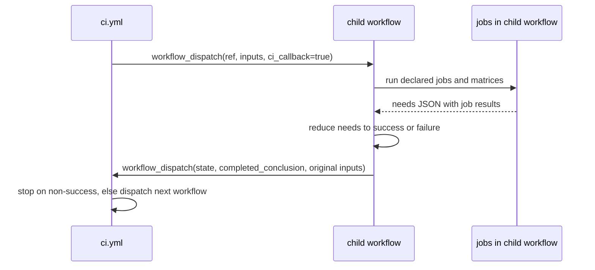
```mermaid
sequenceDiagram
    participant C as ci.yml
    participant W as child workflow
    participant J as jobs in child workflow

    C->>W: workflow_dispatch(ref, inputs, ci_callback=true)
    W->>J: run declared jobs and matrices
    J-->>W: needs JSON with job results
    W->>W: reduce needs to success or failure
    W->>C: workflow_dispatch(state, completed_conclusion, original inputs)
    C->>C: stop on non-success, else dispatch next workflow
```

## Canonical Docker Bake Graph

`yubiOS-bake.hcl` owns every Docker build in the non-fork chain. Four hidden
targets provide the shared contract: `_policy` (exactly one `yubiOS.rego` with
`reset=true, strict=true`), `_source-metadata` (source/revision OCI labels),
`_image-export` (Docker output with provenance and manifest-list mode disabled
when `PUSH=false`; registry output with both retained when `PUSH=true`), and
`_yubios-base` (the pinned production Containerfile build). The design
rationale lives in [the Bake consolidation note](../refs/docker-bake-consolidation-2026-07-17.md).

| Workflow | CI target/group | Explicit publication target |
|---|---|---|
| `yubiOS-ci.yml` | `yubios-ci` (`yubios` + `yubios-smoke`) | `yubios` |
| `ci_dev_image.yml` | `yubios-dev-ci` (`yubios-dev` + `yubios-dev-smoke`) | `yubios-dev` |
| `ci_firmware-rk.yml` | none unless publication requested | `firmware` |
| `ci_mkosi-installer.yml` | DHI-contained mkosi validation + ARM64 comparison | `installer` |
| `ci_test_pq_tls_verify.yml` | `pq-tls-verify` | none (cacheonly) |

Publication shape: prod/dev publish per-arch tags through Bake then assemble the
multi-arch index with `imagetools`; firmware/installer publish directly with the
registry exporter from privileged DHI container jobs on user-scoped `hardened`
builders.

## Full .yml Inventory

Every `.yml` file in the repo, generated from the main tree at regeneration
time (trigger labels condensed; "ext inputs" counts non-`ci_*` workflow_dispatch
inputs; "jobs" counts declared jobs).

| File | Workflow name | Kind | Triggers | ext inputs | jobs |
|---|---|---|---|---|---|
| `.github/workflows/ci.yml` | CI | workflow | workflow_dispatch | 4 | 1 |
| `.github/workflows/ci_build-test-fixtures.yml` | ci_build-test-fixtures | workflow | workflow_dispatch | 2 | 1 |
| `.github/workflows/ci_dev_image.yml` | yubiOS dev/test image (swu2f, ADR-026) | workflow | workflow_dispatch | 1 | 4 |
| `.github/workflows/ci_dispatch-reachability.yml` | ci_dispatch-reachability | workflow | workflow_dispatch + schedule + pull_request (paths) | 1 | 1 |
| `.github/workflows/ci_firmware-rk.yml` | yubiOS RK firmware | workflow | workflow_dispatch | 2 | 6 |
| `.github/workflows/ci_fork-drift-detect.yml` | ci_fork-drift-detect | workflow | workflow_dispatch + schedule | 2 | 1 |
| `.github/workflows/ci_fork_arm-trusted-firmware.yml` | ci_fork_arm-trusted-firmware | workflow | workflow_dispatch | 1 | 2 |
| `.github/workflows/ci_fork_bcvk.yml` | ci_fork_bcvk | workflow | workflow_dispatch | 1 | 3 |
| `.github/workflows/ci_fork_edk2.yml` | ci_fork_edk2 | workflow | workflow_dispatch | 1 | 2 |
| `.github/workflows/ci_fork_mkosi.yml` | ci_fork_mkosi | workflow | workflow_dispatch | 1 | 4 |
| `.github/workflows/ci_fork_ms-tpm-20-ref.yml` | ci_fork_ms-tpm-20-ref | workflow | workflow_dispatch | 1 | 2 |
| `.github/workflows/ci_fork_optee-ftpm.yml` | ci_fork_optee_ftpm | workflow | workflow_dispatch | 1 | 2 |
| `.github/workflows/ci_fork_optee-os.yml` | ci_fork_optee_os | workflow | workflow_dispatch | 1 | 2 |
| `.github/workflows/ci_fork_u-boot.yml` | ci_fork_u-boot | workflow | workflow_dispatch | 1 | 2 |
| `.github/workflows/ci_input-shape.yml` | ci_input-shape | workflow | workflow_dispatch + schedule + pull_request (paths) | 1 | 1 |
| `.github/workflows/ci_mkosi-installer.yml` | yubiOS mkosi-installer | workflow | workflow_dispatch | 2 | 6 |
| `.github/workflows/ci_package-floor.yml` | ci_package-floor | workflow | workflow_dispatch + schedule + pull_request (paths) | 1 | 1 |
| `.github/workflows/ci_test-bootc-lifecycle.yml` | ci_test-bootc-lifecycle | workflow | workflow_dispatch + schedule + pull_request (paths) | 4 | 2 |
| `.github/workflows/ci_test-fedora-bootc-arm64-pull.yml` | yubiOS fedora-bootc arm64 pull integrity (OMN-139) | workflow | workflow_dispatch | 1 | 1 |
| `.github/workflows/ci_test-ftpm-tpm0.yml` | yubiOS fTPM /dev/tpm0 guest verify (OMN-96) | workflow | workflow_dispatch | 3 | 1 |
| `.github/workflows/ci_test-sysext-portable.yml` | ci_test-sysext-portable | workflow | workflow_dispatch + schedule + pull_request (paths) | 5 | 2 |
| `.github/workflows/ci_test-vgpu-vm.yml` | yubiOS vGPU VM e2e (tests/vm) | workflow | workflow_dispatch | 6 | 3 |
| `.github/workflows/ci_test-vm.yml` | yubiOS VM e2e (tests/vm) | workflow | workflow_dispatch | 6 | 3 |
| `.github/workflows/ci_test_bootc-filesystem.yml` | TEST - bootc to-filesystem install e2e | workflow | workflow_dispatch | 1 | 2 |
| `.github/workflows/ci_test_pq_tls_verify.yml` | TEST - PQ hybrid TLS verification (ADR-025) | workflow | workflow_dispatch | 0 | 2 |
| `.github/workflows/ci_test_rootless-docker.yml` | TEST - Rootless Docker bootstrap validation | workflow | workflow_dispatch | 0 | 2 |
| `.github/workflows/ci_test_sealed-uki-vm.yml` | TEST - sealed UKI Secure Boot VM e2e | workflow | workflow_dispatch + workflow_call | 1 | 3 |
| `.github/workflows/ci_token-audit.yml` | ci_token-audit | workflow | workflow_dispatch + schedule + pull_request (paths) | 1 | 1 |
| `.github/workflows/diag_sign-matrix.yml` | DIAG - UKI signing matrix (10 variants) | workflow | workflow_dispatch (no inputs) | 0 | 1 |
| `.github/workflows/fetch-dhi-manifest.yml` | fetch-dhi-manifest | workflow | workflow_dispatch | 1 | 2 |
| `.github/workflows/fetch-fedora-bootc-manifest.yml` | fetch-fedora-bootc-manifest | workflow | workflow_dispatch | 1 | 2 |
| `.github/workflows/fetch-released-tag-ref.yml` | fetch-released-tag-ref | workflow | workflow_dispatch | 1 | 2 |
| `.github/workflows/lean-check.yml` | lean-check | workflow | workflow_dispatch + push (branch/paths) | 1 | 3 |
| `.github/workflows/lean-run.yml` | lean-run | workflow | workflow_dispatch + push (branch/paths) | 1 | 2 |
| `.github/workflows/phonon-followups.yml` | phonon-followups | workflow | workflow_dispatch + push (branch/paths) | 1 | 1 |
| `.github/workflows/yubiOS-ci.yml` | yubiOS CI | workflow | workflow_dispatch | 1 | 8 |
| `.github/workflows/zernike-caustics.yml` | zernike-caustics | workflow | workflow_dispatch | 1 | 1 |
| `.github/workflows/zernike-lens.yml` | zernike-lens | workflow | workflow_dispatch (no inputs) | 0 | 1 |
| `.github/workflows/zernike-spectrum.yml` | zernike-spectrum | workflow | workflow_dispatch (no inputs) | 0 | 1 |
| `.github/FUNDING.yml` | (n/a) | non-workflow | non-workflow YAML | 0 | 0 |

Per-file job trees (jobs with declared step counts, generated):

#### `.github/workflows/ci.yml` — CI

Triggers: workflow_dispatch. Jobs (1): `dispatch` (1 steps). Runner(s): ubuntu-24.04.

#### `.github/workflows/ci_build-test-fixtures.yml` — ci_build-test-fixtures

Triggers: workflow_dispatch. Jobs (1): `build-fixtures` (3 steps). Runner(s): ubuntu-24.04.

#### `.github/workflows/ci_dev_image.yml` — yubiOS dev/test image (swu2f, ADR-026)

Triggers: workflow_dispatch. Jobs (4): `build` (9 steps), `merge-manifest` (9 steps), `verify-attest` (4 steps), `ci-callback` (1 steps). Runner(s): ${{ matrix.runner }}; ubuntu-24.04.

#### `.github/workflows/ci_dispatch-reachability.yml` — ci_dispatch-reachability

Triggers: workflow_dispatch · schedule · pull_request (paths). Jobs (1): `assert` (5 steps). Runner(s): ubuntu-24.04.

#### `.github/workflows/ci_firmware-rk.yml` — yubiOS RK firmware

Triggers: workflow_dispatch. Jobs (6): `stmm` (11 steps), `optee_fip` (17 steps), `firmware-reproducibility` (10 steps), `qemu` (10 steps), `firmware-publish` (11 steps), `ci-callback` (1 steps). Runner(s): ${{ matrix.runner }}; ubuntu-24.04.

#### `.github/workflows/ci_fork-drift-detect.yml` — ci_fork-drift-detect

Triggers: workflow_dispatch · schedule. Jobs (1): `detect` (6 steps). Runner(s): ubuntu-24.04.

#### `.github/workflows/ci_fork_arm-trusted-firmware.yml` — ci_fork_arm-trusted-firmware

Triggers: workflow_dispatch. Jobs (2): `build-tfa` (8 steps), `ci-callback` (1 steps). Runner(s): ${{ matrix.runner }}; ubuntu-24.04.

#### `.github/workflows/ci_fork_bcvk.yml` — ci_fork_bcvk

Triggers: workflow_dispatch. Jobs (3): `unit-tests` (5 steps), `clippy` (3 steps), `ci-callback` (1 steps). Runner(s): ${{ matrix.runner }}; ubuntu-24.04.

#### `.github/workflows/ci_fork_edk2.yml` — ci_fork_edk2

Triggers: workflow_dispatch. Jobs (2): `build-standalonemm` (6 steps), `ci-callback` (1 steps). Runner(s): ${{ matrix.runner }}; ubuntu-24.04.

#### `.github/workflows/ci_fork_mkosi.yml` — ci_fork_mkosi

Triggers: workflow_dispatch. Jobs (4): `validate-profile` (4 steps), `shellcheck` (3 steps), `ruff` (4 steps), `ci-callback` (1 steps). Runner(s): ubuntu-24.04.

#### `.github/workflows/ci_fork_ms-tpm-20-ref.yml` — ci_fork_ms-tpm-20-ref

Triggers: workflow_dispatch. Jobs (2): `build-ms-tpm-20-ref` (6 steps), `ci-callback` (1 steps). Runner(s): ${{ matrix.runner }}; ubuntu-24.04.

#### `.github/workflows/ci_fork_optee-ftpm.yml` — ci_fork_optee_ftpm

Triggers: workflow_dispatch. Jobs (2): `build-ftpm-ta` (6 steps), `ci-callback` (1 steps). Runner(s): ${{ matrix.runner }}; ubuntu-24.04.

#### `.github/workflows/ci_fork_optee-os.yml` — ci_fork_optee_os

Triggers: workflow_dispatch. Jobs (2): `build-optee` (4 steps), `ci-callback` (1 steps). Runner(s): ${{ matrix.runner }}; ubuntu-24.04.

#### `.github/workflows/ci_fork_u-boot.yml` — ci_fork_u-boot

Triggers: workflow_dispatch. Jobs (2): `build-uboot` (7 steps), `ci-callback` (1 steps). Runner(s): ${{ matrix.runner }}; ubuntu-24.04.

#### `.github/workflows/ci_input-shape.yml` — ci_input-shape

Triggers: workflow_dispatch · schedule · pull_request (paths). Jobs (1): `validate` (5 steps). Runner(s): ubuntu-24.04.

#### `.github/workflows/ci_mkosi-installer.yml` — yubiOS mkosi-installer

Triggers: workflow_dispatch. Jobs (6): `build` (14 steps), `installer-reproducibility` (8 steps), `installer-publish` (10 steps), `merge-manifest` (8 steps), `verify-attest` (4 steps), `ci-callback` (1 steps). Runner(s): ${{ matrix.runner }}; ubuntu-24.04.

#### `.github/workflows/ci_package-floor.yml` — ci_package-floor

Triggers: workflow_dispatch · schedule · pull_request (paths). Jobs (1): `verify-floor` (4 steps). Runner(s): ubuntu-24.04.

#### `.github/workflows/ci_test-bootc-lifecycle.yml` — ci_test-bootc-lifecycle

Triggers: workflow_dispatch · schedule · pull_request (paths). Jobs (2): `test-upgrade` (5 steps), `test-homed-migrate` (5 steps). Runner(s): ${{ inputs.run_vm_legs == true && fromJSON('["self-hosted","Linux","ARM64","KVM"]') || 'ubuntu-24.04' }}.

#### `.github/workflows/ci_test-fedora-bootc-arm64-pull.yml` — yubiOS fedora-bootc arm64 pull integrity (OMN-139)

Triggers: workflow_dispatch. Jobs (1): `pull-arm64-integrity` (4 steps). Runner(s): ubuntu-24.04.

#### `.github/workflows/ci_test-ftpm-tpm0.yml` — yubiOS fTPM /dev/tpm0 guest verify (OMN-96)

Triggers: workflow_dispatch. Jobs (1): `ftpm-tpm0-verify` (7 steps). Runner(s): ${{ matrix.runner }}.

#### `.github/workflows/ci_test-sysext-portable.yml` — ci_test-sysext-portable

Triggers: workflow_dispatch · schedule · pull_request (paths). Jobs (2): `test-sysext` (5 steps), `test-portable` (5 steps). Runner(s): ${{ inputs.run_vm_legs == true && fromJSON('["self-hosted","Linux","ARM64","KVM"]') || 'ubuntu-24.04' }}.

#### `.github/workflows/ci_test-vgpu-vm.yml` — yubiOS vGPU VM e2e (tests/vm)

Triggers: workflow_dispatch. Jobs (3): `lint-vm-scripts` (2 steps), `vgpu-vm-e2e` (32 steps), `ci-callback` (1 steps). Runner(s): ${{ matrix.runner }}; ubuntu-24.04.

#### `.github/workflows/ci_test-vm.yml` — yubiOS VM e2e (tests/vm)

Triggers: workflow_dispatch. Jobs (3): `lint-vm-scripts` (2 steps), `vm-e2e` (24 steps), `ci-callback` (1 steps). Runner(s): ${{ matrix.runner }}; ubuntu-24.04.

#### `.github/workflows/ci_test_bootc-filesystem.yml` — TEST - bootc to-filesystem install e2e

Triggers: workflow_dispatch. Jobs (2): `install-to-filesystem` (6 steps), `ci-callback` (1 steps). Runner(s): ${{ matrix.runner }}; ubuntu-24.04.

#### `.github/workflows/ci_test_pq_tls_verify.yml` — TEST - PQ hybrid TLS verification (ADR-025)

Triggers: workflow_dispatch. Jobs (2): `pq-tls-verify` (5 steps), `ci-callback` (1 steps). Runner(s): ubuntu-24.04.

#### `.github/workflows/ci_test_rootless-docker.yml` — TEST - Rootless Docker bootstrap validation

Triggers: workflow_dispatch. Jobs (2): `rootless-docker` (2 steps), `ci-callback` (1 steps). Runner(s): ${{ matrix.runner }}; ubuntu-24.04.

#### `.github/workflows/ci_test_sealed-uki-vm.yml` — TEST - sealed UKI Secure Boot VM e2e

Triggers: workflow_dispatch · workflow_call. Jobs (3): `build-and-verify-uki` (9 steps), `boot-secure-vm` (4 steps), `negative-tamper-tests` (5 steps). Runner(s): ${{ matrix.runner }}; ubuntu-24.04.

#### `.github/workflows/ci_token-audit.yml` — ci_token-audit

Triggers: workflow_dispatch · schedule · pull_request (paths). Jobs (1): `audit` (5 steps). Runner(s): ubuntu-24.04.

#### `.github/workflows/diag_sign-matrix.yml` — DIAG - UKI signing matrix (10 variants)

Triggers: workflow_dispatch: {}. Jobs (1): `sign-variant` (4 steps). Runner(s): ubuntu-24.04.

#### `.github/workflows/fetch-dhi-manifest.yml` — fetch-dhi-manifest

Triggers: workflow_dispatch. Jobs (2): `fetch` (2 steps), `ci-callback` (1 steps). Runner(s): ubuntu-24.04.

#### `.github/workflows/fetch-fedora-bootc-manifest.yml` — fetch-fedora-bootc-manifest

Triggers: workflow_dispatch. Jobs (2): `fetch` (2 steps), `ci-callback` (1 steps). Runner(s): ubuntu-24.04.

#### `.github/workflows/fetch-released-tag-ref.yml` — fetch-released-tag-ref

Triggers: workflow_dispatch. Jobs (2): `fetch-release-refs` (2 steps), `ci-callback` (1 steps). Runner(s): ubuntu-24.04.

#### `.github/workflows/lean-check.yml` — lean-check

Triggers: workflow_dispatch · push (branch/paths). Jobs (3): `check` (20 steps), `verify-measurements` (4 steps), `verify-tools` (15 steps). Runner(s): ubuntu-latest.

#### `.github/workflows/lean-run.yml` — lean-run

Triggers: workflow_dispatch · push (branch/paths). Jobs (2): `run-real-corpus` (10 steps), `run-real-statements` (2 steps). Runner(s): ubuntu-latest.

#### `.github/workflows/phonon-followups.yml` — phonon-followups

Triggers: workflow_dispatch · push (branch/paths). Jobs (1): `followups` (3 steps). Runner(s): ubuntu-latest.

#### `.github/workflows/yubiOS-ci.yml` — yubiOS CI

Triggers: workflow_dispatch. Jobs (8): `shellcheck` (2 steps), `hadolint` (2 steps), `unit-tests` (4 steps), `mkosi` (3 steps), `build` (9 steps), `merge-manifest` (8 steps), `verify-attest` (4 steps), `ci-callback` (1 steps). Runner(s): ${{ matrix.runner }}; ubuntu-24.04.

#### `.github/workflows/zernike-caustics.yml` — zernike-caustics

Triggers: workflow_dispatch. Jobs (1): `caustics` (3 steps). Runner(s): ubuntu-latest.

#### `.github/workflows/zernike-lens.yml` — zernike-lens

Triggers: workflow_dispatch (no inputs). Jobs (1): `zernike-lens` (3 steps). Runner(s): ubuntu-latest.

#### `.github/workflows/zernike-spectrum.yml` — zernike-spectrum

Triggers: workflow_dispatch (no inputs). Jobs (1): `zernike` (4 steps). Runner(s): ubuntu-latest.

#### `.github/FUNDING.yml`

Triggers: non-workflow YAML. Jobs (0): (no jobs — declarative only). Runner(s): —.

## Documented vs Code (ci-launchpad cross-check)

ci-launchpad (the Sauna CI app) is the live tracker for this surface. Its
taxonomy mirrors live ci.yml exactly as of 2026-10-06: what was a hand-maintained
27-file taxonomy with 12 stragglers on 2026-10-05 is now the real group input.
The 2026-10-05 straggler assignments (recorded below for history) were promoted
into real ci.yml groups by commit `e46a3cb8`, and the app taxonomy was re-synced
in the same pass (deploy `c1c70026`): `audits` and `research` became orchestrator
dispatch targets, `fork-drift-detect` moved from the app's interim `fetches`
assignment into ci.yml's real `audits` group, and the app's group-choice list,
dispatch gating, and per-workflow group labels were regenerated from the live
ci.yml source (including the inline-brace parser fix for `diag_sign-matrix.yml`'s
inputless `workflow_dispatch: {}`).

2026-10-05 straggler assignments (historical record; superseded group choices
noted where live ci.yml differs):

| Straggler | 2026-10-05 app group | Live ci.yml group (2026-10-06) |
|---|---|---|
| `ci_input-shape.yml` | tests | audits |
| `ci_token-audit.yml` | tests | audits |
| `ci_dispatch-reachability.yml` | tests | audits |
| `ci_package-floor.yml` | tests | audits |
| `ci_fork-drift-detect.yml` | fetches | audits |
| `ci_build-test-fixtures.yml` | ci-builders | ci-builders |
| `lean-check.yml` | research | research |
| `lean-run.yml` | research (display-only) | research (real, since e46a3cb8) |
| `phonon-followups.yml` | research (display-only) | research (real, since e46a3cb8) |
| `zernike-lens.yml` | research (display-only) | research (real, since e46a3cb8) |
| `zernike-caustics.yml` | research (display-only) | research (real, since e46a3cb8) |
| `zernike-spectrum.yml` | research (display-only) | research (real, since e46a3cb8) |

`research` is no longer a display-only group: ci.yml's own `group` choice carries
`audits` and `research`, so the app dispatches them through the orchestrator like
any other group. Every workflow on main (39) is in exactly one group and
orchestrator-reachable.

Updated 2026-10-05, still true 2026-10-06: the app derives its workflow set from
a full-repo git-tree census (one
`GET /repos/yubi-OS/yubiOS/git/trees/main?recursive=1` call filtered to `*.yml`)
and auto-adopts every `.github/workflows/*.yml` it finds into run tracking, so
the doc/app gap class can no longer occur silently — a new workflow file becomes
tracked on the next status poll after it lands on main. Non-workflow YAML
(`.github/FUNDING.yml`) is inventoried in the app's `/api/yml-inventory` endpoint
(with kind, path, and blob sha) but not run-tracked, since it has no Actions
surface.

Cross-check at regeneration time:

| Measure | Count |
|---|---|
| `.yml` files in repo census | 40 |
| Workflows run-tracked by ci-launchpad | 39 |
| Non-workflow YAML inventoried (not run-tracked) | 1 |
| Files in the app's group taxonomy | 39 (38 dispatchable group members + ci.yml) |
| Files reachable via taxonomy + auto-adoption | 39 |
| Doc-only entries (documented, not on main) | 0 |
| Code-only entries (on main, undocumented here) | 0 |

Known issues carried forward (documented in the app and under active diagnosis,
not fixed in this pass):

- The 2026-10-05 known issue — the `all` group listing `ci_test_pq_tsl_verify.yml`
  (`tsl` ≠ `tls`), which killed the dispatch loop after 3 entries under
  `set -euo pipefail` — is RESOLVED: the live all-group `WORKFLOWS` array lists
  `ci_test_pq_tls_verify.yml` (verified by grep 2026-10-06; no `tsl` string
  remains anywhere under `.github/workflows/`).
- Ten child workflows (`ci_dev_image.yml`, `ci_firmware-rk.yml`, and the eight
  `ci_fork_*.yml`) still declare the legacy `ci_callback` internal input from
  the pre-#145 callback-chain design; ci-launchpad filters it out of its trigger
  UI and the workflows' defaults apply.
- Open diagnosis items (from the 2026-10-06 full CI-path dispatch test, recorded
  out-of-repo in the Sauna workspace at
  `session/ci-test/ci-path-test-report-2026-10-06.md`): several fork workflows
  fail at their dependencies-install steps, and some builder workflows fail
  during their build stages, when dispatched across the full path. Both classes
  are being diagnosed; the dispatch plumbing itself (all 38 group paths) is
  verified reachable.

## Trigger policy

- 38 group members + ci.yml: dispatch-driven only (manual or via the app).
- 7 workflows also run on cron: the 3 workflow-file guards (Mondays 09:00 UTC),
  package-floor + fork-drift-detect (daily 06:00 UTC), bootc-lifecycle +
  sysext-portable (Mondays 06:00 UTC).
- 3 workflows also run on path-scoped push: lean-check/lean-run (main +
  `lean-check-*`), phonon-followups (`phonon-followups-*`).
- 6 workflows also validate on path-scoped pull requests (the 3 guards,
  package-floor, bootc-lifecycle, sysext-portable — each scoped to its own
  files/inputs).
- 1 workflow is `workflow_call`-callable: `ci_test_sealed-uki-vm.yml`.
- No workflow dispatches another workflow back; the callback contract is gone
  (PR #145). The `ci-callback` jobs still present in some child workflows are
  legacy no-ops kept for history.

## Drift discipline

This document is regenerated, not maintained by hand-edits: the census and
inventory blocks are generated from the workflow YAMLs themselves, and the
ci-launchpad `/api/yml-inventory` endpoint can produce the same 40-file census
on demand (one git-tree call), so the map's counts can be re-verified in a
single API call at any time. The 2026-09-18 addendum pattern (a drift record
flagging count mismatches, deferring the fix) is replaced by: any session
touching a workflow file re-runs the census and appends a dated drift note if
counts moved.
