# Steady Orbit Systems - Endpoint Reference

> Generated 2026-10-05. Refreshed 2026-10-05 after discrepancy resolution. The live
> worker (steady-orbit.systems-a.workers.dev) serves all endpoints listed here.
> AGENT.md is the operational contract; this document is the architectural reference.

Assembled from five parallel lanes:

| Lane | Deliverable | Headline numbers |
|---|---|---|
| A | Endpoint inventory from worker code | 121 route rows, 7 module parts |
| B | AGENT.md cross-reference | 85 documented, 14 code-only, 0 doc-only, 12 discrepancies |
| C | Capability map | 13 domains, 97 endpoint assignments, 16 cross-domain flows, 7 resources |
| D | Lean verification map | 12 Lean files, 15 endpoint-to-Lean mappings, 5 CI jobs |
| E | API flow diagram | 78-line mermaid graph |

Resolution refresh (2026-10-05, lanes R1+R2, verified by R3):

| Lane | Deliverable | Headline numbers |
|---|---|---|
| R1 | AGENT.md doc additions (KV write) | 15 new rows: public relays, site surfaces, CORS preflights, map/app.js, audio replies, jev pause GET, approvals guide POST, fits CRUD |
| R2 | Code patches (index.js, exactly 4 hunks) | requireOperatorAuth added to DELETE /api/maps/:id and DELETE /api/fits/:id; n_controls usage-block comment 2..12 -> 2..6 |
| R3 | Fresh cross-reference (updated KV AGENT.md vs patched bundle) | 110 documented, 0 code-only, 0 doc-only, 0 actionable discrepancies |

Reconciliation: Lane A has 121 route rows over 109 unique paths. Lane C assigns 85
unique paths to capability domains. The difference is 6 CORS preflights (OPTIONS),
method variants that collapse onto one path (GET|POST, DELETE 405 guards), and 24
solar-rbs-entry site routes plus 7 API routes Lane C did not assign. All of them are
placed in a domain below, marked with a dagger (†). Every endpoint from Lane A
appears in this document at least once.

After the resolution refresh every endpoint AGENT.md documents resolves to a served
route and every served route is documented: 110 documented endpoints, 0 code-only,
0 doc-only, 0 actionable discrepancies. The daggers below are retained as
reconciliation history - they marked endpoints Lane C had not assigned when the
original was assembled; they are all in AGENT.md now.

## Capability Map

Thirteen capability domains cover the worker. Endpoints marked † were added during
reconciliation from Lane A routes Lane C did not assign; after the 2026-10-05
resolution refresh every one of them is documented in AGENT.md as well. Auth is
taken from Lane A, updated by the R2 code patches where DELETE auth changed.

### Jev Orchestrator (gated task engine)

The Jev v2 gated-approval orchestration core: it ingests a task (caller-supplied actions or a freeform prompt), understands/decides via the jev-1.13 model, passes every proposed action through a deterministic fail-closed gate (allowed / needs_approval / blocked), executes approved actions, verifies outcomes independently, and drives the task to one of six terminal states. Approvals bind actor, target, payload, limits, expiry and policy version; every stage appends an append-only audit event. Learning proposals can only become active policy through an explicit human promote (no automated promotion path exists).

Endpoints:

| Method | Path | Auth |
|---|---|---|
| GET | `/api/jev/health` | none |
| GET\|POST | `/api/jev/tasks` | bearer |
| GET | `/api/jev/tasks/:id` | bearer |
| POST | `/api/jev/tasks/:id/execute` | bearer |
| POST | `/api/jev/tasks/:id/verify` | bearer |
| POST | `/api/jev/tasks/:id/continue` | bearer |
| POST | `/api/jev/tasks/:id/retry` | bearer |
| POST | `/api/jev/tasks/:id/reconcile` | bearer |
| POST | `/api/jev/tasks/:id/close` | bearer |
| POST | `/api/jev/tasks/:id/cancel` | bearer |
| GET | `/api/jev/approvals` | bearer |
| POST | `/api/jev/approvals/:id/approve` | bearer |
| POST | `/api/jev/approvals/:id/reject` | bearer |
| GET\|POST | `/api/jev/pause` | bearer |
| GET | `/api/jev/summary` | bearer |
| GET\|POST | `/api/jev/learnings` | bearer |
| POST | `/api/jev/learnings/:id/promote` | bearer |
| POST | `/api/jev/approvals/:id/guide` † | bearer |

Module parts: jev-main.js, routes-jev.js, jev-ingest.js, jev-state.js, jev-decide.js, jev-gate.js, jev-execute.js, jev-verify.js, jev-review.js, jev-loop.js, jev-improve.js, dbx.js

Bindings: DB, JEV_API_KEY, AI, DEFAPI_API_KEY, RESEND_API_KEY

Terminal states: succeeded; blocked; rejected; expired; failed; cancelled

Key invariants:
- Fail-closed deterministic gate: allowed, needs_approval, or blocked - never open by default
- Approvals invalidated on policy version change; a policy bump invalidates affected approvals
- Six terminal states; unknown outcomes reconcile-before-repeat; never re-dispatch on unknown
- Every stage appends an audit event (append-only)
- No automated policy promotion - promoteLearning() is human-only via POST /api/jev/learnings/:id/promote
- Idempotency: task create dedupes per (tenant, idempotency_key)
- Pause blocks new and queued dispatch but never undoes completed effects
- Invalid resend.send bodies are rejected at propose-time (422 / task closed rejected), never a 500 that orphans the task

Composes with:
- Automations (propose_actions stage feeds proposals into the same gate)
- Evolution (directive execution goes through this gate)
- Taste Engine / Corpus Math (jev-1.13 decision model shared with the scorer and quality gates)

### Automations (versioned stage pipelines + cron)

Versioned automation definitions stored in D1 that run a stage pipeline per fire: tool (GET-only unless a policy tool covers the host; capped, every call audited), llm (interpolated prompt, JSON repair), builtin (pure deterministic function), guard (advisory safety verdict - unsafe skips propose_actions and routes to human review), and propose_actions (proposals enter the same gate as hand-written ones). Interval automations fire on the worker cron via compare-and-set on last_fired_at so double-fire is impossible. Hosts the builtin registry: lead_research, corpus_audit, corpus_lens, corpus_drift, tautology_gate, visco_hysteresis, visco_snapback.

Endpoints:

| Method | Path | Auth |
|---|---|---|
| GET\|POST | `/api/jev/automations` | bearer |
| POST | `/api/jev/automations/:id/activate` | bearer |
| POST | `/api/jev/automations/:id/pause` | bearer |
| POST | `/api/jev/automations/:id/run` | bearer |
| GET | `/api/jev/models` | bearer |
| POST | `/api/jev/webhooks/reply` | none |

Module parts: routes-automations.js, jev-automations.js, jev-engine.js, jev-scheduler.js, jev-llm.js, jev-lead.js, jev-lead-lib.js, jev-corpus-builtins.js

Bindings: DB, AI, RESEND_API_KEY, GITHUB_API_KEY, GOOGLE_PLACES_API_KEY, DAYTONA_API_KEY, NORTHFLANK_API_KEY

Key invariants:
- Single-active automation per name; versioned defs in D1
- Interval fires use compare-and-set on last_fired_at - double-fire impossible
- Model routes pinned: classify=llama-3.1-8b, draft=llama-3.3-70b, guard=llama-guard-3-8b; raw: pins anything else
- Tool stage is GET-only unless a policy tool covers the host; every call audited and capped
- Builtins are pure: no fetch; {ref}/{source_ref} inputs rejected
- Reply webhook is the human loop-closer for lead outreach (handleReplyWebhook)

Composes with:
- Jev Orchestrator (propose_actions and guard human-review feed the gate; execute runs gated actions)
- Corpus Math (corpus_audit / corpus_lens / corpus_drift / tautology_gate builtins)
- Visco Instruments (visco_hysteresis / visco_snapback builtins)
- Evolution (scheduler tick shares the worker cron dispatch)

### Evolution (hourly cycle + directives)

The self-improvement loop: a scheduled sweep ingests structured reports into directives, the hourly machine cycle (preflight, measure, recall, propose at most 1 gated action, candle, notify) measures worker and corpus state, and directives are executed only after fail-closed kind classification plus human approval for every kind outside the auto whitelist. Cycle history, the atom ledger and standard-candle ledger accumulate as measured evidence; memory recall runs on the EVEC vector index; cycle digests go out by email.

Endpoints:

| Method | Path | Auth |
|---|---|---|
| POST | `/api/jev/evolution/sweep` | bearer |
| GET | `/api/jev/evolution/directives` | bearer |
| POST | `/api/jev/evolution/directives/:id/result` | bearer |
| POST | `/api/jev/evolution/directives/:id/approve` | bearer |
| POST | `/api/jev/evolution/directives/:id/reject` | bearer |
| GET | `/api/jev/evolution/state` | bearer |
| GET | `/api/jev/evolution/cycles` | bearer |
| POST | `/api/jev/evolution/cycle/run` | bearer |
| GET | `/api/jev/evolution/atoms` | bearer |
| GET | `/api/jev/evolution/candles` | bearer |
| POST | `/api/jev/evolution/memory/search` | bearer |

Module parts: jev-evolution.js, jev-evolution2-routes.js, jev-cycle.js, jev-queue.js, jev-notify.js, jev-memory.js, jev-quality.js, jev-atoms.js, index.js (scheduled handler / runJevScheduled dispatch)

Bindings: DB, AI, EVEC, RESEND_API_KEY, JEV_API_KEY

Terminal states: directive executed / result recorded; auto kinds: record_learning, note - everything else approval-gated

Key invariants:
- Fail-closed directive kinds: record_learning and note auto-execute; memory_edit, skill_push, schedule_change, repo_push, worker_change, ops_fix, external_comms need approval; unknown kinds rejected
- Sweep ingest is idempotent per fire
- Before 5 completed cycles of history, the cycle records an honest corpus error instead of fabricating metrics
- Directive claiming uses CAS (claim=1); queue driver has backoff; double-fire impossible via scheduler idempotency keys
- Notify digest is silent-cycle aware and never invents atoms/steps (selfCheck parity)

Composes with:
- Jev Orchestrator (directives execute through the gate; jev-quality wraps the decide call)
- Corpus Math (hourly cycle measures corpus metrics dbc/z/verdict/drift once history exists; lens candidates become fail-closed note directives)
- Automations (shares the cron scheduler; builtins feed cycle data)
- Outcome Ledger (realized outcome rows from gated commits)

### Corpus Math (jev-corpus)

The corpus-audit math engine, parity-tested against the Python sources of record (papers/data/lean/verify_claims.py + tools/*): scores a documents x 12-NSS-axis matrix into the V2/z/verdict/dBc audit, proposes lens-format atomic candidates with paired controls, computes dry-run atom plans under the delta >= 0 invariant, classifies tautologies, and records every measurement as an idempotent run row. The structured-evidence scorer (deterministic extraction + one batched jev-1.13 call) is the low-noise grader that replaced free-prose scoring.

Endpoints:

| Method | Path | Auth |
|---|---|---|
| GET | `/api/jev/corpus/health` | none |
| POST | `/api/jev/corpus/audit` | bearer |
| POST | `/api/jev/corpus/scorer/score` | bearer |
| POST | `/api/jev/corpus/scorer/matrix` | bearer |
| POST | `/api/jev/corpus/lens` | bearer |
| POST | `/api/jev/corpus/atom` | bearer |
| POST | `/api/jev/corpus/classify` | bearer |
| POST | `/api/jev/corpus/placements` | bearer |
| GET | `/api/jev/corpus/runs` | bearer |
| GET | `/api/jev/corpus/selftest` | bearer |

Module parts: jev-corpus-routes.js, jev-corpus-math.js, jev-corpus-lens.js, jev-corpus-atom.js, jev-corpus-scorer.js, jev-corpus-deps.js, fixtures__corpus-math-fixtures.mjs

Bindings: DB, DEFAPI_API_KEY, JEV_API_KEY

Key invariants:
- Audit is idempotent per input sha256 - repeat returns the same run_id + cached:true
- Multipass Decision-B mode: each pass through the same computeAudit path; inter_pass_offset_dbc is the measurement band
- The math is a port, never a re-derivation: fixture parity vs the Python sources; on mismatch the JavaScript is wrong until proven otherwise
- Every jev_corpus_runs row carries policy_version (NULL = pre-stamp era, never backfilled)
- Audit/lens results are data, never authorization: only directives through the gate act
- Atom plan is dry-run only with the delta >= 0 invariant asserted; execution is a gated directive, never inline
- Nulls default 100, cap 1000; scorer carries 0.45/0.55 hysteresis v2.1 and ~$0.0002/call cost

Composes with:
- Wayfinder Point-Map (placements POSTs vectors to the worker's own /api/map; MAP_FAILED relays rejections)
- Jev Orchestrator (lens candidates become gated directives; audit results are data, never authorization)
- Visco Instruments (visco endpoints audit base+loaded internally using this domain's computeAudit path)
- Automations (corpus builtins wrap audit/lens/classify)
- Evolution (hourly cycle consumes audit metrics)

### Taste Engine (taste-v1)

The nature-based taste instrument: deterministic extraction (box-counting fractal dimension D, mirror symmetry, scale coherence - fixture-parity-tested against the Python extractor source of record) plus ONE batched jev-1.13/clef call over 8 nature-law axes where every instruction carries a measured number. Includes edge-standard-v1, the standardized ink-normalized edge-map pipeline that made image-derived D comparable across sources and resolved the photo-pipeline confound. Admission stays false pending a human-rated real-photo gold set.

Endpoints:

| Method | Path | Auth |
|---|---|---|
| POST | `/api/jev/corpus/taste/score` | bearer |
| POST | `/api/jev/corpus/taste/matrix` | bearer |
| GET | `/api/jev/corpus/taste/selftest` | bearer |
| POST | `/api/jev/corpus/taste/edge-standard` | bearer |

Module parts: jev-taste.js, jev-taste-math.js, jev-edge-standard.js, fixtures__taste-fixtures.mjs

Bindings: DB, AI, DEFAPI_API_KEY, JEV_API_KEY

Key invariants:
- The instrument never awards itself a quality score; admitted:false stays until the gold-set gate
- Every clef instruction carries a measured number; order_seed permutation controls position bias
- Caller-supplied measurements are stamped source: caller
- Fixture parity vs the Python source of record (edge-standard max dD 4.4e-16 across 4 fixtures)
- 0.45/0.55 hysteresis; matrix is paced batching (1..20 items), one run row per batch
- Calibration sweeps are exact (symmetry 0.6 step, 0.3-0.95 variation window, complexity 0.5 step); sterile-perfect rejected

Composes with:
- Corpus Math (same runs-ledger, same hysteresis and batch-pacing conventions)
- Jev Orchestrator / jev-quality (the clef decision call shape is shared)

### Visco Instruments (rate-dependent round gates)

The viscoelastic measurement layer over the corpus-audit and outcomes history: persistence of bit flips under independent re-grading (scorer variance as the rate dimension), hysteresis rollup over the outcomes supersedes chains, Prony relaxation fitting over the runs history, cell-mobility mining of accumulated lens runs, and the mechanized snapback stop-halt verdict. These instruments turn round-level prediction-vs-realized deltas into measured gate inputs instead of prose judgment.

Endpoints:

| Method | Path | Auth |
|---|---|---|
| POST | `/api/jev/corpus/visco/persistence` | bearer |
| GET | `/api/jev/corpus/visco/hysteresis` | bearer |
| GET | `/api/jev/corpus/visco/prony` | bearer |
| GET | `/api/jev/corpus/visco/mobility` | bearer |
| POST | `/api/jev/corpus/visco/snapback` | bearer |
| GET | `/api/jev/corpus/visco/policy-log` | bearer |

Module parts: jev-visco-math.js, jev-corpus-routes.js (visco route block)

Bindings: DB, DEFAPI_API_KEY, JEV_API_KEY

Terminal states: snapback verdict -> gate_input halt_round | continue (verdicts only, never auto-actions)

Key invariants:
- Snapback and hysteresis return verdicts only - they never execute an action themselves
- Verdicts only, never auto-actions; the prose gate rule remains the fallback
- Empty ledger -> no_data; fewer than 5 points -> 422 INSUFFICIENT_SERIES
- Deterministic scoring collapses R (text-revert recovery) to 1 - stays unmeasured
- Prony policy_version filter excludes NULL-era rows

Composes with:
- Corpus Math (persistence audits base + loaded via computeAudit; runs history feeds prony/mobility)
- Outcome Ledger (hysteresis closes supersedes chains; snapback reads the ledger series)
- Automations (visco_hysteresis / visco_snapback are pure hourly-cycle builtins)
- Jev Orchestrator (policy-log is the wipe-proof changelog appended on every promote-flow version bump)

### Wayfinder Point-Map (frozen-frame geometric instrument)

The pointmap/0.2 instrument: maps documents or numeric vectors onto a frozen binary/PCA/sphere frame (PCA, binary placement, stereographic lift), compares real edits against that same frame, and exposes the diagnostic family - math diagnostics, candidate preview, positive control, exact isolation ledger, radius profiles, axis-redundancy / rayleigh / azimuth admission trials, perturbation consistency, rung placement. Geometry diagnoses movement; an independent task check always decides usefulness. Serves the /map/ browser UI and its dependency-free numeric core.

Endpoints:

| Method | Path | Auth |
|---|---|---|
| POST | `/api/map` | none |
| GET | `/api/maps` | none |
| DELETE\|GET | `/api/maps/:id` | bearer |
| POST | `/api/maps/compare` | none |
| POST | `/api/map/preview` | none |
| POST | `/api/map/control` | none |
| POST | `/api/map/axis-redundancy` | none |
| POST | `/api/map/admission` | none |
| POST | `/api/map/azimuth` | none |
| POST | `/api/map/rayleigh` | none |
| POST | `/api/map/consistency` | none |
| GET | `/map/` | none |
| GET | `/map/pointmap.js` | none |
| GET | `/map/app.js` | none |

Module parts: index.js (map routes + PM numeric core + map handlers), solar-rbs-entry.mjs (delegates legacy /map surface)

Bindings: DB, AI, VEC, SITE

Key invariants:
- Frozen-baseline discipline: baseline_id inherits the complete numeric frame; unchanged vectors keep exactly unchanged positions
- Frame/instrument/run_fingerprint hashing: a frame conflict stops comparison, never silently refits
- Preview/control/consistency write NOTHING (no map row, no Vectorize) - persisted:false is structural
- Exact isolation ledger must agree with an independent recount or the result halts
- admitted:false is hard-coded for axis-redundancy and azimuth; rayleigh/admission admission is computed, never hard-coded
- Transition declaration: a corpus differing by more than the declared transition is 409, persisted:false
- Positive-control recipe is fixed (cutpaste-splice 0.25, centered window); tuning knobs are rejected
- Deletion is never recommended or executed; the 12 NSS axes are an explicitly unvalidated lens dictionary
- Stored maps above ~1.9 MB overflow to KV (map-json:<id>) behind a D1 pointer; DELETE /api/maps/:id is operator bearer-auth guarded (R2 patch: 503 when the JEV_API_KEY binding is missing, 401 on a missing or wrong token)

Composes with:
- Ingestion & Embeddings (embeds full-content texts on the frozen frame; content-hash cache shared)
- Outcome Ledger (preview/control feed pre-registration; observed_delta recomputed via PM.explainTransition)
- Corpus Math (placements composes with /api/map)
- Jev Orchestrator (mapHandler wired into handleJevRequest so jev tasks can drive the map)

### Ingestion & Embeddings (full-content chunked/v1)

Turns repositories and raw text into numeric material for the map: /api/repo-items fetches sorted full-text repo items from GitHub (with resolved_ref and truncation flags), /api/embed runs chunked/v1 full-content ingestion (bge-base-en-v1.5, explicit mean pooling, <=400-byte UTF-8 chunks, byte-length-weighted mean, L2 normalization) with a content-hash embedding cache, and /api/vector/search queries the stored Vectorize index. Coverage is input coverage, not a claim about preserved meaning.

Endpoints:

| Method | Path | Auth |
|---|---|---|
| POST | `/api/repo-items` | none |
| POST | `/api/embed` | none |
| POST | `/api/vector/search` | none |

Module parts: index.js (embeddings, repo fetch, vector search, chunked/v1 cache)

Bindings: DB, AI, VEC, GITHUB_API_KEY

Key invariants:
- Every input byte is submitted - including content after character 2,000; chunk coverage is disclosed
- Cache key includes complete content, model, dimension, pooling, chunk size and aggregation version; no raw document text in the cache
- Uncached work is bounded separately (1,000 docs / 12,000 chunks per request; 413 with counts; warm-then-retry protocol)
- Vectorize metadata holds bounded text snippets only - no secrets or private customer data in the public map storage
- Truncated repo files must be resolved before mapping (prefer a 40-char commit SHA; branch names are mutable)
- Rectangular, finite, D=2..768 vectors; empty/oversized/misaligned inputs fail explicitly

Composes with:
- Wayfinder Point-Map (supplies the vectors every map/preview/control/consistency run embeds)
- Corpus Math (scorer/matrix inputs are ingested documents)
- Evolution (memory recall uses its own EVEC index, same Workers AI embed model)

### Outcome Ledger (append-only pre-registration)

The typed, append-only home for every predicted-vs-realized comparison the wayfinder ever reported in prose. A row separates the prediction (frozen before the check) from the decision outcome (the independent verifier's verdict: pending / kept / reverted / declined / abstained / neutral). Corrections are new rows with supersedes - both stay visible; GET returns a contingency of counts, never a rate.

Endpoints:

| Method | Path | Auth |
|---|---|---|
| GET\|POST | `/api/outcomes` | none |
| GET\|POST | `/api/outcomes?baseline_id=` | none |
| GET\|POST | `/api/outcomes?frame_id=` | none |
| DELETE | `/api/outcomes/*` † | none |

Module parts: index.js (outcomes routes + 405 guard on PUT/PATCH/DELETE)

Bindings: DB

Terminal states: verdicts: pending, kept, reverted, declined, abstained, neutral

Key invariants:
- Append-only: no PUT, PATCH or DELETE (405); a correction is a new supersedes row
- score / quality / success_rate / rate / confidence / z are rejected as inputs - no rates, percentages or z ever computed
- verifier names the independent checker; 'geometry' is refused for any non-pending verdict
- observed_source is server:explainTransition or caller - never mixed in one row
- A row arriving with prediction AND non-pending verdict is stored preregistered:false
- A sign-exact geometric prediction is an instrumentation outcome; a kept verdict does not imply the geometry predicted it

Composes with:
- Wayfinder Point-Map (with after_id the server recomputes observed_delta via PM.explainTransition on the frozen frame; 409 on frame conflict)
- Visco Instruments (hysteresis closes supersedes chains; snapback reads the ledger series)
- Evolution (round records and realized outcome rows land here)

### Repo Assessment (FIT legacy)

The original Steady Orbit business API, kept as a separate legacy surface: POST /api/assess fetches and assesses a GitHub repository into a FIT.json report, GET /api/fits lists the stored assessment population, and POST /api/narrate produces natural-language narration over an assessment using Workers AI.

Endpoints:

| Method | Path | Auth |
|---|---|---|
| POST | `/api/assess` | none |
| GET | `/api/fits` | none |
| POST | `/api/narrate` | none |
| DELETE\|GET | `/api/fits/:id` † | bearer |

Module parts: index.js (assess/fits/narrate routes, refineBasis)

Bindings: DB, AI, GITHUB_API_KEY

Key invariants:
- Legacy surface: deliberately unchanged by the v0.2 map release; llms.txt fallback documents it
- Assessment reports are stored rows in D1 listed by /api/fits
- DELETE /api/fits/:id is operator bearer-auth guarded (R2 patch): 503 when the JEV_API_KEY binding is missing, 401 on a missing or wrong token

Composes with:
- Ingestion & Embeddings (repo fetching shares the GitHub path)
- Wayfinder Point-Map (historically the first consumer of /api/map on assessed corpora)

### Public Relays (media, contact, chat, decide)

Small CORS-open relay endpoints ported from the standalone relay worker into this worker for the Steady Orbit website and agent clients: text-to-speech and speech-to-text via ElevenLabs, the website contact form via Resend, site chat via Workers AI, and the typesafe jev-1.13 decision relay via DefAPI. All are rate-limited through the WEBSITE_RATE_LIMIT binding and unauthenticated apart from rate limits.

Endpoints:

| Method | Path | Auth |
|---|---|---|
| GET\|OPTIONS | `/api/tts` | none |
| OPTIONS\|POST | `/api/stt` | none |
| OPTIONS\|POST | `/api/contact` | none |
| POST | `/api/chat` | none |
| GET\|OPTIONS | `/api/decide` | none |
| POST | `/api/site-assistant` † | none |
| POST | `/api/brain/preview` † | none |

Module parts: index.js (relay block: tts/stt/contact/decide/chat, relayRateLimited, RELAY_CORS)

Bindings: ELEVENLABS_API_KEY, RESEND_API_KEY, DEFAPI_API_KEY, AI, WEBSITE_RATE_LIMIT

Key invariants:
- Per-endpoint rate limits (tts/stt 15, contact 5) via WEBSITE_RATE_LIMIT
- 503 with a named error when the backing secret is not configured - never a silent fallback
- Contact mail is composed server-side (name/company/email/message + source), HTML-escaped, sent to the fixed site inbox with reply_to
- STT caps uploads at 10 MB; TTS caps text at 4000 chars (POST) / 900 chars (GET)
- CORS preflight OPTIONS handled explicitly per relay endpoint

Composes with:
- Jev Orchestrator / jev-quality (the /api/decide relay exposes the same jev-1.13 decision model the gate and scorer use)
- Repo Assessment (narrate/chat share the Workers AI model route)
- Jev Orchestrator execute (resend.send actions use the same Resend credential)

### SEO Dig Proxy (searxng)

A single GET endpoint that forwards a searXNG endpoint + urlencoded query string to the n8n searxng-proxy webhook running on Northflank, with open CORS, no rate limiting and a 20-second timeout. It is the web-search dig path that the refs-refresh sweep and knowledge-corpus minting use to collect source results.

Endpoints:

| Method | Path | Auth |
|---|---|---|
| GET\|OPTIONS | `/api/searxng` | none |

Module parts: index.js (searxng proxy block)

Bindings: NORTHFLANK_API_KEY

Key invariants:
- Stateless passthrough - endpoint and qs are forwarded verbatim to the upstream webhook
- Upstream failures surface as 502 searxng_proxy_failed with detail, never a fabricated result
- CORS open (Access-Control-Allow-Origin: *), explicit OPTIONS preflight, no rate limiting by design

Composes with:
- Automations (tool stage can call it under policy)
- External callers: refs-refresh-sweep / knowledge-corpus-mint sessions use it as their dig endpoint

### Platform Surface & Ops Console

The operator- and answer-engine-facing surface of the worker: GET /api/health (version info incl. diagnostic module versions), the AGENT.md instrument contract served from KV, the llms.txt business summary (with the pre-upload fallback listing the core API), the /jev/ ops console (key entered once, kept in sessionStorage), and the site page adapter that serves the v19 website from KV and delegates everything else to the legacy API module. Also hosts the worker's scheduled entrypoint that dispatches automations and the evolution cycle by cron expression.

Endpoints:

| Method | Path | Auth |
|---|---|---|
| GET | `/api/health` | none |
| GET | `/AGENT.md` | none |
| GET | `/agent.md` | none |
| GET | `/llms.txt` | none |
| GET | `/jev` | none |
| GET | `/jev/` | none |
| GET | `/` † | none |
| GET | `/revenue-blind-spot[/]` † | none |
| GET | `/systems-lab[/]` † | none |
| GET | `/contact[/]` † | none |
| GET | `/founders[/]` † | none |
| GET | `/terms[/]` † | none |
| GET | `/privacy[/]` † | none |
| GET | `/brain[/]` † | none |
| GET | `/audit[/]` † | none |
| GET | `/results[/]` † | none |
| GET | `/booking[/]` † | none |
| GET | `/sitemap.xml` † | none |
| GET | `/robots.txt` † | none |
| GET | `/website-vN/<file>` † | none |
| GET | `/sos[/]\|/sos/index.html` † | none |
| GET | `/sos/client.js` † | none |
| GET | `/audio/reply-1\|2\|3.mp3` † | none |

Module parts: index.js (health/AGENT/llms/console routes + scheduled handler), solar-rbs-entry.mjs (site pages + /website-vN assets), jev-main.js (console wiring)

Bindings: SITE, DB

Key invariants:
- AGENT.md is the source of truth served no-cache from KV - the homepage 'Copy agent guide' button references it
- Ops console is bearer-auth via JEV_API_KEY on every route except /api/jev/health; the key lives in sessionStorage, never persisted
- Cron dispatch is by cron expression: the evolution cron runs the evolution cycle, any other cron keeps the automations scheduler tick
- Site adapter passes every /website-vN/* asset through from KV generically and delegates everything else unchanged

Composes with:
- Jev Orchestrator (the console is the human surface for tasks/approvals/pause)
- Automations + Evolution (the scheduled handler dispatches runJevScheduled by cron expression)

## Endpoint Inventory

The complete 121-route inventory from Lane A, grouped by module part. Auth is
`bearer` (JEV_API_KEY) on every /api/jev route except the two health endpoints and
the reply webhook. Six rows are CORS preflights (OPTIONS).

### solar-rbs-entry.mjs (site adapter + entry API) - 16 routes

| Method | Path | Auth | Description |
|---|---|---|---|
| POST | `/api/site-assistant` | none | Steady Orbit site chat assistant (entry module), grounded on KV llms.txt; rate-limited |
| POST | `/api/brain/preview` | none | Brain demo chat endpoint - identical handler to /api/site-assistant; rate-limited |
| GET | `/` | none | KV-served site landing page (website-v19/index.html); also /index.html |
| GET | `/revenue-blind-spot[/]` | none | Revenue Blind Spot landing page (website-v19/revenue-blind-spot.html); /RBS, /RBS/, /rbs, /rbs/ alias to the same page |
| GET | `/systems-lab[/]` | none | Systems Lab page (lab.html) with Lumina embeds |
| GET | `/contact[/]` | none | Contact page (contact.html) |
| GET | `/founders[/]` | none | Founders page (founders.html) |
| GET | `/terms[/]` | none | Terms page (terms.html) |
| GET | `/privacy[/]` | none | Privacy page (privacy.html) |
| GET | `/brain[/]` | none | Brain demo page (brain.html) |
| GET | `/audit[/]` | none | RBS suite v2 audit page (audit.html) |
| GET | `/results[/]` | none | RBS suite v2 results page (results.html) |
| GET | `/booking[/]` | none | RBS suite v2 booking page (booking.html) |
| GET | `/sitemap.xml` | none | Sitemap served from KV |
| GET | `/robots.txt` | none | robots.txt served from KV |
| GET | `/website-vN/<file>` | none | Generic asset pass-through: /website-v<digits>/<[A-Za-z0-9._-]+> served from KV key website-vN/<file> |

### index.js (legacy API module) - 45 routes

| Method | Path | Auth | Description |
|---|---|---|---|
| GET | `/AGENT.md` | none | Agent guide document (also /agent.md) from KV SITE |
| GET | `/llms.txt` | none | Business summary for answer engines from KV, with inline fallback prompt listing legacy API when not uploaded |
| GET | `/map/app.js` | none | Map UI app script from KV (map-app.js) |
| GET | `/map/pointmap.js` | none | Dependency-free numeric pointmap core from KV (pointmap.js) |
| GET | `/map[/]` | none | Wayfinder map browser UI (KV map-index.html) |
| GET | `/jev[/]` | none | Jev ops console HTML (KV jev-index.html); key entered once, sessionStorage |
| GET | `/sos[/]\|/sos/index.html` | none | SOS voice-agent UI (KV sos-index.html) |
| GET | `/sos/client.js` | none | SOS voice client script (KV sos-client.js) |
| GET | `/[/index.html]` | none | Legacy site index from KV (shadowed by solar-rbs-entry.mjs page table when KV page exists) |
| GET | `/audio/reply-1\|2\|3.mp3` | none | Three hardcoded voice reply audio files from KV (audio/reply-N.mp3) |
| OPTIONS | `/api/searxng` | none | CORS preflight for the searXNG proxy |
| GET | `/api/searxng` | none | searXNG proxy: forwards to the n8n searxng-proxy webhook on Northflank |
| OPTIONS | `/api/tts` | none | CORS preflight for TTS relay |
| GET | `/api/tts (also POST)` | none | Text-to-speech relay to ElevenLabs (eleven_turbo_v2_5); rate-limited |
| OPTIONS | `/api/stt` | none | CORS preflight for STT relay |
| POST | `/api/stt` | none | Speech-to-text relay to ElevenLabs scribe_v1; rate-limited |
| OPTIONS | `/api/contact` | none | CORS preflight for contact relay |
| POST | `/api/contact` | none | Website contact form -> Resend email to mike@steadyorbitsystems.com; rate-limited |
| OPTIONS | `/api/decide` | none | CORS preflight for decision-model relay |
| GET | `/api/decide (also POST)` | none | DefAPI typesafe/jev-1.13 decision relay (clef/clef-flash via Workers AI when selected); rate-limited |
| GET | `/api/health` | none | Worker version info + diagnostic module versions |
| GET | `/api/fits` | none | List stored repository FIT assessments (population) |
| GET | `/api/fits/:id` | none | One stored FIT with full fit_json and population comparison |
| DELETE | `/api/fits/:id` | bearer | Delete a stored FIT row; operator bearer auth required (R2 patch: 503 when JEV_API_KEY unbound, 401 on missing or wrong token) |
| POST | `/api/narrate` | none | Generate a plain-text FIT narrative via Workers AI streaming, persists to fits.narrative |
| POST | `/api/assess` | none | Assess a GitHub repo into a FIT.json: fetch corpus, derive/refine latent basis (AI-assisted, or reuse baseline_id basis), runFit, store, compare to population |
| POST | `/api/repo-items` | none | Fetch sorted full-text repo items (GitHub tree) with truncation flags |
| POST | `/api/vector/search` | none | Cosine search over the sos-embeddings Vectorize index |
| POST | `/api/embed` | none | Chunked/v1 document embedding: bge-base-en-v1.5, mean pooling, byte-weighted chunk mean, SHA256 content-hash cache, Vectorize store |
| POST | `/api/chat` | none | Legacy site assistant relay (Workers AI llama-3.3-70b-instruct-fp8-fast, pinned SOS system prompt) |
| POST | `/api/map` | none | Wayfinder: map texts or vectors onto the frozen pointmap/0.2 frame; optionally persist a stored map; baseline_id freezes frame |
| POST | `/api/map/preview` | none | Preview ONE candidate (ADD/CHANGE) against a stored baseline's frozen frame; writes nothing |
| POST | `/api/map/control` | none | CutPaste-style positive control: seeded splice CHANGEs measured through the preview path on the frozen frame |
| POST | `/api/map/consistency` | none | Measure ONE candidate under 1..3 caller-supplied text variants on the frozen frame; sign agreement report |
| POST | `/api/map/axis-redundancy` | none | Per-axis leave-one-out NN-vote predictability trial vs fixed-margin null |
| POST | `/api/map/admission` | none | Unified membership trials: rayleigh, axis trial, spectra shares, radius I(r) grid in one call |
| POST | `/api/map/rayleigh` | none | Isolation-graph components/isolates (exact), Fiedler lambda2 + exact Rayleigh-Ritz cut witness, fixed-margin null tails |
| POST | `/api/map/azimuth` | none | Rotation/reflection-invariant Rayleigh Z_m (m=2,3,4,6,12) + largest circular gap trial on the placement plane |
| POST | `/api/outcomes` | none | Append-only pre-registration ledger: prediction separated from independent task-check outcome (201) |
| GET | `/api/outcomes` | none | Ledger rows + contingency of COUNTS (never a rate) |
| DELETE | `/api/outcomes/* (also PUT, PATCH)` | none | Explicit 405: outcomes ledger is append-only |
| GET | `/api/maps` | none | Stored map metrics list (no map_json) |
| GET | `/api/maps/:id` | none | Complete stored MapResult (KV-overflow aware), enriched with radius profile on read |
| DELETE | `/api/maps/:id` | bearer | Delete one saved map (+ KV overflow cleanup); operator bearer auth required (R2 patch: 503 when JEV_API_KEY unbound, 401 on missing or wrong token) |
| POST | `/api/maps/compare` | none | Compare two stored maps on compatible frames |

### routes-jev.js (jev orchestrator) - 22 routes

| Method | Path | Auth | Description |
|---|---|---|---|
| OPTIONS | `/api/jev/*` | none | Catch-all CORS preflight for all /api/jev routes (also re-handled inside corpus/evolution/automations handlers) |
| GET | `/api/jev/health` | none | Jev health: policy version + paused flag |
| POST | `/api/jev/tasks` | bearer | Task create: caller-supplied payload.actions or freeform prompt; runs ingest->understand->decide->gate pipeline; rate-limited |
| GET | `/api/jev/tasks` | bearer | List tasks (expireStale first); rate-limited |
| GET | `/api/jev/tasks/:id` | bearer | Task detail with actions, approvals, audit events, cost; rate-limited |
| POST | `/api/jev/tasks/:id/execute` | bearer | Dispatch task actions (re-checks pause; skips rather than firing); rate-limited |
| POST | `/api/jev/tasks/:id/verify` | bearer | Verify action outcome; rate-limited |
| POST | `/api/jev/tasks/:id/continue` | bearer | Continue task: more_work (re-decide + re-gate) or terminal; rate-limited |
| POST | `/api/jev/tasks/:id/retry` | bearer | Retry an action within limits; rate-limited |
| POST | `/api/jev/tasks/:id/reconcile` | bearer | Reconcile an unknown outcome with evidence; never re-dispatches; rate-limited |
| POST | `/api/jev/tasks/:id/close` | bearer | Close task with a terminal outcome; rate-limited |
| POST | `/api/jev/tasks/:id/cancel` | bearer | Cancel task (closes cancelled); rate-limited |
| GET | `/api/jev/approvals` | bearer | Pending approvals queue with expiry countdowns (expireStale first); rate-limited |
| POST | `/api/jev/approvals/:id/approve` | bearer | Approve: auto-dispatches bound action after CURRENT-policy gate re-check, then verifies + continues/closes task in-request; rate-limited |
| POST | `/api/jev/approvals/:id/reject` | bearer | Reject an approval; rate-limited |
| POST | `/api/jev/approvals/:id/guide` | bearer | Attach human guidance to the approval's task (documented in AGENT.md by the R1 refresh); rate-limited |
| GET | `/api/jev/pause` | bearer | Read pause state (fail-closed: unreadable policy reports paused:true scope all); rate-limited |
| POST | `/api/jev/pause` | bearer | Set pause {paused, scope}; blocks new and queued dispatch, never undoes completed effects; rate-limited |
| GET | `/api/jev/summary` | bearer | Tasks by state/outcome, pending approvals, cost rollup + policy version; rate-limited |
| GET | `/api/jev/learnings` | bearer | Learning proposal ledger list; rate-limited |
| POST | `/api/jev/learnings` | bearer | Propose a learning; rate-limited |
| POST | `/api/jev/learnings/:id/promote` | bearer | Human promotion: bumps policy version (new_policy optional - falls back to current doc version bump), expires affected approvals, appends policy changelog row; rate-limited |

### routes-automations.js (automations + webhooks + models) - 7 routes

| Method | Path | Auth | Description |
|---|---|---|---|
| POST | `/api/jev/webhooks/reply` | none | Reply webhook (provider->worker): records reply, routes to task/lead handling; rate-limited |
| GET | `/api/jev/automations` | bearer | List versioned automation defs; rate-limited |
| POST | `/api/jev/automations` | bearer | Create an automation def (stage pipeline validation); rate-limited |
| POST | `/api/jev/automations/:id/activate` | bearer | Activate automation (single-active per name enforced); rate-limited |
| POST | `/api/jev/automations/:id/pause` | bearer | Pause an automation; rate-limited |
| POST | `/api/jev/automations/:id/run` | bearer | Run automation inline (<=25s CPU): body IS the automation input (or {prompt} for prompt-input automations); creates + runs the task and returns full result; rate-limited |
| GET | `/api/jev/models` | bearer | Model routes for the console (classify=llama-3.1-8b, draft=llama-3.3-70b, guard=llama-guard-3-8b; raw: pins anything else); rate-limited |

### jev-evolution.js (evolution v1) - 6 routes

| Method | Path | Auth | Description |
|---|---|---|---|
| POST | `/api/jev/evolution/sweep` | bearer | Structured report ingest; findings become directives; idempotent per fire (duplicate -> 200); rate-limited |
| GET | `/api/jev/evolution/directives` | bearer | Directive list, or CAS claim one with ?claim=1; rate-limited |
| POST | `/api/jev/evolution/directives/:id/result` | bearer | Record execution result for a claimed directive; rate-limited |
| POST | `/api/jev/evolution/directives/:id/approve` | bearer | Human approval of a directive (forced for every kind except the auto whitelist); rate-limited |
| POST | `/api/jev/evolution/directives/:id/reject` | bearer | Reject a directive; rate-limited |
| GET | `/api/jev/evolution/state` | bearer | Evolution state: sweeps, directives, calibration trend, notify state; rate-limited |

### jev-evolution2-routes.js (evolution v2 cycle) - 5 routes

| Method | Path | Auth | Description |
|---|---|---|---|
| GET | `/api/jev/evolution/cycles` | bearer | Cycle history: cycle_completed events newest-first with preflight/measured/proposed/candle/steps/errors; rate-limited |
| GET | `/api/jev/evolution/atoms` | bearer | Atom ledger plus server-side asserted cumulative (monotone check); rate-limited |
| POST | `/api/jev/evolution/memory/search` | bearer | Memory recall (EVEC-index based) with degrade envelope; rate-limited |
| GET | `/api/jev/evolution/candles` | bearer | Standard-candle ledger with detection power summary; rate-limited |
| POST | `/api/jev/evolution/cycle/run` | bearer | Manual trigger of the hourly cycle: one cycle + enqueue + queue drain (the scheduled pass on demand); rate-limited |

### jev-corpus-routes.js (corpus, taste, visco) - 20 routes

| Method | Path | Auth | Description |
|---|---|---|---|
| GET | `/api/jev/corpus/health` | none | Corpus module health: which math/atom/lens modules are wired |
| POST | `/api/jev/corpus/audit` | bearer | Corpus audit: V2, z, verdict, dBc, shares, E_l; idempotent per input sha256 (repeat returns same run_id cached:true); Decision-B multipass mode; rate-limited |
| POST | `/api/jev/corpus/lens` | bearer | Lens candidates: K reals + K paired controls in guided-curve-ideate format; rate-limited |
| POST | `/api/jev/corpus/atom` | bearer | RSI-descent atom plan, DRY-RUN only (Delta >= 0 invariant asserted); rate-limited |
| POST | `/api/jev/corpus/classify` | bearer | Tautology discerner (parity with tools/tautology-discerner); rate-limited |
| POST | `/api/jev/corpus/placements` | bearer | Audit then POST vectors to the worker's own /api/map (self-call); rate-limited |
| GET | `/api/jev/corpus/runs` | bearer | Last 50 corpus run rows; rate-limited |
| GET | `/api/jev/corpus/selftest` | bearer | All module selftests (math, atom, lens + scorer-v2 extraction) with fixture parity vs Python sources; rate-limited |
| POST | `/api/jev/corpus/scorer/score` | bearer | Structured-evidence scorer v2.1: deterministic per-axis extraction + ONE batched jev-1.13 request, hysteresis flip p>=0.55/p<=0.45; rate-limited |
| POST | `/api/jev/corpus/scorer/matrix` | bearer | Paced batch scoring of 1..20 docs (default 4.5s spacing between docs); rate-limited |
| POST | `/api/jev/corpus/taste/edge-standard` | bearer | edge-standard-v1: gray_b64 in -> ink-normalized 1px contour bitmap + features (fractal D band, mirror symmetry); rate-limited |
| GET | `/api/jev/corpus/taste/selftest` | bearer | Taste-math selftest + 6-fixture parity against the Python extractor source of record; rate-limited |
| POST | `/api/jev/corpus/taste/score` | bearer | Nature-based taste instrument: deterministic extraction (box-counting D, mirror symmetry, scale coherence) + ONE batched clef call over 8 nature-law axes, 0.45/0.55 hysteresis, order_seed position-bias control; rate-limited |
| POST | `/api/jev/corpus/taste/matrix` | bearer | Paced batch taste scoring of 1..20 items, one run row kind taste-matrix; rate-limited |
| POST | `/api/jev/corpus/visco/persistence` | bearer | Persistence of flips under independent re-grading: audits base + loaded internally (same computeAudit path); rate-limited |
| GET | `/api/jev/corpus/visco/hysteresis` | bearer | Close supersedes chains in the outcomes ledger: prediction-vs-realized dissipation rollup; rate-limited |
| GET | `/api/jev/corpus/visco/prony` | bearer | Prony relaxation fit (tau grid + NNLS) over corpus-runs history, t_basis created_at; rate-limited |
| GET | `/api/jev/corpus/visco/mobility` | bearer | Mines accumulated lens runs into the cell-mobility series (frozen-baseline recheck input); rate-limited |
| POST | `/api/jev/corpus/visco/snapback` | bearer | Mechanized stop verdict for a round's cumulative (predicted, realized) series; rate-limited |
| GET | `/api/jev/corpus/visco/policy-log` | bearer | Wipe-proof policy changelog (promote flow appends on every version bump); rate-limited |

### Rate limits and notes

- /api/site-assistant and /api/brain/preview: same-origin enforced (Origin host must match, else 403 CROSS_ORIGIN), POST-only (405 otherwise), rate-limited via the WEBSITE_RATE_LIMIT binding keyed by cf-connecting-ip; limiter failure allows the request.
- /api/tts: rate-limited, 4000 char cap on POST and 900 on GET. /api/stt: rate-limited, 10 MB upload cap. /api/contact: rate-limited (5).
- /api/searxng: no rate limiting, CORS *, 20s timeout, upstream failure returns 502 searxng_proxy_failed.
- DELETE /api/outcomes/* (and PUT, PATCH): guard route returning 405; the outcomes ledger is append-only.
- DELETE /api/maps/:id: operator bearer auth required (R2 patch); 503 when the JEV_API_KEY binding is missing, 401 on a missing or wrong token.
- DELETE /api/fits/:id: operator bearer auth required (R2 patch); same 503/401 behavior as DELETE /api/maps/:id.
- OPTIONS /api/jev/*: catch-all CORS preflight for all /api/jev routes; also re-handled inside the corpus, evolution and automations handlers.

## Documented vs Code

Lane B parsed AGENT.md (72997 bytes, JSON-quoted string; decoded to 71810 chars of markdown) and cross-referenced every documented row against the
actual dispatch comparisons in the 42 module parts under parts/. Refreshed 2026-10-05:
lanes R1+R2 resolved the Lane B findings (doc additions written to KV, code patches in
index.js) and lane R3 re-ran the cross-reference fresh against the updated KV AGENT.md
(76399 bytes, byte-identical to the resolved doc R1 deployed) and the patched bundle.

| Measure | Lane B (before) | R3 (after) |
|---|---|---|
| AGENT.md sections | 23 | 23 |
| Documented endpoints (rows incl. method variants and prose references) | 85 | 110 |
| Code-only endpoints (served, undocumented) | 14 | 0 |
| Doc-only endpoints (documented, not served) | 0 | 0 |
| Actionable discrepancies | 12 | 0 |

The code route set is unchanged from Lane B: the R2 patch touches index.js in exactly
4 hunks - the requireOperatorAuth/timingSafeEqual helper, the n_controls usage-block
comment 2..12 -> 2..6, and one auth guard before each of the two destructive DELETE
handlers. No route was added or removed.

### Previously flagged, now resolved

The 14 Lane B code-only endpoints, every one now documented in AGENT.md:

| Method | Path | Lane B note | Resolution |
|---|---|---|---|
| GET | `/api/jev/pause` | served but only POST documented | documented with the fail-closed read contract (paused:true scope all when policy unreadable) |
| GET\|POST | `/api/tts` | completely undocumented | documented: ElevenLabs eleven_turbo_v2_5, 4000-char POST / 900-char GET caps, rate-limited 15/min |
| POST | `/api/stt` | undocumented | documented: ElevenLabs scribe_v1, 10 MB upload cap (413 over), rate-limited |
| POST | `/api/contact` | undocumented | documented: Resend send to the fixed site inbox, per-field caps, rate-limited 5/min |
| GET\|POST | `/api/decide` | undocumented | documented: DefAPI typesafe/jev-1.13 relay (clef path via Workers AI), rate-limited |
| POST | `/api/chat` | alluded to as 'site chat', never named | documented by path, marked legacy and superseded by /api/site-assistant |
| POST | `/api/site-assistant` | undocumented | documented: same-origin enforced, grounded on KV llms.txt, rate-limited |
| POST | `/api/brain/preview` | undocumented | documented: identical handler to /api/site-assistant |
| GET | `/sos` (+ /sos/, /sos/index.html, /sos/client.js) | undocumented | documented: SOS voice-agent UI and client script from KV |
| GET | `/index.html` | not in the endpoint table | documented: legacy site index, shadowed by the entry module page table |
| GET | `/map/app.js` | only /map/pointmap.js was documented | documented: map UI app script from KV |
| GET | `/sitemap.xml` | undocumented | documented: served from KV, falls through to the legacy module when missing |
| GET | `/robots.txt` | undocumented | documented: served from KV, same fallthrough |
| GET | `/AGENT.md` (and `/agent.md`) | the doc never documented its own route | documented: both spellings, no-cache, fallback text when not uploaded |

The 12 Lane B discrepancies, one by one:

1. No doc-only endpoints - confirmed again by R3: every documented endpoint resolves to a route in the patched 42 module parts.
2. GET /api/jev/pause method-coverage gap - RESOLVED: new GET row documents the fail-closed read contract.
3. Four relay endpoints absent (/api/tts, /api/stt, /api/contact, /api/decide) - RESOLVED: full rows with method variants, caps and binding names.
4. POST /api/chat undocumented by path - RESOLVED: explicit row, marked legacy and superseded by /api/site-assistant.
5. solar-rbs-entry routes (/api/site-assistant, /api/brain/preview, /sitemap.xml, /robots.txt) undocumented - RESOLVED: all four documented.
6. /sos/* routes, GET /index.html and GET /map/app.js absent - RESOLVED: all documented.
7. /AGENT.md and /agent.md spellings undocumented - RESOLVED: one row documents both spellings with the no-cache contract.
8. n_controls usage-block comment said 2..12 vs actual 2..6 - RESOLVED in code (R2): index.js line 5073 now says 2..6, matching the MIN_N2=2/MAX_N3=6 validation and AGENT.md.
9. builtins table-category note - carried informational, no action.
10. POST /audit shorthand note - carried informational, no action.
11. OPTIONS CORS preflights - RESOLVED: AGENT.md now documents OPTIONS on /api/jev/* (incl. /api/jev/corpus/*), /api/searxng and the public relays (204 + Access-Control-Allow-Origin: *).
12. Numeric contracts verified in agreement (no drift) - re-verified by R3 on both sides: n_controls 2..6 (doc + index.js:5073 usage block and validation), K 2..40 for /api/map family, K 2..400 for azimuth.

Code patches landed in R2 (the Lane B flags that were code-side):

- DELETE auth gaps. DELETE /api/fits/:id and DELETE /api/maps/:id - the only two
  unauthenticated DELETE routes on the worker and the sharpest gap between the
  documented contract and the served surface - now call requireOperatorAuth first:
  Secrets Store JEV_API_KEY, fail-closed, constant-time comparison; 503 'not
  configured: JEV_API_KEY binding missing' when the binding is unbound, 401
  'unauthorized: missing or wrong bearer token' on mismatch. DELETE /api/outcomes/*
  remains safe by design: a 405 guard route protecting the append-only ledger.
- NORTHFLANK_API_KEY note. Fixed in prose: the AGENT.md searxng row now states the
  binding is 'reserved for future direct-Northflank API access'; the current proxy
  goes through the n8n webhook, which is public.

The last 2 items R3 still flagged (R3-1/R3-2, stale DELETE-auth prose in the KV doc
rows saying 'AUTH GAP: no authentication in code') were fixed after the R3 read, so
the resolved state is 0 actionable discrepancies.

Carried informational notes (no action, unchanged from Lane B):

- The 'builtins | visco_hysteresis, visco_snapback' row in the Corpus math table
  describes automation builtins (jev-corpus-builtins.js), not HTTP endpoints.
- POST /audit in the RSI-chain runbook is shorthand for POST /api/jev/corpus/audit,
  not a separate route.
- Numeric contracts agree on both sides: no drift.

## Lean Verification Map

The math is a port, never a re-derivation: the JavaScript worker (jev-corpus-math.js,
jev-taste-math.js, jev-visco-math.js, jev-edge-standard.js) is parity-tested against
the Python sources of record in tools/ and papers/data/lean/. On any fixture mismatch
the JavaScript is wrong until proven otherwise.

Refresh note (2026-10-05): the discrepancy-resolution refresh added no Lean-connected
endpoints. The newly documented routes are the public relays, site surfaces, CORS
preflights, GET /api/jev/pause, POST /api/jev/approvals/:id/guide and the fits CRUD -
none of them corpus math - so this section is unchanged from the original.

### Verification chain

```
Lean 4.33.0 kernel (check job)
  CurvedCorpus / WayfinderBounds / RadiusBounds / RayleighBounds / AzimuthBounds
  + verify_wayfinder_axioms.py: printed axioms vs scope manifests, no sorryAx
        |
        v
Python verify scripts (verify-measurements job)
  verify_claims.py CLAIM_1..8, verify_rayleigh_claims.py M1..M4
  resolves the measurement-side claims Lean deliberately does not make
        |
        v
Tool selftests + fixture parity (verify-tools job)
  11 tools --selftest, point-map regression suite (15 test files),
  edge-standard selftest + Python-vs-JS parity (taste-engine source of record)
        |
        v
Worker endpoint selftests
  GET /api/jev/corpus/selftest (math, atom, lens + scorer-v2 extraction)
  GET /api/jev/corpus/taste/selftest (taste-math + 6-fixture parity)
        |
        v
CI green -> endpoint serves
```

### Lean files

| File | Theorems | What it proves | Endpoints verified | CI job |
|---|---|---|---|---|
| `CurvedCorpus.lean` | 90 | The corpus-math algebra kernel-side (core Lean 4.33.0, no Mathlib): atom-plan Delta>=0 invariant (atom_delta_nonneg), cumulative monotonicity, phi-ladder telescope, heat-exponent monotonicity/additivity, checkerboard-swap (MH flux / trade) margin-preservation identities, stationary-distribution uniqueness+uniformity (stationary_unique_uniform, max_propagates), Catalan/MP moment identities (mp_rowsum_eq_catalan, catalan_first_nine), dBc level laws (bpow_*, level_double, level_injective), Zernike R-generator identities (zernikeR_gen_11..44, parity, degrees, normalized), acoustic sum rule, diatomic/gap/Klemens lemmas, Gaunt L3 triangle counts, hcomp associativity/identity, halt-lattice lemmas (blocked_is_noop, fixed_halts, capped_halts), and the dz_band_iff gate-band identity. | POST /api/jev/corpus/audit, POST /api/jev/corpus/atom, POST /api/jev/corpus/lens, GET /api/jev/corpus/selftest | check |
| `WayfinderBounds.lean` | 11 | 11 core-Lean theorems for strict threshold inequalities and the exact ADD/CHANGE isolation ledgers of the point-map instrument: stable_on/stable_off, crossing_on_iff/crossing_off_iff, old_vertex_after_add, add_isolation_delta, chg_hit_eval, change_neighbour_ledger, change_isolation_delta, change_neutral. Integer/count theorems only; nonclaims exclude float bounds, significance, forecasting, and any keep/revert rule. | POST /api/map/preview, POST /api/map, POST /api/maps/compare, POST /api/map/control, POST /api/map/consistency | check |
| `RadiusBounds.lean` | 18 | 18 theorems behind the radius diagnostics: isoAt_le_one/isoAt_zero/isoAt_tie/isoAt_antitone, isoCount lemmas, radius_count_antitone, isoCount_le_length, isolated/connected perturbation bounds, perturbation_band, and clipped-area bounds (clampLow_ge, clampHigh_le, clipLen_nonneg/le_window, clipArea_nonneg/le_window). Canonical radius stays 0.095; continuous clipped area stays runtime-derived. | POST /api/map/preview (radius_profile), POST /api/map (radius_profile/radius_comparison), GET /api/maps/:id, POST /api/maps/compare, POST /api/map/admission (radius I(r) grid) | check |
| `RayleighBounds.lean` | 16 | 16 integer/rational identities for the Rayleigh diagnostics: quadratic-form nonnegativity/consistency/shift/scale (quad_*), indicator-vs-cut identity (quad_indicator, ind_sq_diff), edgeCut/cut_singleton lemmas, quad_no_incident, and the exact rational Rayleigh-Ritz witness numerator/denominator plus path example (witness_numerator, witness_denominator, rr_path_example, rr_path_quad). Nonclaims: nullity=#components, Ky Fan, and the float lambda_2 are stated, not proved. | POST /api/map/rayleigh, POST /api/map (rayleigh_frame Ky Fan gap), POST /api/map/admission | check |
| `AzimuthBounds.lean` | 14 | 14 theorems for the placement-plane azimuth statistics over Z[i]: \|z\|^2 >= 0 and its D4 gauge invariance (negation/conjugation/swap/quarter-rotation: absSq_neg/conj/swap/quarter, check_* lemmas), sum order-independence, replicate scaling (absSq_scale - duplicating every row k times scales \|moment\|^2 by k^2). SO(2) rotation, GL(2) rescaling, null distributions and Float behaviour are stated non-claims. | POST /api/map/azimuth, POST /api/map/admission | check |
| `wayfinder-scope.json` | - | Axiom scope manifest for WayfinderBounds.lean: 11 theorems, permitted axioms [propext, Classical.choice, Quot.sound], 8 nonclaims. Validated then checked against the kernel's printed axioms. | POST /api/map/preview, POST /api/map | check |
| `radius-scope.json` | - | Axiom scope manifest for RadiusBounds.lean: 18 theorems, permitted axioms [propext, Classical.choice, Quot.sound], 8 nonclaims (radius 0.095 unchanged; nothing admits a new score or policy). | POST /api/map/preview (radius_profile) | check |
| `rayleigh-scope.json` | - | Axiom scope manifest for RayleighBounds.lean: 15 theorem entries, permitted axioms [propext, Classical.choice, Quot.sound], 5 nonclaims (nullity identity, Ky Fan, float lambda_2 explicitly not proved). | POST /api/map/rayleigh | check |
| `azimuth-scope.json` | - | Axiom scope manifest for AzimuthBounds.lean: 14 theorems, permitted axioms [propext, Classical.choice, Quot.sound], 8 nonclaims (no null distribution, no p-value, gauge group is D4 not SO(2), Z_1 confounding). | POST /api/map/azimuth | check |
| `verify_claims.py` | - | Measurement-side resolution of the 8 claims CurvedCorpus.lean deliberately does NOT make, on the shipped fixtures and the real 2286x9 corpus: CLAIM_1 sampler uniformity (chi2 on an exhaustively enumerated fibre), CLAIM_2 curveball mixing convergence on the real matrix, CLAIM_3 S2 heat-kernel semigroup E[Y_l(B_t)] = exp(-l(l+1)t) Y_l, CLAIM_4 Lean identities hold in float64 at machine precision (500-trade margin preservation), CLAIM_5 real V2 reproduces published 0.7235293731 with curveball null z (published +12.13), CLAIM_6 F3 null canonicity (trade-graph irreducibility; analytic V2 = 2*(d/(d-1))/d at constant margins), CLAIM_7 Lyu-Mukherjee/MP moment anchor vs the Narayana/Catalan target moments, CLAIM_8 corpus level L = 20*log10(\|dV2\|/sigma_null) in dBc (published +21.68 dBc; both windows above the +15.6 dBc floor). | POST /api/jev/corpus/audit, POST /api/jev/corpus/atom, POST /api/jev/corpus/lens | verify-measurements |
| `verify_rayleigh_claims.py` | - | Measurement-side companion to RayleighBounds.lean (rayleigh/1), stdlib only, on shipped fixtures and seeded random graphs: M1 quad(1_S) == cut(S) numerically on 200 seeded random graphs; M2 the exact rational witness R = n*cut/(k*(n-k)) upper-bounds the power-iteration Fiedler estimate on every fixture map; M3 BFS component count == nullity(L) via exact Fraction Gaussian elimination (the identity Lean states but does not prove); M4 degree-0 isolated count equals the fixture's stored isolated count. Exit 1 on any FAIL. | POST /api/map/rayleigh, POST /api/map (rayleigh_frame) | verify-measurements |
| `verify_wayfinder_axioms.py` | - | Axiom gate for ALL FOUR bounded .lean files: parses the actual #print axioms output of the pinned Lean toolchain (never source comments, never a sorry-grep), asserts every manifest theorem appears with an axiom line, each axiom set is a subset of permitted_axioms, no sorryAx anywhere, and no Lean error lines. Invoked with --axioms/--manifest for wayfinder, radius, azimuth and rayleigh scope manifests. | POST /api/map/preview, POST /api/map, POST /api/map/rayleigh, POST /api/map/azimuth, POST /api/map/preview (radius_profile) | check |

### Endpoint to Lean map

| Endpoint | Worker module | Lean file | Verify script / CI |
|---|---|---|---|
| POST /api/jev/corpus/audit | jev-corpus-math.js | CurvedCorpus.lean | verify_claims.py |
| POST /api/jev/corpus/atom | jev-corpus-atom.js | CurvedCorpus.lean | verify_claims.py |
| POST /api/jev/corpus/lens | jev-corpus-lens.js | CurvedCorpus.lean | verify_claims.py |
| POST /api/jev/corpus/classify | jev-corpus-builtins.js (tautology_gate) / tools/tautology-discerner parity | - | verify-tools (tautology-discerner selftest) + run-real-statements (docs corpus, 500+ sentences, fixed-refuter-bag invariance) |
| POST /api/jev/corpus/scorer/score (+ /scorer/matrix) | jev-corpus-scorer.js | - | GET /api/jev/corpus/selftest (scorer-v2 extraction checks, fixture parity) |
| GET /api/jev/corpus/selftest | jev-corpus-routes.js | - | verify-tools (selftests of the underlying tools) |
| POST /api/jev/corpus/taste/score (+ /taste/matrix, /taste/selftest) | jev-taste-math.js | - | verify-tools (corpus-sonometer/edge-standard ecosystem selftests; taste selftest endpoint) |
| POST /api/jev/corpus/taste/edge-standard | jev-edge-standard.js | - | verify-tools (edge-standard selftest + fixture parity: test_parity_edge.test.js, test_e2e_edge.test.js) |
| POST /api/jev/corpus/visco/{persistence,snapback} (+ GET hysteresis, prony, mobility, policy-log) | jev-visco-math.js | - | verify-tools (selftest discipline; visco fixtures via /api/jev/corpus/selftest) |
| POST /api/jev/corpus/placements | jev-corpus-routes.js -> /api/map | WayfinderBounds.lean | verify_wayfinder_axioms.py |
| POST /api/map/preview (+ /api/map, /api/maps/compare, /api/map/control, /api/map/consistency) | point-map numeric core (pointmap/0.2) | WayfinderBounds.lean | verify_wayfinder_axioms.py (against wayfinder-scope.json) |
| radius_profile / radius_comparison (in /api/map, /api/map/preview, /api/maps/:id) | point-map radius module | RadiusBounds.lean | verify_wayfinder_axioms.py (against radius-scope.json) |
| POST /api/map/rayleigh (+ rayleigh_frame on /api/map, rayleigh block in /api/map/admission) | point-map rayleigh module | RayleighBounds.lean | verify_rayleigh_claims.py |
| POST /api/map/azimuth (+ azimuth block in /api/map/admission) | point-map azimuth module | AzimuthBounds.lean | verify_wayfinder_axioms.py (against azimuth-scope.json) |
| POST /api/map/axis-redundancy (+ axis block in /api/map/admission) | point-map axis-trial module | CurvedCorpus.lean | verify_claims.py |

### Tool to CI map

| Tool | Endpoints it backs | CI job | Steps |
|---|---|---|---|
| tools/point-map/ | POST /api/map; POST /api/map/preview; GET /api/maps; GET /api/maps/:id; POST /api/maps/compare; DELETE /api/maps/:id; POST /api/map/control; POST /api/map/consistency; POST /api/map/axis-redundancy; POST /api/map/admission; POST /api/map/azimuth; POST /api/map/rayleigh | verify-tools | point-map numerical, API and archive regressions (test-pointmap.js, test-api.mjs, test-tar.mjs, test-math.mjs, test-preview.mjs, test-storage.mjs, test-radius.mjs, test-radius-extra.mjs, test-limits.mjs, test-control-outcomes.mjs, test-axis-consistency.mjs, test-placement.mjs, test-rayleigh.mjs, test-admission.mjs, test-azimuth.mjs) |
| tools/corpus-auditor/ | POST /api/jev/corpus/audit; POST /api/jev/corpus/visco/persistence (internal audits) | verify-tools + run-real-corpus | corpus-auditor selftest; corpus-auditor on real matrix (reproduce published effect: v2=0.7235293731, z>6, verdict SIGNAL) |
| tools/rsi-descent/ | POST /api/jev/corpus/atom; POST /api/jev/corpus/lens (descent-side Delta accounting) | verify-tools + run-real-corpus | rsi-descent selftest; rsi-descent on real bundle (Lean Delta invariant on real data: cumulative_delta >= 0, coverage in (0,1]) |
| tools/boltzmann-collapse/ | POST /api/jev/corpus/lens (collapse diagnostic) | verify-tools | boltzmann-collapse selftest |
| tools/spectral-defocus/ | POST /api/jev/corpus/lens (defocus leg) | verify-tools + run-real-corpus | spectral-defocus selftest; spectral-defocus atomicity admission (asserts recorded negative: --admit-null --n-null 50); spectral-defocus real-corpus leg (overall_passed=true) |
| tools/injective-mapping/ | POST /api/jev/corpus/placements (slug-keyed mapping) | verify-tools + run-real-corpus | injective-mapping selftest; injective-mapping full-ladder injectivity on real corpus (2286/2286 unique keyed rows) |
| tools/corpus-sonometer/ | POST /api/jev/corpus/audit (dbc level field) | verify-tools + run-real-corpus | corpus-sonometer selftest; corpus-sonometer level of the real corpus (L > +15.6 dBc floor, published +21.68) |
| tools/tautology-discerner/ | POST /api/jev/corpus/classify | verify-tools + run-real-statements | tautology-discerner selftest; tautology-discerner over the real docs corpus (>= 500 sentences, Falsifiable 30-90%, zero Paradox, deterministic, fixed-refuter-bag invariance) |
| tools/spectral-decomposer/ | POST /api/jev/corpus/lens (candidate generation) | verify-tools + run-real-corpus | spectral-decomposer selftest; spectral-decomposer lens candidates from the real corpus (2286x9, verdicts in {YES, PARTIAL, NO}, delta_dBc fields present) |
| tools/phonon-dispersion/ | GET spectra card diagnostics (E_l, l(l+1) eigenvalues) | verify-tools | phonon-dispersion selftest |
| tools/zernike-spectrum/ | POST /api/jev/corpus/lens (Zernike admission trials) | run-real-corpus (admission non-empty on real corpus) | zernike-spectrum corpus admission (any_admitted=true) |
| tools/edge-standard/ | POST /api/jev/corpus/taste/edge-standard | verify-tools (NEWLY ADDED - taste-engine source of record) | edge-standard selftest (taste-engine source of record); edge-standard fixture parity (Python source of record vs JS worker port: test_parity_edge.test.js + test_e2e_edge.test.js) |

### CI jobs

| Job | Workflow | Timeout | What it does |
|---|---|---|---|
| check | lean-check.yml | 15 min | Lean 4.33.0 kernel compilation of all five papers/data/lean/*.lean files (pinned elan toolchain) + no-sorry assertions + scope-manifest well-formedness validation + printed-axiom-vs-manifest assertion via verify_wayfinder_axioms.py for all four scope manifests |
| verify-measurements | lean-check.yml | 30 min | Python verification scripts resolving the measurement-side claims the Lean files do not prove, on shipped fixtures + seeded fixtures |
| verify-tools | lean-check.yml | 45 min | Tool selftests + parity checks on planted synthetic matrices: point-map numerical/API/archive regressions (15 test files), 10 Python tool --selftest runs, spectral-defocus null admission (asserts recorded negative), and the edge-standard selftest + Python-vs-JS fixture parity (taste-engine source of record) |
| run-real-corpus | lean-run.yml | 60 min | Real-data companion: extracts the actual 2286x9 evidence bundle (papers/is-this-x-2026-08-12-Final.zip) and asserts published numbers reproduce: v2_real = 0.7235293731 (1e-6), z > 6, corpus level > +15.6 dBc floor, Delta >= 0 on real descent, Zernike admission non-empty, injectivity 2286/2286. Also runs spectral-decomposer lens candidates from the real corpus. |
| run-real-statements | lean-run.yml | 10 min | tautology-discerner over the repo's own docs/ corpus at runtime (no committed expected-verdict file, so it cannot self-confirm): >= 15 docs files, >= 500 sentences, Falsifiable share in [30%, 90%], zero Paradox verdicts, determinism across two passes, and the fixed-refuter-bag invariance (Lean sec. 8 analogue) on 5 seeded real sentences. |

**Edge-standard cross-reference.** lean-check.yml `verify-tools` lists 11 tools and
its last entry is `edge-standard`, so the tool backing POST /api/jev/corpus/taste/edge-standard
is included: the job runs the edge-standard selftest plus Python-vs-JS fixture parity
(test_parity_edge.test.js, test_e2e_edge.test.js). The worker side is additionally
covered by GET /api/jev/corpus/taste/selftest (6-fixture parity, max dD 4.4e-16).

## API Flow Diagram

```mermaid
flowchart TD
    Client[Client / Agent] --> Entry["solar-rbs-entry.mjs<br/>site adapter + /api delegate"]
    Client -->|"cron tick"| Evolve2
    subgraph SITE["Site pages - KV backed"]
        Chat["POST /api/site-assistant<br/>POST /api/brain/preview - same-origin"]
        Pages["named pages: / /audit /results /booking<br/>sitemap.xml, robots.txt, 404"]
        Assets["GET /website-vN/*<br/>generic KV pass-through"]
    end
    Entry --> Chat & Pages & Assets
    Entry -->|"everything else<br/>LEGACY_TERRITORY"| Legacy["index.js<br/>legacy API relay"]
    Entry -->|"/api/jev*"| Jev["jev-main.js<br/>buildDeps + handleJevRequest"]
    subgraph LEGACY["Legacy API - index.js"]
        MapPub["POST /api/map + /map/preview, /control, /consistency,<br/>/azimuth, /rayleigh, /admission, /axis-redundancy<br/>GET /api/maps, /maps/compare"]
        DataPub["POST /api/repo-items, /api/embed, /api/outcomes<br/>GET /api/health, /api/outcomes<br/>POST /api/vector/search"]
        Tts["POST /api/tts, /api/stt, /api/contact,<br/>GET/POST /api/decide - public relays"]
        Surf["GET /api/searxng, /map/ UI, /map/app.js,<br/>/map/pointmap.js, /AGENT.md, /llms.txt, /sos, /audio/"]
    end
    Legacy --> MapPub
    Legacy --> DataPub
    Legacy --> Tts
    Legacy --> Surf
    subgraph JEV["Jev orchestrator - routes-jev.js"]
        Health["GET /api/jev/health<br/>GET /api/jev/corpus/health - unauth"]
        Bearer{"Bearer auth<br/>JEV_API_KEY"}
        Autom["routes-automations.js: /api/jev/automations<br/>:id/activate|pause|run, /api/jev/models"]
        Hook["POST /api/jev/webhooks/reply<br/>no bearer - optional ?k= secret"]
        Tasks["POST/GET /api/jev/tasks<br/>GET /api/jev/tasks/:id<br/>:id/execute|verify|continue|<br/>retry|reconcile|close|cancel"]
        Approve["GET /api/jev/approvals<br/>POST /api/jev/approvals/:id/<br/>approve|reject|guide"]
        Evolve2["jev-evolution2-routes.js: GET evolution/cycles,<br/>/atoms, /candles; POST cycle/run, memory/search"]
        Evolve1["jev-evolution.js v1: evolution/sweep,<br/>/directives :id/approve|reject|result, /state"]
        Corpus["jev-corpus-routes.js: audit, scorer/score,<br/>scorer/matrix, lens, atom, classify, placements,<br/>runs, selftest, visco/*"]
        Taste["jev-taste.js: taste/score, taste/matrix,<br/>taste/selftest, taste/edge-standard"]
    end
    Jev --> Health
    Health --> Bearer
    Bearer -->|"webhook paths first"| Hook
    Bearer --> Autom
    Bearer --> Tasks
    Tasks -->|"pipeline"| Pipe["ingest -> decide -> gate -> execute -> verify -> loop<br/>jev-ingest/decide/gate/execute/verify/loop"]
    Tasks --> Approve
    Bearer --> Evolve2
    Bearer --> Evolve1
    Bearer --> Corpus
    Corpus -->|"/corpus/taste*"| Taste
    subgraph STORE["Storage layer"]
        DB[("D1 env.DB<br/>maps, tasks, approvals, events, corpus runs")]
        KV[("KV env.SITE<br/>site pages, llms.txt, map overflow, embed cache")]
        VEC[("Vectorize env.VEC - document vectors")]
        AI["Workers AI env.AI<br/>llama-3.3 chat, bge embeddings"]
        RL["rate limiter<br/>WEBSITE_RATE_LIMIT"]
    end
    Chat --> AI & RL & KV
    Pages & Assets --> KV
    DataPub --> DB & VEC & AI
    MapPub --> DB & KV
    Tasks & Approve & Corpus & Taste & Evolve2 & Evolve1 --> DB
    subgraph EXT["External services"]
        Resend["Resend api.resend.com<br/>resend.send + reply webhooks"]
        Eleven["ElevenLabs api.elevenlabs.io"]
        DefAPI["DefAPI jev-1.13<br/>decide, scorer, taste clef"]
        GH["GitHub API<br/>repo-items, worker_change commits"]
        Places["Google Places<br/>lead research"]
        NF["Northflank n8n<br/>searxng-proxy webhook"]
    end
    Pipe -->|"gated actions only"| Resend
    Pipe --> GH
    Tts --> Eleven
    Tasks & Corpus & Taste --> DefAPI
    Hook -->|"reply records"| Pipe
    Autom -->|"builtins: lead_research, corpus_audit,<br/>corpus_lens, drift, tautology_gate"| Corpus
    Autom --> Places
    Surf --> NF
    classDef green fill:#d8f3dc,stroke:#2d6a4f
    classDef yellow fill:#fdf3c4,stroke:#b58a00
    classDef red fill:#f8cfcf,stroke:#b02a2a
    class Pages,Assets,MapPub,DataPub,Surf,Health green
    class Chat,Tts,Tasks,Autom,Evolve1,Evolve2,Corpus,Taste yellow
    class Approve,Pipe,Hook red
```



## Cross-Domain Flows

Sixteen flows between capability domains, from Lane C.

| From | To | What flows |
|---|---|---|
| Automations (versioned stage pipelines + cron) | Jev Orchestrator (gated task engine) | propose_actions-stage proposals and unsafe-guard human reviews enter the same fail-closed gate as hand-written actions; executed actions flow back as verified outcomes |
| Automations (versioned stage pipelines + cron) | Corpus Math (jev-corpus) | the builtins corpus_audit, corpus_lens, corpus_drift and tautology_gate call the corpus routes as pure deterministic stages |
| Automations (versioned stage pipelines + cron) | Visco Instruments (rate-dependent round gates) | the builtins visco_hysteresis and visco_snapback run visco rollups inside hourly automations under the same purity contract |
| Evolution (hourly cycle + directives) | Jev Orchestrator (gated task engine) | evolution directives (repo_push, worker_change, ops_fix, external_comms, ...) execute only through the orchestrator's gate; jev-quality wraps the decide call for proposal/execution/sweep scoring |
| Evolution (hourly cycle + directives) | Corpus Math (jev-corpus) | after 5 completed cycles of history the hourly cycle measures corpus metrics (dbc, z, verdict, drift_vs_prev); lens candidates enter as fail-closed note directives |
| Evolution (hourly cycle + directives) | Public Relays (media, contact, chat, decide) | the notify module sends cycle digests by email through Resend |
| Corpus Math (jev-corpus) | Wayfinder Point-Map (frozen-frame geometric instrument) | POST /api/jev/corpus/placements audits a matrix then POSTs its vectors to the worker's own /api/map; map rejections relay back as MAP_FAILED |
| Wayfinder Point-Map (frozen-frame geometric instrument) | Outcome Ledger (append-only pre-registration) | preview/control runs are pre-registered as pending outcome rows; with after_id the ledger recomputes observed_delta on the frozen frame via PM.explainTransition |
| Visco Instruments (rate-dependent round gates) | Outcome Ledger (append-only pre-registration) | hysteresis closes the supersedes chains and snapback reads the predicted-vs-realized series straight from the ledger |
| Ingestion & Embeddings (full-content chunked/v1) | Wayfinder Point-Map (frozen-frame geometric instrument) | every map/preview/control/consistency run embeds its corpus through chunked/v1 on the shared content-hash cache; Vectorize stores the document representations for /api/vector/search |
| Jev Orchestrator (gated task engine) | Public Relays (media, contact, chat, decide) | the execute stage performs resend.send actions with the same Resend credential, and the jev-1.13 decide model backing /api/decide is the model the understand/decide and quality stages call |
| Jev Orchestrator (gated task engine) | Wayfinder Point-Map (frozen-frame geometric instrument) | handleJevRequest wires a mapHandler so orchestrator tasks can run map requests inside gated actions |
| Platform Surface & Ops Console | Jev Orchestrator (gated task engine) | the /jev/ console (bearer JEV_API_KEY, sessionStorage) is the human surface for tasks, approvals, pause and the summary/cost rollup |
| Platform Surface & Ops Console | Automations (versioned stage pipelines + cron) + Evolution (hourly cycle + directives) | the worker's scheduled handler dispatches runJevScheduled by cron expression: the evolution cron runs the machine cycle, other crons run the automation scheduler tick (compare-and-set on last_fired_at) |
| Automations (versioned stage pipelines + cron) | Jev Orchestrator (gated task engine) | the lead_research builtin produces gated resend.send outreach actions and closes the loop via POST /api/jev/webhooks/reply when a lead answers |
| SEO Dig Proxy (searxng) | External research pipelines (refs-refresh-sweep, knowledge-corpus-mint) | is the search-result dig endpoint those agentic pipelines call to collect sources; the automations tool stage can also call it under policy |

## Resource Map

Which bindings each domain uses, from Lane C.

### DB (D1)

Used by: Jev Orchestrator (gated task engine), Automations (versioned stage pipelines + cron), Evolution (hourly cycle + directives), Corpus Math (jev-corpus), Taste Engine (taste-v1), Visco Instruments (rate-dependent round gates), Wayfinder Point-Map (frozen-frame geometric instrument), Ingestion & Embeddings (full-content chunked/v1), Outcome Ledger (append-only pre-registration), Repo Assessment (FIT legacy), Platform Surface & Ops Console.

Key tables:
- jev_tasks (+ actions, gate reasons, terminal_outcome)
- jev_approvals (bound actor/target/payload/limits/expiry/policy_version)
- jev_events (append-only per-stage audit trail)
- jev_automations (versioned defs, single-active per name, last_fired_at CAS)
- jev_learnings (proposal ledger, human-promotion only)
- jev_policy_changelog (wipe-proof policy history; NULL-era policy_version never backfilled)
- jev_corpus_runs (audit/scorer/taste/edge-standard run rows, kind-tagged, idempotent per sha256)
- evolution tables: sweeps, directives (CAS claim), cycles, atoms, standard candles
- outcomes ledger (pre-registration + realized rows with supersedes chains)
- stored maps + frames (D1 row-limit tuples; KV-overflow pointers for >1.9 MB)
- FIT assessment reports
- scheduler last_fired_at state

### SITE (KV)

Used by: Platform Surface & Ops Console, Wayfinder Point-Map (frozen-frame geometric instrument).

Key keys:
- AGENT.md (instrument contract, no-cache)
- llms.txt (business summary; inline fallback if missing)
- pointmap.js, map-app.js (/map/ UI assets)
- map-json:<id> (oversized stored-map overflow behind a small D1 pointer)
- jev ops console HTML
- v19 website pages (index.html, revenue-blind-spot.html, audit/results/booking) + /website-vN/* assets

### AI (Workers AI)

Used by: Ingestion & Embeddings (full-content chunked/v1), Wayfinder Point-Map (frozen-frame geometric instrument), Automations (versioned stage pipelines + cron), Evolution (hourly cycle + directives), Public Relays (media, contact, chat, decide), Repo Assessment (FIT legacy).

Key models:
- @cf/baai/bge-base-en-v1.5 (embeddings, chunked/v1 + evolution memory)
- @cf/meta/llama-3.3-70b-instruct-fp8-fast (draft / site chat / narrate)
- llama-3.1-8b (classify route)
- llama-guard-3-8b (guard stage)
- @cf/cloudflare/* decision-model route (the jev-1.13 decide call surface)

### VEC (Vectorize)

Used by: Ingestion & Embeddings (full-content chunked/v1), Wayfinder Point-Map (frozen-frame geometric instrument).

Key keys:
- document-level length-weighted chunk-mean vectors for /api/vector/search (whole-document representation, not per-chunk)

### EVEC (Vectorize, evolution memory)

Used by: Evolution (hourly cycle + directives).

Key keys:
- recall/search + upsert of memory atoms; graceful no-index degradation (index_missing)

### WEBSITE_RATE_LIMIT (ratelimit)

Used by: Public Relays (media, contact, chat, decide).

Key keys:
- per-endpoint buckets: tts 15, stt 15, contact 5

### Secrets (Secrets Store)

Used by: all domains that fetch upstream.

Key keys:
- JEV_API_KEY - bearer auth on every jev route except /api/jev/health; also the operator key behind DELETE /api/maps/:id and DELETE /api/fits/:id (R2 patch)
- DEFAPI_API_KEY - /api/decide relay, corpus scorer, taste clef calls, jev quality/decide stages
- ELEVENLABS_API_KEY - /api/tts (eleven_turbo_v2_5) and /api/stt (scribe_v1)
- RESEND_API_KEY - /api/contact relay, jev resend.send actions, evolution notify digests (schema {from,to,subject,html})
- GITHUB_API_KEY - /api/repo-items fetch, automations tool stage, repo_push directives
- NORTHFLANK_API_KEY - reserved for future direct-Northflank API access; the current searxng proxy goes through the public n8n webhook (prose corrected in the R1 refresh)
- GOOGLE_PLACES_API_KEY / DAYTONA_API_KEY - lead_research builtin tools

## Reconciliation Notes

Decisions made while assembling the five lanes:

1. Route counts. Lane A inventory = 121 dispatch rows (115 non-OPTIONS). Unique paths = 109. Lane C assigns 97 entries over 85 unique paths. The 121-vs-97 gap decomposes into 6 OPTIONS preflights, 10 method variants collapsing onto shared paths (GET|POST pairs, the DELETE 405 guard, the query-variant forms of GET /api/outcomes), and 24 paths Lane C did not assign.
2. The 24 uncovered paths were placed into domains and marked †: 17 solar-rbs-entry site routes into Platform Surface & Ops Console, 2 chat assistants (/api/site-assistant, /api/brain/preview) into Public Relays, 2 FIT detail routes into Repo Assessment, POST /api/jev/approvals/:id/guide into Jev Orchestrator, and the DELETE /api/outcomes/* guard into Outcome Ledger. The catch-all OPTIONS /api/jev/* stays in the inventory only.
3. Zero contradictions between lanes: every Lane C endpoint exists in Lane A, and no doc-only endpoints exist in Lane B. Numeric contracts (K 2..40 for /api/map, K 2..400 for azimuth, n_controls 2..6) were verified in agreement by Lane B.
4. Lane D cross-reference confirmed: lean-check.yml verify-tools lists edge-standard (11th tool), so the taste-engine source of record is under CI. Lane D also names GET /api/jev/corpus/selftest as the deploy gate tying every ported endpoint to its Python source of record.
5. The mermaid diagram from Lane E is raw text; it is fenced as mermaid above.
6. AGENT.md multipass note: POST /api/jev/corpus/audit carries both the single-pass and Decision-B multipass modes on one route (passes: [matrix x 2..8] -> inter_pass_offset_dbc); it is one endpoint, not two.
7. POST /audit in the RSI-chain runbook is shorthand for POST /api/jev/corpus/audit, not a separate route. The "builtins | visco_hysteresis, visco_snapback" row in the AGENT.md Corpus math table describes automation builtins (jev-corpus-builtins.js), not HTTP endpoints.

Refresh notes (2026-10-05, discrepancy resolution):

8. Lane R1 wrote 15 new AGENT.md rows to KV: the public relays (/api/tts, /api/stt, /api/contact, /api/decide and the legacy /api/chat), the site surfaces (/api/site-assistant, /api/brain/preview, /sos*, /index.html, /sitemap.xml, /robots.txt, /AGENT.md and /agent.md, /map/app.js, /audio/reply-N.mp3), the CORS preflight block, GET /api/jev/pause, POST /api/jev/approvals/:id/guide, and the /api/fits/:id GET and DELETE rows. Lane R2 patched index.js in exactly 4 hunks: the requireOperatorAuth/timingSafeEqual helper, the n_controls usage-block comment 2..12 -> 2..6, and bearer guards on both destructive DELETE handlers. Lane R3 re-ran the Lane B cross-reference fresh: 110 documented, 0 code-only, 0 doc-only, 0 actionable discrepancies.
9. The daggers in the capability map are reconciliation history, not open gaps: they marked endpoints Lane C had not assigned at assembly time, and every one is in AGENT.md now.
10. The DELETE-auth prose fix (the stale 'AUTH GAP' wording R3 flagged as R3-1/R3-2 in the KV doc rows) landed after the R3 read; this refreshed document reflects the fixed wording.
11. The Lean verification map is unchanged by the refresh: none of the newly documented endpoints has a Lean connection - they are not corpus math.
