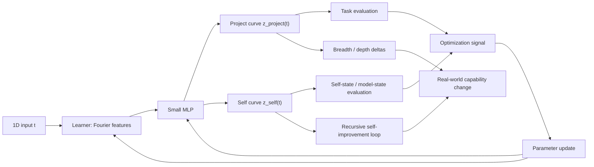

# LLC (Learned Latent Curves) and The Vacuum

## Conceptual Rendering of a Y33 hyper-sphere at 384-D

## Charts

## Diagram

## 2026-09-18 drift check (wayfinder round 10, cycle 16)

LEARN.md: unchanged this round; inventory completeness only.
