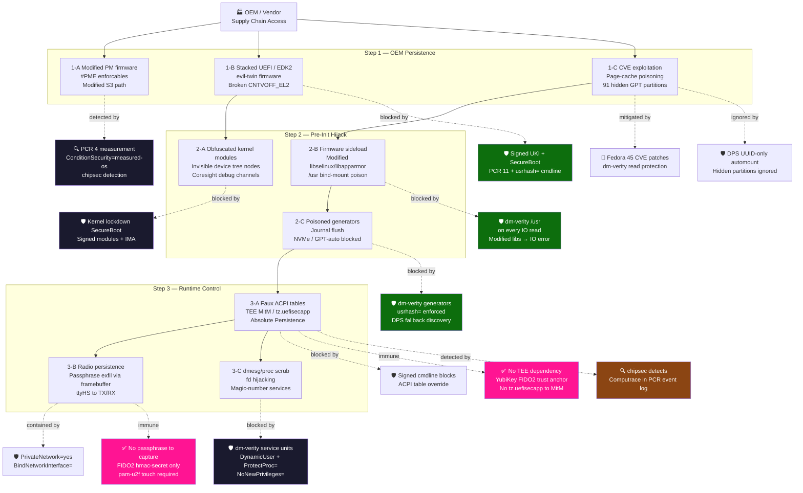

# MITIGATE.md — yubiOS vs. Faux Phy Attack Chain

> Reference: **Faux Phy ... Phe Phum v1.05** by Shant Tchatalbachian (0mniteck)  
> https://gist.github.com/0mniteck/e92c74276333e43912a5baa6802fcbd4
>
> VNDR: Qualcomm (qcom) supply-chain and absolute persistence attack chain.

---

## Overview

The Faux Phy attack chain is a multi-stage, supply-chain-initiated compromise across three phases:

1. **Step 1 — OEM/Vendor persistence**: Modified power manager, stacked UEFI firmware, hidden partitions, CVE-driven page-cache poisoning.
2. **Step 2 — Pre-init hijack**: Kernel modules before systemd, modified libc/LSM libraries sideloaded via firmware, /usr bind-mounted over /usr with poisoned generators.
3. **Step 3 — Runtime control**: Faux ACPI tables from hidden media, TEE/TrustZone MitM, Absolute Persistence (Computrace), radio persistence, dmesg/proc scrubbing.

yubiOS is built on the principle that *every component must be cryptographically validated before it runs*. Many of these vectors require substituting /usr files, the initrd, ACPI tables, or UEFI firmware — all treated as untrusted without a valid signature.

---

## Step 1 — OEM/Vendor Supply Chain Compromise

### 1-A: Modified Power Manager + Stacked PME

**Attack:** OEM modifies firmware PM, adds #PME enforcables across D0–D3 states for controlled reboot triggers. Creates a modified S3 sleep path under OEM control.

| Control | How | Coverage |
|---|---|---|
| PCR 4 measurement | Every UEFI firmware component measured into TPM PCR 4. Modified PM produces different PCR 4 values detectable via attestation. | **Detect** |
| Signed UKI (SecureBoot) | Any bootpath deviating from the signed UKI fails SecureBoot validation before yubiOS userspace runs. | **Block at boot** |
| `ConditionSecurity=measured-os` (v261) | Enrollment wizard refuses to run if measured-boot semantics are not satisfied. Altered PCR state fails this condition. | **Gate** |

**Residual risk:** OEM firmware modified before SecureBoot key enrollment is inherited. Mitigation: `bootctl enroll-keys` to replace OEM Secure Boot keys. chipsec portable service (#24) for firmware-level anomaly detection.

---

### 1-B: Stacked UEFI / Evil-Twin EDK2 + Broken CNTVOFF_EL2

**Attack:** Duplicate EDK2 instances as a stacked UEFI presenting evil-twins for any trusted data. Exploits broken CNTVOFF_EL2 (ARMv8 generic timer virtual offset) to manipulate virtual time at EL1/EL0.

| Control | How | Coverage |
|---|---|---|
| UKI as single signed binary | Kernel + initrd + cmdline bundled into one UEFI PE signed by yubiOS PIV slot 9c. Any evil-twin lacking this signature is rejected. | **Block** |
| `usrhash=` in signed cmdline | dm-verity root hash of /usr baked into the UKI cmdline at build time. Any substitute /usr fails the kernel hash check. | **Block** |
| x86-64 (primary): platform scope | CNTVOFF_EL2 is ARMv8-only — no attack surface on x86-64. | **N/A** |
| arm64 (in dev): kernel arch_timer erratum workarounds | Linux `arch_timer` driver applies per-CPU erratum workarounds at boot. Virtual offset manipulation at EL1/EL0 is corrected at the kernel level before userspace runs. UKI/PCR trust chain unchanged on ARM64. | **Mitigated (kernel)** |
| PCR 11 measurement | All UKI components measured into PCR 11. Evil-twin produces different values, detectable via attestation. | **Detect** |

---

### 1-C: CVE Exploitation / Page-Cache Poisoning / Hidden GPT Partitions

**Attack:** dirtyfrag-style page-cache poisoning. 91 hidden GPT partitions with poisoned ESP/ACPI/.MBN files masked by BPF-restricted filesystem.

| Control | How | Coverage |
|---|---|---|
| dm-verity on /usr | Every /usr read validated against the Merkle tree in real time. Poisoned page-cache produces IO errors, not transparent substitution. | **Block (reads)** |
| DPS UUID-only mount | systemd-gpt-auto-generator ignores partitions without recognised DPS type UUIDs. Hidden attacker partitions are never automounted. | **Ignore** |
| Kernel CVE patching | Fedora 45 upstream kernel patches. Base image digest policy (ADR-015) ensures they land. | **Reduce** |
| `RestrictFileSystems=` (v261) | BPF LSM restricts which filesystem types services can access. Attacker-controlled filesystems not propagated. | **Contain** |

---

## Step 2 — Pre-Init Hijack

### 2-A: Obfuscated Kernel Modules Before systemd Init

**Attack:** Kernel modules with obfuscated names loaded before systemd inits via device tree input manipulation, creating invisible nodes in /sys and /proc. ARM CoreSight debug/trace infrastructure loaded for exfiltration.

| Control | How | Coverage |
|---|---|---|
| Signed initrd embedded in UKI | initrd embedded in the UKI as the `.initrd` PE section, signed and measured into PCR 11. No external initrd path — module injection without invalidating the UKI signature is impossible. | **Block** |
| Kernel lockdown (SecureBoot) | When UEFI SecureBoot is active, Linux enters lockdown mode. Unsigned kernel modules are rejected by the kernel itself. | **Block** |
| IMA measurement | All kernel modules measured by IMA before loading. | **Detect** |
| `ConditionSecurity=measured-os` | PCR 11 state check. Module injection that alters measurements breaks this condition. | **Gate** |
| arm64 (in dev): kernel lockdown disables CoreSight | When UEFI SecureBoot is active, Linux enters lockdown mode (`CONFIG_LOCK_DOWN_KERNEL_FORCE_CONFIDENTIALITY`). CoreSight trace interfaces are explicitly disabled — no ARM64 trace exfiltration channel. | **Block** |

---

### 2-B: Modified libselinux / libapparmor + /usr Bind-Mount Poison

**Attack:** qcom firmware sideload replaces `libselinux.so.1`, `libapparmor.so.1`, `libacl`, `libmount`. Modified `libmount` bind-mounts a poisoned /usr over the real /usr *before* systemd loads, nullifying all LSM enforcement.

> **This is the centrepiece of the attack. yubiOS’s core defence applies here.**

| Control | How | Coverage |
|---|---|---|
| **dm-verity on /usr (on every IO)** | Every dlopen() and read from /usr — including `libselinux.so.1` — is validated against the Merkle tree. A modified library produces a hash mismatch → IO error. The poisoned library is never served to any process. | **Block — hard** |
| Immutable /usr mount | /usr is mounted read-only via dm-verity. Cannot be bind-mounted over using modified libmount. | **Block** |
| x86-64 (primary): no qcom,dload path | `qcom,dload` is Qualcomm-specific — does not exist on x86-64 UEFI. | **N/A** |
| arm64 (in dev): dm-verity blocks library substitution | Even if sideload runs on Qualcomm ARM64 hardware, every `dlopen()` from /usr traverses the dm-verity Merkle tree. Modified library → hash mismatch → IO error. Sideload without a dm-verity bypass changes nothing. Preferred non-Qualcomm ARM64 targets avoid this entirely. | **Block (dm-verity)** |
| `usrhash=` in signed cmdline | Kernel refuses to mount any /usr whose root hash doesn’t match the signed cmdline. | **Block** |

---

### 2-C: Poisoned systemd Generators + Journal Flushing + NVMe Blocking

**Attack:** During root-pivot, poisoned /usr causes systemd generators to run attacker code. Flushes pre-pivot journal. Blocks NVMe discovery and gpt-auto. Reinjects cmdline to start attacker-controlled systemd PID.

| Control | How | Coverage |
|---|---|---|
| dm-verity on generators | All files in `/usr/lib/systemd/system-generators/` are dm-verity protected. Poisoned generator → hash mismatch → IO error → not executed. | **Block** |
| `usrhash=` integrity | Kernel refuses to run with a /usr whose root hash doesn’t match. Poisoned /usr never mounts. | **Block** |
| PCR boot phase measurements | `initrd-enter` and `initrd-leave` measured into PCR 11. Journal flush creates detectable gaps in the measurement log. | **Detect** |
| DPS fallback discovery | systemd-gpt-auto-generator uses DPS UUIDs for discovery — resilient to device node enumeration being blocked. | **Resilient** |

---

## Step 3 — Runtime Control

### 3-A: Faux ACPI Tables + TEE MitM + Absolute Persistence (Computrace)

**Attack:** Loads fake ACPI tables from `(hd1,gpt42)/acpi/ACPI.lzma`. Modified `tz.uefisecapp` MitMs the TrustZone TEE. PCR 4 shows `Fv()\ComputraceAgent` — Absolute Persistence firmware active.

| Control | How | Coverage |
|---|---|---|
| Signed cmdline blocks ACPI override | ACPI table overrides via boot parameters require modifying the signed UKI cmdline, which would break the SecureBoot signature. | **Block** |
| **No TEE dependency** | yubiOS uses **YubiKey FIDO2** as trust anchor — no TrustZone/TEE. There is no `tz.uefisecapp` equivalent to compromise. Compromising the TEE does not unlock the LUKS2 root fs. | **Architectural immunity** |
| Computrace detection | `Fv()\ComputraceAgent` in the PCR event log is detectable via `chipsec`. `ConditionSecurity=measured-os` fails if PCR state doesn’t match a clean boot. | **Detect** |

**Residual risk:** Computrace/Absolute in UEFI ROM is installed below the OS. yubiOS can detect it via chipsec and refuse enrollment, but cannot remove it without reflashing firmware.

---

### 3-B: Radio Persistence + Password Exfiltration via Framebuffer

**Attack:** hci_uart + btqcom creates a persistent Ethernet emulator over a radio that cannot be powered off. Secure console output (including visible passwords) routed to a secondary framebuffer and sent over the radio TX/RX path via ttyHS devices.

| Control | How | Coverage |
|---|---|---|
| **No passphrase to capture** | LUKS2 disk unlock uses YubiKey FIDO2 hmac-secret — no typed passphrase. The framebuffer/ttyHS path captures nothing useful because no cleartext secret is ever entered. | **Architectural immunity** |
| systemd-homed FIDO2 | User login uses FIDO2 touch + PIN. `pam-u2f` requires physical YubiKey presence. Captured PIN without the physical token is useless. | **Render capture useless** |
| `PrivateNetwork=yes` / `BindNetworkInterface=` | Security-critical services use private network namespaces. Cannot reach hidden radio interfaces. | **Contain** |
| dm-verity on drivers | Modified hci_uart/btqcom drivers in /usr rejected by dm-verity. Unsigned drivers rejected by kernel lockdown. | **Block new drivers** |

---

### 3-C: Runtime dmesg/proc Scrubbing + fd Hijacking + Magic-Number Services

**Attack:** Generated systemd services block dmesg, kmesg, journalctl, /sys, /proc. Monitor dmesg for magic numbers from Cpuidle:PM. Open file descriptors from the controlled parent PID.

| Control | How | Coverage |
|---|---|---|
| dm-verity on service units | All service units in `/usr/lib/systemd/system/` are dm-verity protected. Foreign service cannot be injected without breaking Merkle tree. | **Block** |
| `DynamicUser=` + `ProtectProc=invisible` | Service processes cannot see other PIDs’ /proc entries. Scrubbing service cannot enumerate or attach to other processes. | **Contain** |
| `RestrictFileSystems=` (v261) | BPF LSM restricts which filesystem types are accessible per service. Rogue services cannot open arbitrary /proc or /sys paths. | **Contain** |
| `NoNewPrivileges=yes` | Enrollment and auth services cannot escalate to inject code into systemd parent PID. | **Contain** |
| Journal forward-secure sealing | HMAC-based sealing detects journal tampering via `journalctl --verify`. | **Detect** |

---

## Attack Surface Chart

| Attack Surface | Step | yubiOS Control | Coverage |
|---|---|---|---|
| OEM power manager firmware | 1-A | PCR 4 + chipsec + ConditionSecurity=measured-os | 🟡 Detect |
| Stacked UEFI / evil-twin EDK2 | 1-B | Signed UKI + SecureBoot + PCR 11 | 🟢 Block |
| Virtual timer CNTVOFF_EL2 | 1-B | x86-64: N/A (ARM-only vuln). arm64: kernel arch_timer erratum workarounds | ✅ N/A (x86-64) / 🟢 Mitigated (arm64) |
| Page-cache CVE (dirtyfrag) | 1-C | Fedora 45 patch cadence + dm-verity | 🟡 Reduce |
| Hidden GPT partitions (91 GPT) | 1-C | DPS UUID-only automount | 🟢 Ignore |
| BPF filesystem restriction | 1-C | RestrictFileSystems= (v261) | 🟢 Counter |
| Obfuscated kernel modules | 2-A | Kernel lockdown + IMA + signed initrd | 🟢 Block |
| ARM CoreSight debug | 2-A | arm64: kernel lockdown (SecureBoot) disables CoreSight trace interfaces | 🟢 Block (arm64) |
| qcom,dload firmware sideload | 2-B | x86-64: N/A. arm64: dm-verity blocks substitution; prefer non-Qualcomm hardware | ✅ N/A (x86-64) / 🟢 Block (arm64) |
| Modified libselinux/libapparmor | 2-B | **dm-verity /usr on every IO** | 🟢 Block |
| /usr bind-mount poison | 2-B | Immutable dm-verity + usrhash= | 🟢 Block |
| Poisoned systemd generators | 2-C | **dm-verity /usr on every IO** | 🟢 Block |
| Journal flush / pre-pivot wipe | 2-C | Forward-secure sealing + PCR phases | 🟡 Detect |
| NVMe / GPT-auto blocking | 2-C | DPS UUID fallback discovery | 🟢 Resilient |
| Faux ACPI table injection | 3-A | Signed UKI cmdline | 🟢 Block |
| TEE / tz.uefisecapp MitM | 3-A | **No TEE dependency — YubiKey FIDO2** | ✅ Immune |
| Absolute Persistence (Computrace) | 3-A | chipsec + ConditionSecurity=measured-os | 🟡 Detect |
| Radio that won’t power off | 3-B | PrivateNetwork= + BindNetworkInterface= | 🟡 Contain |
| Passphrase capture via framebuffer | 3-B | **FIDO2 hmac-secret — no typed passphrase** | ✅ Immune |
| Runtime dmesg/proc scrubbing | 3-C | dm-verity + DynamicUser + ProtectProc= | 🟢 Block |
| fd hijacking from parent PID | 3-C | NoNewPrivileges= + DynamicUser= | 🟢 Contain |
| Magic-number monitoring service | 3-C | dm-verity service units | 🟢 Block |

**Legend:** 🟢 Block/Contain  🟡 Detect/Reduce  ✅ Architectural immunity (attack does not apply to this platform/design)

---

## What yubiOS Cannot Fully Prevent

| Gap | Reason | Path Forward |
|---|---|---|
| OEM ROM Absolute Persistence (Computrace) | Firmware in UEFI ROM runs before SecureBoot chain starts | Reflash firmware + custom SecureBoot key enrollment. chipsec at first boot (#24). |
| Hardware radio ignoring OS power commands | Hardware-wired TX/RX below the OS layer | Hardware selection: open-firmware devices (e.g. Intel AX210 without backdoored microcode) |
| Novel kernel CVEs (dirtyfrag-class) | Requires upstream kernel patch | Automated fedora-bootc:45 digest bumps (Renovate, ADR-015) |
| qcom,dload on Qualcomm ARM64 hardware | dm-verity blocks library substitution, but Qualcomm firmware sideload runs below the Merkle tree check. Risk is present on Qualcomm-based ARM64 boards. | Prefer non-Qualcomm ARM64 hardware (Ampere, RPi 5, Juno). Board matrix in ADR-017. |
| UEFI firmware supply chain root | If UEFI itself is malicious from the factory, the chain starts compromised | chipsec surfaces anomalies. Hardware RoT (Titan/verified-boot firmware) is beyond OS scope. |

---

## Attack Flow

---

*Attack chain reference: Faux Phy ... Phe Phum v1.5 by 0mniteck — https://0mniteck.com/*  
*yubiOS architecture references: [ADR.md](ADR.md) | [ARCHITECTURE.md](ARCHITECTURE.md)*

# yubiOS Mitigation Matrix

Last reviewed: 2026-07-11
Status: planning baseline for `main`

This document maps the main yubiOS threat surfaces to current mitigations and open gaps. It is intentionally concrete: if the project cannot currently mitigate something, that is stated plainly.

## Threat Model Summary

| Area | Assumption |
|---|---|
| Owner | The owner controls the YubiKey, recovery key, Secure Boot enrollment, and installation target |
| Attacker | May control the network, registry mirror, disk at rest, or a stolen powered-off device |
| Strong attacker | May have temporary physical access, malicious firmware supply chain influence, or compromised CI inputs |
| Out of scope | Defeating a malicious CPU/SoC, closed-source ROM behavior, or an owner who enrolls malicious keys |

## Primary Mitigations

| Threat | Mitigation | Residual risk |
|---|---|---|
| Disk theft | LUKS2 root/swap with FIDO2 hmac-secret, PIN, touch, and offline recovery key | An attacker with both YubiKey and PIN can unlock |
| Silent disk decryption | FIDO2 physical presence and PIN | Malware running after unlock can access mounted plaintext while the session is active |
| Mutable `/usr` tampering | composefs over erofs with dm-verity and signed UKI command line | Firmware or kernel compromise can subvert checks below Linux |
| Malicious base image drift | Digest pins in [PINNED.md](../PINNED.md), build policy, provenance/SBOM | Pins require active refresh for security fixes |
| Secure Boot key substitution | Owner-enrolled db key, PIV-backed signing, `sbverify` in CI | OEM firmware behavior is still trusted on x86-64 |
| TPM-bound update lockout | FIDO2 hmac-secret avoids PCR-hash-bound LUKS unlock | FIDO2 does not prove which OS asked for the secret |
| Weak local auth | pam-u2f >= 1.3.1, `required` PAM flow | Emergency recovery paths must remain guarded and documented |
| Per-user data exposure | systemd-homed LUKS2 homes with per-user FIDO2 credentials | Active logged-in session remains plaintext to that user's processes |
| Registry TLS downgrade | OpenSSL 3.5+ and Go 1.24+ defaults for `X25519MLKEM768` | Server-side support and future library defaults must keep being checked |

## ARM64-Specific Risks

ARM64 is the primary platform because it enables an owner-owned root below the UKI, but that path is only as strong as the board provisioning evidence.

| Risk | Mitigation | Status |
|---|---|---|
| Vendor secure-world ownership | TF-A + OP-TEE + fTPM stack owned and pinned by yubiOS | Design accepted; hardware validation post-launch |
| Unsafe or irreversible fuse burns | Path A/Path B split, sacrificial-board rehearsal, explicit board classification | Planning baseline; not production-complete |
| RPi 5 Broadcom VideoCore trust anchor | Classified as Path B only | Documented; not a production Path A target |
| RPMB/fTPM NV bootstrap | OP-TEE RPMB-backed NV for production, volatile NV only in CI | Needs real-board proof |
| U-Boot console break-in | Proposed FIDO2/U2F console gate plus recovery plan | Idea-stage, not a current mitigation |
| CoreSight/debug exposure | Secure Boot lockdown and board policy | Needs per-board kernel/config verification |
| Qualcomm-style sideload paths | Prefer non-Qualcomm targets for Path A; dm-verity above firmware boundary | Hardware below firmware remains out of scope |

## x86-64-Specific Risks

x86-64 remains supported but secondary. Its firmware and TPM root are not yubiOS-owned.

| Risk | Mitigation | Residual risk |
|---|---|---|
| OEM UEFI compromise | Owner-enrolled Secure Boot keys above firmware | Cannot remove OEM firmware as a trust anchor today |
| TPM/fTPM vendor ownership | Do not make TPM the sole disk-unlock gate | Measurement evidence may still come from an OEM-controlled stack |
| VM CI false confidence | Keep VM CI as compatibility evidence, not hardware-root evidence | Bare-metal x86 remains separate from ARM64 Path A goals |

## Firmware Validation

`yubiOS-chipsec-firstboot.service` is a one-shot firmware validation service. It is allowed raw hardware access only because firmware inspection requires it, and that exception is explicitly scoped. The service warns by default; fleet deployments may choose fail-closed policy through kernel arguments.

CHIPSEC does not provide a reliable automated Absolute/Computrace verdict. The best current evidence is informational scanning for WPBT and relevant UEFI variables, not a pass/fail guarantee.

## systemd Hardening Notes

Use `RestrictFileSystems=` when a filesystem-type allow/deny policy is appropriate and the kernel has BPF LSM support. Do not describe this as a systemd v261-only feature. Track `RestrictFileSystemAccess=` separately as the v261 filesystem-access primitive to evaluate in future service audits.

- A malicious or vulnerable CPU/SoC executing below the owner-controlled chain.
- Closed boot ROM or firmware stages that cannot be replaced or verified by the owner.
- Physical coercion of the owner into providing PIN, touch, or recovery material.
- Compromise after the system is unlocked and the owner session is active.
- Supply-chain compromise of a pinned source before the project detects and rotates the pin.

## Current Follow-Up

The active inconsistency and mitigation cleanup log is [refs/planning-cycle-2026-07-11.md](../refs/planning-cycle-2026-07-11.md). It records the research sources used for the systemd, PQ TLS, bootc, and QEMU corrections.

## Declarative policy coverage

This document integrates with the yubiOS declarative-policy substrate — OPA/Rego policy files, signing-config JSON, policy-as-code workflows. Policy gates are named at the integration point; policy evaluation is the gate, not an afterthought.

## Continuous / adaptive coverage

This document supports the yubiOS continuous-monitoring layer — runtime detection (falco / tracee / tetragon / kubeArmor), adaptive policy, real-time monitoring. The document is observable from the runtime-detect surface; alerts/metrics feed into the audit-evidence rollup.

## Segmentation coverage

This document applies the yubiOS segmentation primitive — Linux namespaces, cgroups, sandbox, isolation boundary, trust boundary, jail idioms (nsjail, bwrap, firejail), landlock, seccomp. The boundary is named; the trust-domain transition is documented.
